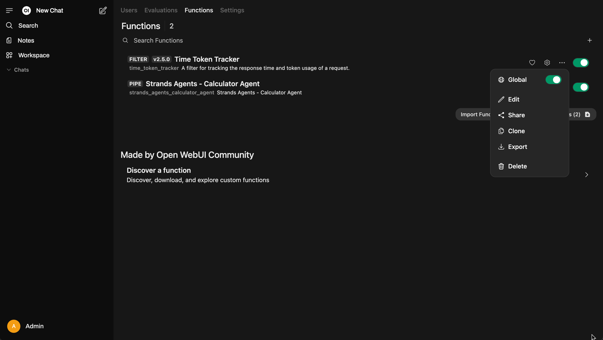
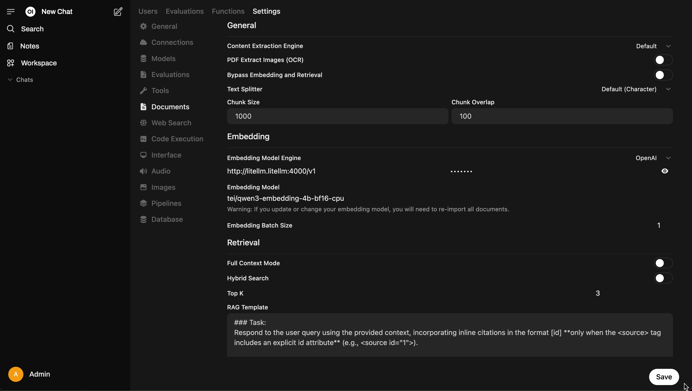
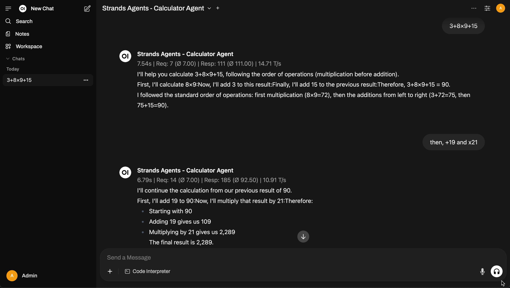

## Demo Walkthrough

These components and examples will be deployed:

- LiteLLM for AI gateway
- vLLM for deploying and serving LLM models, with 2 models deployed:
  - [Qwen/Qwen3-30B-A3B-FP8](https://huggingface.co/Qwen/Qwen3-30B-A3B-FP8) - 8-bit quantization (BF16) on single g6e EC2 instance, fast model ~75 token/sec with tools and thinking support
  - [Qwen3-32B-FP8](https://huggingface.co/Qwen/Qwen3-32B-FP8) - 8-bit quantization (BF16) on single g6e EC2 instance, slow model ~15 token/sec with tools and thinking support
- Langfuse for observability
- Open WebUI fore GUI App
- Qdrant for vector database
- Text Embedding Inference (TEI) deploying and serving Embedding models, with 1 model deployed:
  - [Qwen3-Embedding-4B](https://huggingface.co/Qwen/Qwen3-Embedding-4B) - 16-bit quantization (BF16) on single r7i EC2 instance.
- Calculator MCP server built by using FastMCP 2.0
- Calculator Agent built by using Strands Agents

### Setup Demo

Access Open WebUI at `openwebui.<DOMAIN>` and then:

- Setup [Open WebUI Functions](https://docs.openwebui.com/features/plugin/functions/#%EF%B8%8F-how-to-use-functions) to add and enable [Time Token Tracker](https://openwebui.com/f/owndev/time_token_tracker) and [Strands Agents - Calculator Agent](../examples/strands-agents/calculator-agent/openwebui_pipe_function.py) functions
  
- Change [Open WebUI RAG embedding model](https://docs.openwebui.com/features/rag#rag-embedding-support) to use the deployed Qwen3-Embedding model (check `LITELLM_API_KEY` on `.env.local` for API Key)
  

### Use Demo

1. Using Open WebUI to interact with LLM models, document RAG and AI Agents:

   - Check [Chat Features Overview](https://docs.openwebui.com/features/chat-features) on how to start using the chat features

   - Check [Tutorial: Configuring RAG with Open WebUI Documentation](https://docs.openwebui.com/tutorials/tips/rag-tutorial) on how to start using the document RAG feature
   - Select and explore `Strands Agents - Calculator Agent` (code available at `examples/strands-agents/calculator-agent`), this is a basic agent with memory so you can continue the calculation and/or reset the caculator

   

2. Access LiteLLM dashboard at `litellm.<DOMAIN>/ui` (check `LITELLM_UI_USERNAME` and `LITELLM_UI_PASSWORD` on `.env.local` for Username and Password):
   - Check [LiteLLM Proxy Server (LLM Gateway)](https://docs.litellm.ai/docs/simple_proxy) to explore some of the features
   - LiteLLM Proxy will receive the requests from Open WebUI and AI Agent
3. Access Langfuse dashboard at `langfuse.<DOMAIN>` (check `LANGFUSE_USERNAME` and `LANGFUSE_PASSWORD` on `.env.local` for Email and Password):
   - Check [Feature Overview](https://langfuse.com/docs/core-features) to explore some of the features
   - [LiteLLM Proxy logging integration with Langfuse](https://docs.litellm.ai/docs/proxy/logging#langfuse) is already configured
