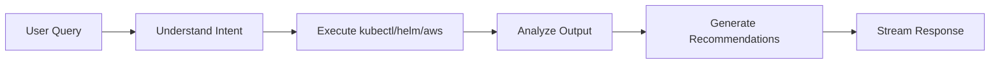

# OpenClaw DevOps Agent

An interactive AI assistant for Kubernetes cluster management and troubleshooting. The agent has kubectl, helm, and AWS CLI access with read-only RBAC permissions, making it a safe and powerful tool for cluster inspection, diagnostics, and recommendations.

## What It Does

The DevOps Agent:

- Inspects cluster resources (pods, services, deployments, nodes)
- Analyzes logs and events for troubleshooting
- Queries Helm releases and their configurations
- Checks AWS resources related to the cluster
- Provides actionable recommendations
- Explains configuration issues and best practices
- Streams responses for interactive conversations

## Installation

### 1. Prerequisites

Install required components:

```bash
./cli ai-agent openclaw install      # OpenClaw bridge server
./cli ai-gateway litellm install     # LiteLLM for model access
./cli gui-app openwebui install      # Open WebUI for interaction
```

### 2. Configure Environment Variables

Add to `.env.local`:

```bash
# Required
LITELLM_API_KEY=sk-1234567890abcdef

# Optional: Observability
LANGFUSE_PUBLIC_KEY=pk-lf-xxx
LANGFUSE_SECRET_KEY=sk-lf-xxx
```

### 3. Install Agent

```bash
./cli openclaw devops-agent install
```

This will:

1. Deploy the agent as a Kubernetes Deployment
2. Create ServiceAccount with read-only ClusterRole
3. Create Service at `http://devops-agent.openclaw:8080`
4. Automatically register the pipe function in Open WebUI

## Verification

Check the deployment:

```bash
# Check pods
kubectl get pods -n openclaw -l app=devops-agent

# Check service
kubectl get svc -n openclaw devops-agent

# Check RBAC
kubectl get clusterrole devops-agent-reader
kubectl get clusterrolebinding devops-agent-reader-binding

# Check logs
kubectl logs -n openclaw -l app=devops-agent

# Test health endpoint
kubectl port-forward -n openclaw svc/devops-agent 8080:8080
curl http://localhost:8080/health
```

## How It Works

### Agent Workflow



1. **Parse Request**: Understands what information the user needs
2. **Execute Commands**: Runs kubectl, helm, or AWS CLI commands
3. **Analyze Results**: LLM processes command output
4. **Generate Insights**: Provides explanations and recommendations
5. **Stream Response**: Sends formatted response to user

### Available Tools

| Tool | Purpose | Example Commands |
|------|---------|-----------------|
| **kubectl** | Kubernetes resource management | `get pods`, `describe deployment`, `logs`, `top nodes`, `get events` |
| **helm** | Helm release management | `list --all-namespaces`, `status`, `get values`, `history` |
| **AWS CLI** | AWS resource queries | `eks list-clusters`, `ec2 describe-security-groups`, `rds describe-db-instances` |

## Open WebUI Integration

The pipe function is automatically registered during installation.

!!! note
    If Open WebUI was not running during install, re-run `./cli openclaw devops-agent install`.

### Using the Agent

1. Open Open WebUI
2. Start a new chat
3. Select **OpenClaw - DevOps Agent** from the model dropdown
4. Ask questions about your cluster

## Example Queries

### Cluster Health

```
Check the overall health of my cluster - node status, pod failures, resource usage, recent events
```

### Pod Troubleshooting

```
Why is pod "my-app-xyz" in default namespace failing? Analyze status, events, logs, resource limits
```

### Resource Inspection

```
List all deployments in the production namespace and their replica counts

Show all services of type LoadBalancer across all namespaces

What pods are consuming the most CPU in kube-system?
```

### Helm Releases

```
List all Helm releases in the cluster and their status

Show the values used for the "litellm" Helm release in the litellm namespace

What version of vLLM is currently deployed?
```

### AWS Resources

```
List all EKS clusters in us-west-2 region

Show security groups attached to my EKS cluster

What IAM roles are associated with this cluster?
```

### Log Analysis

```
Analyze logs from "api-server" deployment in default namespace for errors

Show last 100 lines of logs from all pods with label app=frontend

Are there any crash loops in the cluster?
```

### Recommendations

```
Review resource requests/limits for "web-app" deployment and suggest optimizations

Analyze ingress configuration for "my-service" and recommend improvements

Check if any pods are running with security vulnerabilities
```

## Configuration

### Environment Variables

| Variable | Description | Default |
|---|---|---|
| `OPENCLAW_GATEWAY_TOKEN` | Authentication token | `openclaw-gateway-token` |
| `LITELLM_BASE_URL` | LiteLLM API endpoint | `http://litellm.litellm:4000` |
| `LITELLM_API_KEY` | LiteLLM API key | From `.env` |
| `LITELLM_MODEL_NAME` | Model to use | `bedrock/claude-4.5-sonnet` |
| `LANGFUSE_HOST` | Langfuse endpoint (optional) | Auto-detected |

### config.json

```json
{
  "examples": {
    "openclaw": {
      "devops-agent": {
        "env": {
          "LITELLM_MODEL_NAME": "bedrock/claude-4.5-sonnet",
          "OPENCLAW_GATEWAY_TOKEN": "openclaw-gateway-token"
        }
      }
    }
  }
}
```

## RBAC Permissions

The DevOps Agent has read-only access to cluster resources:

```yaml
apiVersion: rbac.authorization.k8s.io/v1
kind: ClusterRole
metadata:
  name: devops-agent-reader
rules:
- apiGroups: ["*"]
  resources: ["*"]
  verbs: ["get", "list", "watch"]
```

### What the Agent Can Do

- ✅ List and describe all resources
- ✅ View logs from pods
- ✅ Check resource status and events
- ✅ Query Helm releases
- ✅ Run AWS CLI read operations

### What the Agent Cannot Do

- ❌ Create, update, or delete resources
- ❌ Execute commands in pods (`kubectl exec`)
- ❌ Modify configurations
- ❌ Read Kubernetes Secrets (explicitly excluded)
- ❌ Scale deployments
- ❌ Apply manifests

## Security Considerations

!!! warning "Cluster-Wide Read Access"
    The DevOps Agent uses a **ClusterRole** that grants read access (`get`, `list`, `watch`) to resources **across all namespaces**. Combined with `automountServiceAccountToken: true`, an LLM-driven agent with this access poses security risks:
    
    - **Prompt injection**: Malicious prompts could instruct the agent to read sensitive configmaps or environment variables
    - **Data exfiltration**: Agent could be tricked into including sensitive data in responses
    - **Lateral discovery**: Full cluster visibility reveals infrastructure details that should be compartmentalized
    
    **For production use, replace ClusterRole/ClusterRoleBinding with namespace-scoped Role/RoleBinding** to limit the blast radius.

### Security Features

- **Read-only access**: Agent cannot modify cluster resources
- **No exec**: Agent cannot execute commands in pods
- **No secrets**: Agent cannot read Kubernetes Secrets
- **Audit logs**: All kubectl commands logged in Kubernetes audit logs
- **RBAC enforced**: Permissions strictly limited by ClusterRole

### Recommended Security Enhancements

For production use:

1. **Namespace-scoped access** (strongly recommended):
   ```yaml
   apiVersion: rbac.authorization.k8s.io/v1
   kind: Role
   metadata:
     name: devops-agent-reader
     namespace: production
   rules:
   - apiGroups: ["apps", ""]
     resources: ["deployments", "pods", "services"]
     verbs: ["get", "list", "watch"]
   ```

2. **Resource filtering**: Limit to specific resource types
3. **Network policies**: Restrict agent network access
4. **Pod security standards**: Apply restricted PSS
5. **Audit logging**: Enable detailed Kubernetes audit logs
6. **Review responses**: Periodically check for data exposure

## Langfuse Observability

If Langfuse is installed, view agent execution traces:

1. Open Langfuse UI
2. Navigate to **Traces**
3. Filter by `devops-agent` tag
4. View detailed metrics:
   - Query submission time
   - kubectl/helm/aws commands executed
   - LLM API calls with prompts and responses
   - Token usage and costs
   - Response latency
   - Error events

## Cost Optimization

- **Long-lived deployment**: Runs continuously for low-latency responses
- **Resource limits**: Configured with minimal CPU/memory requests
- **Spot instances**: Karpenter provisions Spot ARM64 nodes (up to 90% savings)
- **Model selection**: Use smaller models for faster, cheaper responses

Estimated cost: ~$0.01-0.02 per hour (excluding LLM API costs)

## Troubleshooting

### Agent returns "permission denied"

**Problem**: Agent lacks RBAC permissions

**Solution**: Verify ClusterRoleBinding:
```bash
kubectl get clusterrolebinding devops-agent-reader-binding -o yaml
```

### Agent cannot access AWS resources

**Problem**: Pod lacks AWS IAM permissions

**Solution**: Ensure EKS node IAM role has necessary permissions or use IRSA

### Responses are generic/unhelpful

**Problem**: Model lacks context or instructions

**Solution**:
- Be more specific in queries
- Use a more capable model
- Provide additional context in the prompt

## Example Use Cases

### Scenario 1: Investigating Pod Failures

**Query:**
```
Why are pods in the web-app deployment failing to start?
```

**Agent Actions:**
1. Lists pods in deployment
2. Describes failing pods
3. Checks recent events
4. Analyzes logs
5. Identifies image pull error
6. Recommends solution

### Scenario 2: Capacity Planning

**Query:**
```
Which nodes are under memory pressure? Should I scale the cluster?
```

**Agent Actions:**
1. Runs `kubectl top nodes`
2. Checks node conditions
3. Reviews pod resource requests
4. Calculates utilization
5. Recommends scaling strategy

### Scenario 3: Security Audit

**Query:**
```
Are any pods running as root? List security concerns.
```

**Agent Actions:**
1. Checks pod security contexts
2. Reviews privileged containers
3. Identifies host network usage
4. Lists security recommendations

## Uninstallation

Remove the DevOps Agent:

```bash
./cli openclaw devops-agent uninstall
```

This will delete:
- Deployment and Service
- ServiceAccount
- ClusterRole and ClusterRoleBinding
- Open WebUI pipe function

## References

- [OpenClaw Repository](https://github.com/openclaw/openclaw)
- [kubectl Documentation](https://kubernetes.io/docs/reference/kubectl/)
- [Helm Documentation](https://helm.sh/docs/)
- [AWS CLI Documentation](https://docs.aws.amazon.com/cli/)
- [Kubernetes RBAC](https://kubernetes.io/docs/reference/access-authn-authz/rbac/)
- [Kubernetes Audit Logging](https://kubernetes.io/docs/tasks/debug/debug-cluster/audit/)
