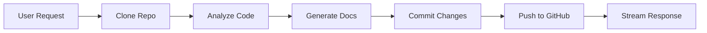

# OpenClaw Document Writer Agent

An autonomous AI-powered documentation agent that clones Git repositories, analyzes code, generates comprehensive documentation, and commits changes back to the repository. Built with OpenClaw, this agent demonstrates advanced autonomous task execution.

## What It Does

The Document Writer Agent:

- Clones Git repositories (public or private with credentials)
- Analyzes code structure, dependencies, and patterns
- Generates comprehensive documentation using LLM
- Creates or updates README, API docs, tutorials, and changelogs
- Commits and pushes changes back to the repository
- Streams progress updates to the user

## Installation

### 1. Prerequisites

Install required components:

```bash
./cli ai-agent openclaw install      # OpenClaw bridge server
./cli ai-gateway litellm install     # LiteLLM for model access
./cli gui-app openwebui install      # Open WebUI for interaction
```

### 2. Configure Environment Variables

Add to `.env.local` (via `./cli configure`):

```bash
# Required
LITELLM_API_KEY=sk-1234567890abcdef

# Optional: Git credentials for pushing changes
OPENCLAW_DOC_WRITER_GIT_USERNAME=your-github-username
OPENCLAW_DOC_WRITER_GIT_TOKEN=ghp_your_github_token

# Optional: Observability
LANGFUSE_PUBLIC_KEY=pk-lf-xxx
LANGFUSE_SECRET_KEY=sk-lf-xxx
```

### 3. Install Agent

```bash
./cli openclaw doc-writer install
```

This will:

1. Deploy the agent as a Kubernetes Deployment
2. Create a Service at `http://doc-writer.openclaw:8080`
3. Automatically register the pipe function in Open WebUI

## Verification

Check the deployment:

```bash
# Check pods
kubectl get pods -n openclaw -l app=doc-writer

# Check service
kubectl get svc -n openclaw doc-writer

# Check logs
kubectl logs -n openclaw -l app=doc-writer

# Test health endpoint
kubectl port-forward -n openclaw svc/doc-writer 8080:8080
curl http://localhost:8080/health
```

## How It Works

### Agent Workflow



1. **Clone**: Downloads the repository using Git credentials
2. **Analyze**: Reads code files, understands project structure
3. **Generate**: Uses LLM to create comprehensive documentation
4. **Commit**: Stages and commits changes with descriptive message
5. **Push**: Pushes changes to the remote repository
6. **Stream**: Sends progress updates and final result to user

### Git Configuration

The agent is pre-configured with:

```bash
git config --system user.name "OpenClaw Doc Writer"
git config --system user.email "openclaw-doc-writer@noreply"
```

## Open WebUI Integration

The pipe function is automatically registered during installation.

!!! note
    If Open WebUI was not running during install, re-run `./cli openclaw doc-writer install`.

### Using the Agent

1. Open Open WebUI
2. Start a new chat
3. Select **OpenClaw - Document Writer** from the model dropdown
4. Send documentation requests:

**Example 1: Generate README**
```
Write a comprehensive README for https://github.com/myorg/myproject

Include:
- Project overview
- Installation instructions
- Usage examples
- API documentation
- Contributing guidelines
```

**Example 2: Update API Docs**
```
Update the API documentation in https://github.com/myorg/api-server

Document all REST endpoints with:
- Request/response formats
- Authentication requirements
- Error codes
- Rate limiting
```

**Example 3: Create Changelog**
```
Generate a CHANGELOG.md for https://github.com/myorg/project

Based on recent commits, document:
- New features
- Bug fixes
- Breaking changes
- Deprecations
```

## Configuration

### Environment Variables

| Variable | Description | Default |
|---|---|---|
| `OPENCLAW_GATEWAY_TOKEN` | Authentication token | `openclaw-gateway-token` |
| `LITELLM_BASE_URL` | LiteLLM API endpoint | `http://litellm.litellm:4000` |
| `LITELLM_API_KEY` | LiteLLM API key | From `.env` |
| `LITELLM_MODEL_NAME` | Model to use | `bedrock/claude-4.5-sonnet` |
| `GIT_USERNAME` | Git username for clone/push | From `.env` |
| `GIT_TOKEN` | Git personal access token | From `.env` |
| `LANGFUSE_HOST` | Langfuse endpoint (optional) | Auto-detected |

### config.json

```json
{
  "examples": {
    "openclaw": {
      "doc-writer": {
        "env": {
          "LITELLM_MODEL_NAME": "bedrock/claude-4.5-sonnet",
          "OPENCLAW_GATEWAY_TOKEN": "openclaw-gateway-token"
        }
      }
    }
  }
}
```

## Example Tasks

| Task | Example Prompt |
|------|---------------|
| **Generate README** | Write a README for `https://github.com/user/repo` - include project description, installation steps, quick start guide, configuration options |
| **Update API Docs** | Update the API documentation in `https://github.com/user/api-server` - REST endpoints, request/response formats, authentication, error codes |
| **Create Changelog** | Generate a CHANGELOG.md for `https://github.com/user/project` - new features, bug fixes, breaking changes based on recent commits |
| **Contributing Guide** | Create a CONTRIBUTING.md for `https://github.com/user/opensource-project` - code of conduct, development setup, PR process, coding standards |
| **Architecture Docs** | Document the system architecture for `https://github.com/user/system` - components, data flow, integration points, deployment topology |

## Git Credentials (Optional)

The agent can push changes back to repositories with proper credentials.

!!! warning "Security Warning"
    Git credentials are injected as **plain-text environment variables**. The LLM-driven agent has access to these at runtime. A prompt injection attack could potentially leak or misuse the token. **Do not use tokens with broad access.**

### Creating a Scoped GitHub Token

Use a [fine-grained personal access token](https://docs.github.com/en/authentication/keeping-your-account-and-data-secure/managing-your-personal-access-tokens#creating-a-fine-grained-personal-access-token):

1. Go to **GitHub Settings** → **Developer settings** → **Personal access tokens** → **Fine-grained tokens**
2. Click **Generate new token**
3. Configure:
   - **Token name**: `openclaw-doc-writer`
   - **Expiration**: 30 days (or shorter)
   - **Repository access**: **Only select repositories** - pick specific repos
   - **Permissions**: Set **Contents** to **Read and write** - leave everything else at **No access**
4. Generate token and add to `.env.local`:

```bash
OPENCLAW_DOC_WRITER_GIT_USERNAME=your-github-username
OPENCLAW_DOC_WRITER_GIT_TOKEN=ghp_your_fine_grained_token
```

### Recommendations

- ❌ **Never use classic tokens** - they grant access to all repos
- ✅ **Set short expiration** - rotate tokens frequently
- ✅ **Limit to specific repos** - never grant org-wide access
- ✅ **Review agent output** - check commits before merging
- ✅ **Use branch protection** - require reviews for main branches
- ✅ For production, consider AWS Secrets Manager instead of env vars

### Without Credentials

The agent can still operate without credentials:

- ✅ Clone public repositories
- ✅ Analyze code and generate documentation
- ❌ Cannot commit and push changes
- Agent will provide documentation as text response instead

## Langfuse Observability

If Langfuse is installed, view agent execution traces:

1. Open Langfuse UI
2. Navigate to **Traces**
3. Filter by `doc-writer` tag
4. View detailed metrics:
   - Task submission time
   - Git operations (clone, commit, push)
   - LLM API calls with prompts and responses
   - Token usage and costs
   - Response latency
   - Error events

## Cost Optimization

- **Spot instances**: Karpenter provisions Spot ARM64 nodes (up to 90% savings)
- **Model selection**: Use smaller models for simpler docs
- **Job-based execution**: Consider using Jobs instead of Deployment for one-off tasks
- **Prompt optimization**: Be specific to reduce unnecessary LLM calls

## Troubleshooting

### Agent cannot clone private repos

**Problem**: `fatal: could not read Username`

**Solution**: Configure Git credentials in `.env.local`

### Agent cannot push changes

**Problem**: `remote: Permission denied`

**Solution**: Ensure GitHub token has **Contents: Read and write** permission

### Documentation quality is poor

**Problem**: Generated docs lack detail

**Solution**: 
- Be specific in prompts about what to include
- Use a more capable model (e.g., Claude 3.5 Sonnet)
- Provide example documentation style

## Uninstallation

Remove the Document Writer Agent:

```bash
./cli openclaw doc-writer uninstall
```

This will delete Kubernetes resources (Deployment, Service, ServiceAccount) and the Open WebUI pipe function.

## References

- [OpenClaw Repository](https://github.com/openclaw/openclaw)
- [Open WebUI Pipe Functions](https://docs.openwebui.com/features/pipe-functions)
- [GitHub Personal Access Tokens](https://docs.github.com/en/authentication/keeping-your-account-and-data-secure/creating-a-personal-access-token)
- [Git Credential Storage](https://git-scm.com/book/en/v2/Git-Tools-Credential-Storage)
