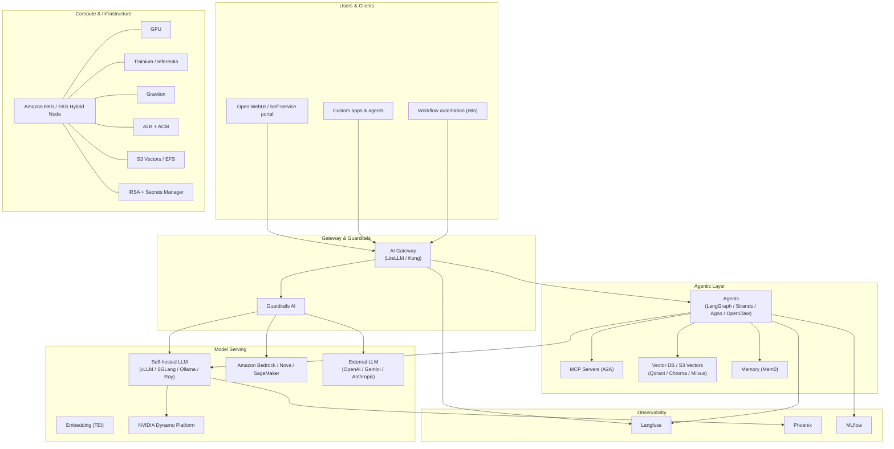

[한국어](architecture.ko.md){ .md-button } [English](architecture.md){ .md-button .md-button--primary }

# Functional View & Building Blocks

Flexible AI spans every layer from the application surface down to cloud, on-premises, and edge infrastructure. Adopt the components you need today and grow into the rest, or stand up the integrated platform in one pass.

## Layered stack



## Building blocks

### Application layer

- **Self-service portal** — single UI for unified access to models and agents.
- **Open WebUI / custom apps / n8n** — users and workflows enter through the same gateway.

### Gateway & Guardrails

- [LiteLLM](../components/ai-gateway/litellm.md) — OpenAI-compatible proxy with multi-provider routing.
- [Kong AI Gateway OSS](../components/ai-gateway/kong.md) — Kong with AI plugins.
- [Guardrails AI](../components/guardrail/guardrails-ai.md) — policy enforcement and safety guards.

### Agentic layer

- **LangGraph / Strands / Agno / OpenClaw** — agent workflow frameworks, fully controllable at the code level.
- **MCP servers** — expose tools as services over Model Context Protocol ([Calculator MCP](../examples/mcp-server/calculator.md)).
- **Vector DB / S3 Vectors / Memory (Mem0)** — RAG and long-term memory.

### Model serving

- Self-hosted: [vLLM](../components/llm-model/vllm.md), [SGLang](../components/llm-model/sglang.md), [TGI](../components/llm-model/tgi.md), [Ollama](../components/llm-model/ollama.md), [TEI](../components/embedding-model/tei.md).
- AWS-managed: Amazon Bedrock, Nova, SageMaker.
- External LLMs: OpenAI, Gemini, Anthropic — same gateway entry point.
- Acceleration path: [NVIDIA Dynamo Platform](../components/nvidia-platform/index.md) (KV-cache routing, AIPerf, AIConfigurator).

### Observability

- [Langfuse](../components/observability/langfuse.md) — LLM and agent tracing with session / tag attribution.
- [Phoenix](../components/observability/phoenix.md) — evaluation and monitoring.
- [MLflow](../components/observability/mlflow.md) — experiment tracking.

### Compute & infrastructure

- **Amazon EKS / EKS Hybrid Node** — unify AWS Cloud and on-premises in one cluster.
- **Heterogeneous compute** — mix GPU / Trainium / Inferentia / Graviton per workload.
- **ALB + ACM, S3 Vectors / EFS, IRSA + Secrets Manager** — production-grade defaults.

## Configuration model

Every component reads configuration from this merge order:

```
.env -> config.json -> .env.local -> config.local.json
```

CLI subcommands consume the merged result, render Handlebars manifests into `*.rendered.yaml`, and apply them. The same pattern repeats across every category, so once you've read one component the rest are familiar.

See [Configuration](../reference/configuration.md) for the full schema.

## Deployment shapes

- **Demo setup** — `./cli demo-setup` deploys the curated stack in parallel with explicit dependency ordering (e.g. `openwebui` waits for `litellm`). See [Quick Start](../getting-started/quick-start.md).
- **Interactive setup** — `./cli interactive-setup` lets you pick components per category. Both produce the same cluster shape.

[:octicons-arrow-right-24: Use Cases](use-cases.md){ .md-button .md-button--primary }
[:octicons-arrow-right-24: Get Started](get-started.md){ .md-button }
