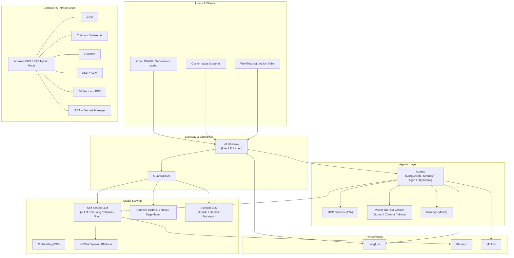

[한국어](architecture.ko.md){ .md-button .md-button--primary } [English](architecture.md){ .md-button }

# Functional View & Building Blocks

Application 레이어부터 Cloud·On-prem·Edge 인프라까지 전 계층을 포괄하는 구조입니다. 환경에 맞춰 필요한 컴포넌트부터 점진적으로 확장하거나, 통합 플랫폼으로 한 번에 구축할 수 있습니다.

## 계층 구조



## 빌딩 블록

### Application Layer

- **Self-service portal** — 모델·에이전트에 대한 통합 액세스를 단일 UI에서 제공.
- **Open WebUI / Custom Applications / n8n** — 사용자와 워크플로우 자동화가 게이트웨이를 통해 동일한 진입점을 사용.

### Gateway & Guardrails

- [LiteLLM](../components/ai-gateway/litellm.md) — OpenAI 호환 프록시, multi-provider routing.
- [Kong AI Gateway OSS](../components/ai-gateway/kong.md) — Kong 기반 AI 플러그인.
- [Guardrails AI](../components/guardrail/guardrails-ai.md) — 정책 강제 및 안전 가드.

### Agentic Layer

- **LangGraph / Strands / Agno / OpenClaw** — 에이전트 워크플로우 프레임워크. 코드 레벨에서 완전 제어.
- **MCP Servers** — Model Context Protocol을 통해 도구를 서비스로 노출 ([Calculator MCP](../examples/mcp-server/calculator.md)).
- **Vector DB / S3 Vectors / Memory(Mem0)** — RAG와 장기 메모리.

### Model Serving

- 자체 호스팅: [vLLM](../components/llm-model/vllm.md), [SGLang](../components/llm-model/sglang.md), [TGI](../components/llm-model/tgi.md), [Ollama](../components/llm-model/ollama.md), [TEI](../components/embedding-model/tei.md).
- AWS 관리형: Amazon Bedrock, Nova, SageMaker.
- 외부 LLM: OpenAI, Gemini, Anthropic — 동일 게이트웨이로 라우팅.
- 고도화 경로: [NVIDIA Dynamo Platform](../components/nvidia-platform/index.md) (KV-cache routing, AIPerf, AIConfigurator).

### Observability

- [Langfuse](../components/observability/langfuse.md) — LLM·에이전트 트레이싱, 세션·태그 단위 분석.
- [Phoenix](../components/observability/phoenix.md) — 평가·모니터링.
- [MLflow](../components/observability/mlflow.md) — 실험 추적.

### Compute & Infrastructure

- **Amazon EKS / EKS Hybrid Node** — AWS Cloud와 온프레미스를 하나의 클러스터로 통합.
- **이기종 컴퓨트** — Workload별 GPU / Trainium / Inferentia / Graviton 조합.
- **ALB + ACM, S3 Vectors / EFS, IRSA + Secrets Manager** — 프로덕션-grade 디폴트.

## 구성 모델

모든 컴포넌트는 다음 머지 순서로 구성을 읽습니다.

```
.env -> config.json -> .env.local -> config.local.json
```

CLI 서브커맨드는 머지된 결과를 입력으로 Handlebars 템플릿을 `*.rendered.yaml`로 렌더링한 뒤 적용합니다. 모든 카테고리에서 동일한 패턴을 사용하므로, 한 컴포넌트를 이해하면 나머지도 같은 방식으로 동작합니다.

자세한 스키마는 [Configuration](../reference/configuration.md)을 참고하세요.

## 배포 형태

- **Demo setup** — `./cli demo-setup` 으로 큐레이션된 스택을 병렬 설치 (`openwebui`는 `litellm` 이후 등 명시적 의존성 적용). [Quick Start](../getting-started/quick-start.md)
- **Interactive setup** — `./cli interactive-setup` 으로 카테고리별 컴포넌트 선택. 둘 다 동일한 클러스터 형태를 산출합니다.

[:octicons-arrow-right-24: Use Cases](use-cases.ko.md){ .md-button .md-button--primary }
[:octicons-arrow-right-24: Get Started](get-started.ko.md){ .md-button }
