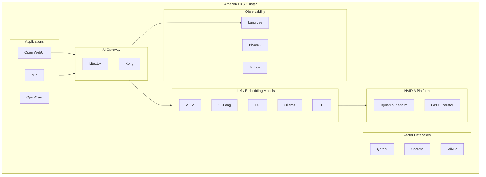

# GenAI on EKS Starter Kit

A starter kit for deploying and managing GenAI components and examples on **Amazon EKS** (Elastic Kubernetes Service). This project provides a collection of tools, configurations, components, and examples to help you quickly set up a GenAI project on Kubernetes.

-   :material-rocket-launch:{ .lg .middle } **Quick Start**

    ---

    Get up and running in minutes with the demo setup

    [:octicons-arrow-right-24: Getting Started](getting-started/quick-start.md)

-   :material-puzzle:{ .lg .middle } **Components**

    ---

    Browse 25+ deployable components across 10 categories

    [:octicons-arrow-right-24: Components](components/index.md)

-   :material-code-braces:{ .lg .middle } **Examples**

    ---

    Explore AI agents, MCP servers, and more

    [:octicons-arrow-right-24: Examples](examples/index.md)

-   :material-book-open:{ .lg .middle } **Reference**

    ---

    CLI commands, configuration, FAQ, and security

    [:octicons-arrow-right-24: Reference](reference/cli-commands.md)

## What's Included

| Category | Components |
|----------|-----------|
| **NVIDIA Platform** | GPU Operator, Monitoring, Dynamo Platform, Dynamo vLLM, AIPerf Benchmark, AIConfigurator |
| **AI Gateway** | [LiteLLM](https://www.litellm.ai), [Kong AI Gateway](https://github.com/Kong/kong) |
| **LLM Model** | [vLLM](https://docs.vllm.ai), [SGLang](https://docs.sglang.ai), [TGI](https://huggingface.co/docs/text-generation-inference), [Ollama](https://ollama.com) |
| **Embedding Model** | [Text Embedding Inference (TEI)](https://huggingface.co/docs/text-embeddings-inference) |
| **Guardrail** | [Guardrails AI](https://www.guardrailsai.com) |
| **Observability** | [Langfuse](https://langfuse.com), [MLflow](https://mlflow.org), [Phoenix](https://phoenix.arize.com) |
| **GUI App** | [Open WebUI](https://docs.openwebui.com) |
| **Vector Database** | [Qdrant](https://qdrant.tech), [Chroma](https://docs.trychroma.com), [Milvus](https://milvus.io) |
| **Workflow Automation** | [n8n](https://docs.n8n.io) |
| **AI Agent** | [OpenClaw](https://github.com/openclaw/openclaw) |

## Architecture Overview

## Disclaimer

!!! warning
    This repository is intended for **demonstration and learning purposes only**. It is not intended for production use. The code provided here is for educational purposes and should not be used in a live environment without proper testing, validation, and modifications.
