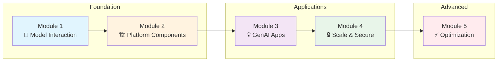

# EKS GenAI Workshop: From LLMs to Scalable Agent Systems

Welcome to a comprehensive hands-on GenAI workshop on Amazon EKS! Over the next few hours, you'll build a complete generative AI platform - from deploying your first LLM to orchestrating sophisticated multi-agent systems.

## 🎯 What Makes This Workshop Special?

This isn't just another "Hello World" AI tutorial. You'll work with:

- **Enterprise-grade infrastructure** using EKS Auto Mode and specialized hardware
- **Real LLMs** including Llama 3.1 and Claude 3.5 running on AWS Neuron chips
- **Enterprise patterns** for observability, security, and cost optimization
- **Cutting-edge frameworks** like LangChain, LangGraph, and Model Context Protocol
- **Hands-on exercises** that mirror real-world GenAI deployments

## 🚀 Your Learning Journey

## 📚 Module Overview

### Module 1: Interacting with Models
**From Zero to LLM in Production**

You'll start by interacting with Large Language Models through different deployment patterns:

- 💬 **Open WebUI** - Deploy a ChatGPT-like interface for model interaction
- ⚡ **vLLM on AWS Neuron** - Host Llama 3.1 8B & Qwen3 8b with hardware acceleration
- ☁️ **AWS Bedrock Integration** - Connect to Claude 3.7 via Amazon Bedrock

::alert[**Hands-on Focus**: You'll get to use real models deployed on EKS and see immediate results - no simulation or mocking!]{type="success"}

### Module 2: GenAI Platform Components
**Building Your AI Infrastructure**

Transform individual components into a unified platform:

- 🔄 **LiteLLM Gateway** - Create a unified API for all your models
- 📊 **Langfuse Observability** - Track every token, cost, and interaction
- 🔧 **Platform Integration** - Connect all components seamlessly

### Module 3: Building GenAI Applications
**From Chatbots to Intelligent Agents**

Create sophisticated AI applications using modern frameworks:

- 🔗 **LangChain & LangGraph** - Build chains, agents, and workflows
- 💾 **Memory Stores** - Implement persistent memory with vector databases
- 🔧 **Model Context Protocol** - Integrate external tools and APIs
- 🤖 **Multi-Agent Systems** - Orchestrate teams of specialized agents
- 🧠 **Agentic RAG** - Build intelligent retrieval-augmented generation

### Module 4: Scaling and Securing Agents
**Enterprise-Grade AI Systems**

Implement enterprise patterns for scale and security:

- 📈 **Distributed Inference** - Scale across multiple nodes with LeaderWorkerSet
- 🔐 **Pod Identity & IAM** - Secure access to AWS services
- 💰 **Cost Optimization** - Calculate and optimize agentic transaction costs
- 🛡️ **Security Best Practices** - Implement guardrails and compliance

### Module 5: vLLM Optimization
**Advanced Performance Tuning**

Master the art of LLM optimization:

- 🔄 **Tensor Parallelism** - Distribute models across multiple accelerators
- 📦 **Quantization Techniques** - INT8 and FP8 optimization strategies
- 💾 **KV Cache Optimization** - Improve memory efficiency
- 📊 **LLM Evaluation** - Implement LLM-as-a-judge techniques

## 🛠️ Technologies You'll Master

::::tabs

:::tab{label="Infrastructure"}
- **Amazon EKS Auto Mode** - Fully managed Kubernetes
- **AWS Neuron** - Purpose-built AI chips (inf2/trn1)
- **Amazon EFS** - Shared storage for models
- **Pod Identity** - Modern AWS authentication
:::

:::tab{label="AI/ML Stack"}
- **vLLM** - High-performance inference server
- **LiteLLM** - Unified LLM gateway
- **Langfuse** - LLM observability platform
- **Open WebUI** - Chat interface
- **AWS Bedrock** - Managed AI services
:::

:::tab{label="Frameworks"}
- **LangChain** - LLM application framework
- **LangGraph** - Workflow orchestration
- **Model Context Protocol** - Tool integration
:::

::::

## 👥 Who Should Attend?

This workshop is designed for:

- **Software Engineers** building GenAI applications
- **DevOps Engineers** deploying AI workloads on Kubernetes
- **Solution Architects** designing GenAI platforms
- **ML Engineers** optimizing LLMs in production
- **Technical Leaders** evaluating GenAI strategies

## ✅ Prerequisites

Before starting, ensure you have:

- ✓ Basic Kubernetes knowledge (`kubectl` experience)
- ✓ AWS account access or Workshop Studio event credentials
- ✓ Python programming experience
- ✓ Understanding of REST APIs
- ✓ Curiosity about AI and willingness to experiment!

::alert[**No AI/ML expertise required!** We'll explain concepts as we build.]{type="info"}

## 🎓 Learning Objectives

By the end of this workshop, you will be able to:

- ✅ Deploy and optimize open-source LLMs on Amazon EKS
- ✅ Build a unified GenAI platform with proper observability
- ✅ Create intelligent agents using modern frameworks
- ✅ Implement enterprise-grade security and scaling patterns
- ✅ Calculate and optimize costs for GenAI workloads
- ✅ Evaluate and compare different model deployment strategies

## 🚦 Workshop Format

- **Duration**: 3 hours (with breaks)
- **Style**: Hands-on with guided exercises
- **Pace**: Progressive difficulty with checkpoints

## 💡 Tips for Success

1. **Follow the modules in order** - Each builds on the previous
2. **Run the verification commands** - Ensure each step completes successfully
3. **Experiment freely** - The environment is yours to explore
4. **Ask questions** - No question is too basic
5. **Take breaks** - This is a lot of content to absorb!

## 🎉 Ready to Begin?

Your GenAI journey starts here. In just 3 hours, you'll go from deploying your first model to building sophisticated agent systems. The infrastructure is ready, the models are waiting, and your instructors are here to help.

Let's build something amazing together!

---

**[Get Started with the Introduction →](/introduction/)**
