Welcome to a comprehensive hands-on GenAI workshop on Amazon EKS! Over the next few hours, you'll build a complete generative AI platform - from deploying your first LLM to creating intelligent applications.

## 🏗️ Built on Proven Foundation

This workshop is built on the **[AWS GenAI on EKS Starter Kit](https://github.com/aws-samples/sample-genai-on-eks-starter-kit)** - a comprehensive reference architecture for deploying GenAI platforms on Amazon EKS.

**After the workshop**, you can:
- Deploy the same patterns in your own AWS account using the starter kit
- Customize the platform for your specific use cases
- Scale to handle thousands of AI requests with confidence
- Leverage battle-tested Kubernetes configurations

::alert[**Take It Home**: Everything you build today can be deployed in your own environment using the open-source starter kit!]{type="success"}

## 🎯 What Makes This Workshop Special?

This isn't just another "Hello World" AI tutorial. You'll work with:

- **GenAI Platform** built on EKS Auto Mode
- **Real LLMs** including Qwen 3 8b & DeepSeek R1 Qwen 3 8b running on AWS Neuron chips and Claude 4.5 via Amazon Bedrock
- **Modern AI Patterns** for observability, cost tracking, and scalability
- **Cutting-edge frameworks** like LangChain, LangGraph, and Model Context Protocol
- **Hands-on exercises** that mirror real-world GenAI deployments

## 🚀 Your Learning Journey

```mermaid
graph LR
    subgraph "Foundation"
        M1[Module 1<br/>🤖 Model Interaction]
        M2[Module 2<br/>🏗️ Platform Components]
    end
    
    subgraph "Applications"
        M3[Module 3<br/>💡 GenAI Apps]
        M4[Module 4<br/>🔒 Scale & Secure]
    end
    
    subgraph "Advanced"
        M5[Module 5<br/>⚡ Optimization]
    end
    
    M1 --> M2
    M2 --> M3
    M3 --> M4
    M4 --> M5
    
    style M1 fill:#e1f5fe
    style M2 fill:#fff3e0
    style M3 fill:#f3e5f5
    style M4 fill:#e8f5e9
    style M5 fill:#ffebee
```

## 📚 Module Overview

### Module 1: Interacting with Models
**From Zero to AI Chat in Minutes**

You'll start by interacting with Large Language Models through different deployment patterns:

- 💬 **Open WebUI** - Deploy a ChatGPT-like interface for model interaction
- ⚡ **vLLM on AWS Neuron** - Host Qwen 3 8b & DeepSeek R1 Qwen 3 8b on Neuron
- ☁️ **AWS Bedrock Integration** - Connect to Claude 4.5 and GPT OSS 20b via Amazon Bedrock

::alert[**Hands-on Focus**: You'll get to use real models deployed on EKS and see immediate results - no simulation or mocking!]{type="success"}

### Module 2: GenAI Platform Components
**Building Your AI Infrastructure**

Transform individual components into a unified platform:

- 🔄 **LiteLLM Gateway** - Create a unified API for all your models
- 📊 **Langfuse Observability** - Track every token, cost, and interaction
- 🔧 **Platform Integration** - Connect all components seamlessly

### Module 3: Building GenAI Applications
**From Chatbots to Intelligent Agents**

Create sophisticated AI applications using modern frameworks:

- 🔗 **LangChain & LangGraph** - Build chains, agents, and workflows
- 💾 **Memory Stores** - Use Lang-* memory stores for keeping session data
- 🔧 **Model Context Protocol** - Integrate external tools and APIs with MCP servers
- 🤖 **Secure and Observe** - Integrate your Agent flow with platform components

## 🛠️ Technologies You'll Master

::::tabs

:::tab{label="Infrastructure"}
- **Amazon EKS Auto Mode** - Fully managed Kubernetes
- **AWS Neuron** - Purpose-built AI chips (inf2)
- **Amazon EFS** - Shared storage for models
:::

:::tab{label="AI/ML Stack"}
- **vLLM** - High-performance inference server
- **LiteLLM** - Unified LLM gateway
- **Langfuse** - LLM observability platform
- **Open WebUI** - Chat interface
- **AWS Bedrock** - Managed AI services
:::

:::tab{label="Frameworks"}
- **LangChain** - LLM application framework
- **LangGraph** - Workflow orchestration
- **Model Context Protocol** - Tool integration
:::

::::

## 👥 Who Should Attend?

This workshop is designed for:

- **Software Engineers** building GenAI applications
- **DevOps Engineers** deploying AI workloads on Kubernetes
- **Solution Architects** designing GenAI platforms
- **ML Engineers** working with LLMs
- **Technical Leaders** evaluating GenAI strategies

## ✅ Prerequisites

Before starting, ensure you have:

- ✓ Basic Kubernetes knowledge (`kubectl` experience)
- ✓ AWS account access or Workshop Studio event credentials
- ✓ Curiosity about AI and willingness to experiment!

::alert[**No AI/ML expertise required!** We'll explain concepts as we build.]{type="info"}

## 🎓 Learning Objectives

By the end of this workshop, you will be able to:

- ✅ Deploy and interact with open-source LLMs on Amazon EKS
- ✅ Build a unified GenAI platform with comprehensive observability
- ✅ Create intelligent agents using modern frameworks
- ✅ Monitor costs and performance of AI workloads
- ✅ Compare different model deployment strategies
- ✅ Use the starter kit to deploy similar platforms in your own AWS account

## 🚦 Workshop Format

- **Duration**: 3-4 hours (with breaks)
- **Style**: Hands-on with guided exercises
- **Pace**: Progressive difficulty with checkpoints
- **Take Home**: Deploy the same patterns using the AWS starter kit

## 💡 Tips for Success

1. **Follow the modules in order** - Each builds on the previous
2. **Run the verification commands** - Ensure each step completes successfully
3. **Experiment freely** - The environment is yours to explore
4. **Ask questions** - No question is too basic
5. **Take breaks** - This is a lot of content to absorb!

## 🎉 Ready to Begin?

Your GenAI journey starts here. In the next few hours, you'll go from deploying your first model to building intelligent applications. The infrastructure is ready, the models are waiting, and your instructors are here to help.

Let's build something amazing together!

---

**[Get Started with the Introduction →](/introduction/)**
