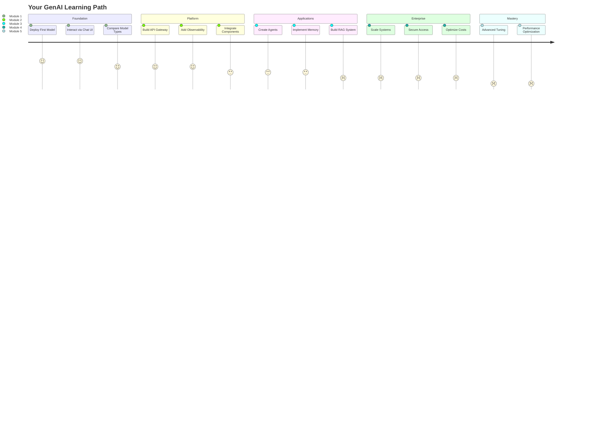

# Introduction

Welcome to the frontier of artificial intelligence on Kubernetes! This workshop represents the convergence of two transformative technologies: **Generative AI** and **Amazon EKS**. Together, they enable you to build scalable AI systems that can transform how organizations work.

## 🌟 Why GenAI on EKS?

The explosion of Large Language Models has created unprecedented opportunities - and challenges. Organizations need to:

- **Deploy models efficiently** while controlling costs
- **Scale dynamically** based on demand
- **Maintain security** and compliance
- **Monitor performance** and quality
- **Integrate seamlessly** with existing systems

Amazon EKS provides an excellent platform for these requirements, offering:

::::tabs

:::tab{label="Scalability"}
**Elastic Infrastructure**
- Auto-scaling based on demand
- Support for specialized hardware (GPUs, Neuron)
- Distributed inference capabilities
- Multi-region deployment options
:::

:::tab{label="Flexibility"}
**Choice and Control**
- Self-hosted open-source models
- Managed cloud services integration
- Hybrid deployment patterns
- Custom optimization strategies
:::

:::tab{label="Operations"}
**Operational Excellence**
- Comprehensive observability
- Automated lifecycle management
- Cost optimization tools
- Security best practices
:::

::::

## 🎯 Workshop Philosophy

This workshop follows three core principles:

### 1. **Learn by Doing** 🛠️
Every concept is immediately reinforced with hands-on exercises. You won't just read about LLMs - you'll deploy them, optimize them, and build applications with them.

### 2. **Enterprise-First** 🏭
We use real enterprise patterns from day one. The techniques you learn here are the same ones used by leading AI companies and AWS customers worldwide.

### 3. **Progressive Complexity** 📈
We start with simple model deployment and gradually build to sophisticated multi-agent systems. Each module prepares you for the next level of complexity.

## 🗺️ Your GenAI Journey Map

## 🏗️ What We're Building

Throughout this workshop, you'll construct a complete GenAI platform with these capabilities:

### **Model Serving Layer**
- Self-hosted models on AWS Neuron hardware
- Integration with AWS Bedrock managed services
- Unified API access through LiteLLM
- Automatic failover and load balancing

### **Application Layer**
- Intelligent agents with reasoning capabilities
- Retrieval-Augmented Generation (RAG) systems
- Memory stores for context persistence
- Tool integration via Model Context Protocol

### **Operations Layer**
- Comprehensive observability with Langfuse
- Cost tracking and optimization
- Performance monitoring and alerting
- Security and compliance controls

## 🔍 What Sets This Workshop Apart?

### **Comprehensive Coverage**
From infrastructure to applications, we cover the entire GenAI stack on Kubernetes.

### **Current Technology**
Work with the latest models and frameworks (LangChain, MCP).

### **AWS Integration**
Leverage AWS-specific optimizations like Neuron chips and Bedrock services.

### **Enterprise Patterns**
Learn patterns used by AWS customers running GenAI at scale.

### **Hands-On Experience**
Over 20 practical exercises with immediate feedback.

## 🚀 By the End of Today

You will have:

✅ **Deployed** multiple LLMs with different optimization strategies

✅ **Built** a unified platform for model management

✅ **Created** intelligent applications with advanced capabilities

✅ **Implemented** enterprise-grade security and scaling

✅ **Mastered** cost optimization for AI workloads

## 💭 A Note on Innovation

Generative AI is evolving at an unprecedented pace. The foundations you learn today will enable you to adapt to tomorrow's innovations. We focus on:

- **Principles** that transcend specific models
- **Patterns** that scale with your needs
- **Practices** that ensure operational success

## ⚡ Infrastructure Already Deployed

::alert[**Good news!** All infrastructure has been pre-deployed. You can dive straight into the exciting parts - deploying models and building applications!]{type="success"}

Your environment includes:
- ✅ EKS cluster with Auto Mode enabled
- ✅ Specialized node pools (GPU, Neuron)
- ✅ GenAI platform components installed
- ✅ Networking and security configured
- ✅ Observability stack ready

## 🎬 Ready to Start?

The world of GenAI on Kubernetes awaits. Whether you're building the next breakthrough application or optimizing existing systems, this workshop provides the knowledge and hands-on experience you need.

Your journey from LLM basics to sophisticated agent systems begins now!

---

**[Continue to Getting Started →](/introduction/getting-started/)**
