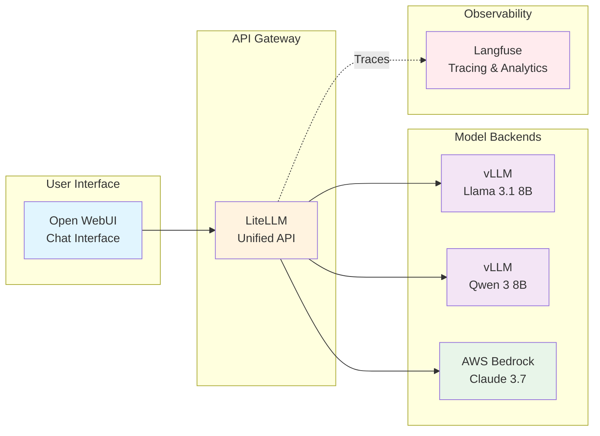

Welcome to a hands-on GenAI workshop where you'll build a complete AI platform on Amazon EKS! In the next few hours, you'll deploy real Large Language Models, create a unified AI gateway, and build intelligent applications - all using scalable patterns that you can take home and deploy in your own AWS account.

## 🎯 What You'll Build

By the end of this workshop, you'll have a fully functional GenAI platform running on EKS:

- **Chat with real AI models** including Llama 3.1 running on AWS Neuron and Claude 3.7 via Bedrock
- **Unified AI gateway** that routes requests across multiple model providers
- **Complete observability** tracking every AI interaction, cost, and performance metric
- **Intelligent applications** that use your platform to solve real business problems

## 🏗️ Your GenAI Platform Architecture

Here's the platform you'll build together:

**The Flow:**
1. **Users interact** through Open WebUI (like ChatGPT)
2. **Requests route** through LiteLLM (your AI gateway)
3. **Models process** on specialized hardware (Neuron chips) or managed services (Bedrock)
4. **Everything tracked** in Langfuse for cost and performance monitoring

## 🚀 Why EKS for GenAI?

Through this workshop, you'll see how EKS provides an excellent foundation for AI platforms:

::::tabs

:::tab{label="Scalability"}
**Dynamic Infrastructure**
- Auto-scaling based on AI workload demand
- Support for specialized hardware (GPUs, Neuron)
- Distributed inference capabilities
- Multi-model deployment patterns
:::

:::tab{label="Flexibility"}
**Choice and Control**
- Self-hosted open-source models
- Managed cloud services integration
- Hybrid deployment patterns
- Custom optimization strategies
:::

:::tab{label="Operations"}
**Operational Excellence**
- Comprehensive observability with Langfuse
- Automated lifecycle management with Helm
- Cost optimization and tracking
- Security best practices
:::

::::

## 📚 Your Learning Path

### **Module 1: Interacting with Models**
**Experience AI Models on Kubernetes**

You'll start by chatting with real AI models and see them running on EKS:
- Deploy Open WebUI and have your first AI conversation
- Explore vLLM serving Llama 3.1 on AWS Neuron hardware
- Connect to Claude 3.7 via AWS Bedrock and compare capabilities
- Watch your models process requests in real-time with kubectl

### **Module 2: GenAI Platform Components**
**Build Your AI Infrastructure**

Transform individual models into a unified, observable platform:
- Explore LiteLLM as your AI gateway routing requests across models
- Use Langfuse to track every AI interaction with detailed metrics
- Add new models to your platform through configuration
- Monitor costs, performance, and usage patterns in real-time

### **Module 3: Building GenAI Applications**
**From Platform to Intelligent Applications**

Use your platform to build real AI applications:
- Deploy "Loan Buddy" - an intelligent loan processing application
- See how AI agents use your platform to make business decisions
- Watch complex workflows execute with full traceability in Langfuse
- Experience how platforms enable rapid AI application development

## 🏗️ Built on the AWS GenAI Starter Kit

This workshop leverages the **[AWS GenAI on EKS Starter Kit](https://github.com/aws-samples/sample-genai-on-eks-starter-kit)** - a comprehensive reference architecture that you can use to deploy similar platforms in your own AWS account.

**What this means for you:**
- All patterns you learn are battle-tested and scalable
- You can deploy the same infrastructure in your own environment
- The starter kit provides Terraform, Helm charts, and documentation
- Your learning translates directly to real-world deployments

## 🎬 Ready to Start?

The world of GenAI on Kubernetes awaits. Whether you're building your first AI application or optimizing existing systems, this workshop provides the hands-on experience and practical patterns you need.

Your journey from individual models to a complete AI platform begins now!

---

**[Continue to Getting Started →](/introduction/getting-started/)**
