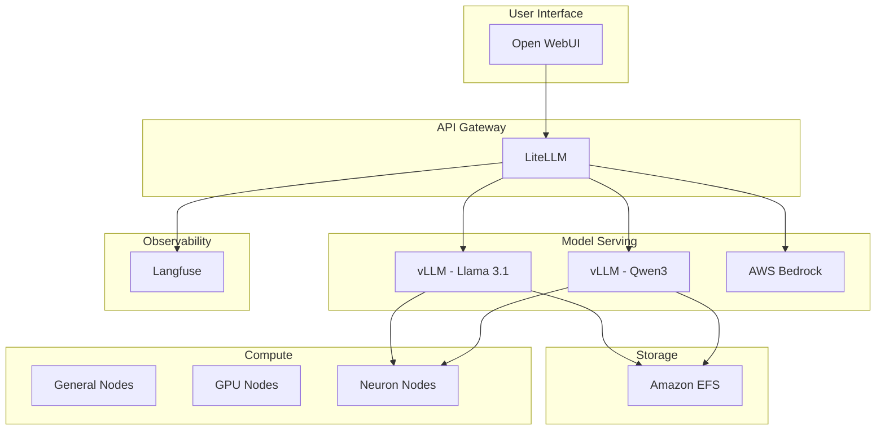

# Infrastructure Setup

Welcome to the EKS GenAI Workshop! Before diving into building and deploying GenAI applications, let's explore the infrastructure that has been pre-configured for you. This workshop environment provides a ready to go foundation for running generative AI workloads on Amazon EKS.

::alert[All infrastructure components have been pre-deployed and configured. You can focus entirely on learning and experimenting with GenAI applications without worrying about setup complexities.]{type="success"}

## Pre-Configured Infrastructure Overview

Your workshop environment includes a fully operational Amazon EKS cluster with the following components:

### 🚀 Amazon EKS Cluster with Auto Mode

The workshop uses **Amazon EKS Auto Mode**, a managed AWS Kubernetes Service that eliminates the operational overhead of managing compute, storage, and networking resources.

#### What is EKS Auto Mode?

EKS Auto Mode provides a fully managed Kubernetes experience where AWS handles:

- **Automatic compute provisioning** - No need to manually create or manage EC2 instances
- **Dynamic scaling** - Automatically adjusts capacity based on workload demands
- **Patch management** - Automated OS and Kubernetes component updates
- **Cost optimization** - Intelligent instance selection and Spot instance integration

:::code{language=bash showCopyAction=true}
# View your EKS cluster details
kubectl cluster-info

# Check the EKS Auto Mode configuration
kubectl get nodes -L eks.amazonaws.com/compute-type
:::

### 💻 Node Pools Configuration

Your cluster includes specialized node pools optimized for different workload types:

#### 1. **General Purpose Nodes**
- **Instance Types**: Mixed instances (t3, m5, c5 families)
- **Purpose**: Running general workloads, web services, and control plane components
- **Scaling**: Automatically scales based on pod requirements

#### 2. **GPU-Accelerated Nodes** 
- **Instance Types**: g5 instances with NVIDIA GPUs
- **Purpose**: Running GPU-intensive AI/ML workloads
- **Features**: CUDA support, GPU operator pre-installed

#### 3. **AWS Neuron Nodes**
- **Instance Types**: inf2 and trn1 instances
- **Purpose**: Optimized inference for large language models
- **Benefits**: 
  - Up to 50% lower cost per inference compared to GPUs
  - Pre-compiled models for optimal performance
  - Native int8 quantization support

:::code{language=bash showCopyAction=true}
# View available node pools and their configurations
kubectl get nodepools -o wide

# Check node labels to see specialized hardware
kubectl get nodes --show-labels | grep -E "node.kubernetes.io/instance-type|karpenter.sh/capacity-type"
:::

### 📦 Storage Configuration

The cluster uses **Amazon EFS** (Elastic File System) for persistent storage, providing:

#### EFS Storage Class Features:
- **Shared Storage**: Multiple pods can read/write simultaneously
- **Elastic Throughput Mode**: Automatically scales performance based on workload
- **Model Caching**: Pre-downloaded models stored in EFS for fast deployment
- **Cross-AZ Availability**: High availability across multiple availability zones

:::code{language=bash showCopyAction=true}
# View available storage classes
kubectl get storageclass

# Check EFS persistent volumes
kubectl get pv | grep efs
:::

::alert[The EFS storage is pre-configured with model caches for Llama 3.1 and Qwen3 models, significantly reducing deployment time for new model instances.]{type="info"}

### 🎯 Pre-Installed GenAI Stack

The following GenAI components have been deployed and are ready for use:

#### **1. Open WebUI** 🌐
A feature-rich web interface for interacting with large language models.

- **URL**: Available at your workshop domain
- **Features**: Chat interface, conversation history, model switching
- **Integration**: Pre-configured to work with LiteLLM gateway

#### **2. LiteLLM** 🔄
A unified API gateway that provides a single interface to multiple LLM providers.

- **Purpose**: Standardizes API calls across different model providers
- **Supported Models**: vLLM, AWS Bedrock, OpenAI-compatible endpoints
- **Load Balancing**: Automatically distributes requests across available models

#### **3. Langfuse** 📊
Comprehensive observability platform for LLM applications.

- **Monitoring**: Track token usage, latency, and costs
- **Debugging**: Trace individual requests through the entire stack
- **Analytics**: Understand model performance and user interactions

#### **4. vLLM** ⚡
High-performance inference engine for large language models.

- **Pre-loaded Models**:
  - Llama 3.1 8B (INT8 quantized for Neuron)
  - Qwen3 8B (FP8 quantized for Neuron)
- **Optimization**: Continuous batching, PagedAttention, tensor parallelism
- **Hardware Acceleration**: Optimized for AWS Neuron chips

:::code{language=bash showCopyAction=true}
# Check deployed GenAI components
kubectl get pods -A | grep -E "litellm|langfuse|openwebui|vllm"

# View service endpoints
kubectl get svc -A | grep -E "litellm|langfuse|openwebui|vllm"
:::

## Architecture Diagram

## What's Next?

Now that you understand the infrastructure foundation, you're ready to explore the GenAI ecosystem through hands-on modules:

- **Module 1: GenAI Model Hosting & Interaction** - Deploy and optimize LLMs using vLLM on EKS, explore AWS Bedrock integration, and interact with models through Open WebUI's intuitive chat interface

- **Module 2: GenAI Platform Components** - Deep dive into observability with Langfuse for monitoring and debugging, and implement unified API management with LiteLLM

- **Module 3: Building GenAI Applications** - Create production-ready applications using LangChain, implement RAG patterns, and build intelligent agents

- **Module 4: Securing and Scaling Agents** - Implement enterprise security patterns, scale agentic systems, and optimize for production workloads

::alert[Each module builds upon the previous one, creating a comprehensive understanding of GenAI on EKS from infrastructure to production deployment.]{type="info"}

## Quick Verification

Let's verify that all components are running correctly:

:::code{language=bash showCopyAction=true}
# Check cluster status
kubectl get nodes

# Verify GenAI stack is running
kubectl get pods -n vllm
kubectl get pods -n litellm
kubectl get pods -n langfuse
kubectl get pods -n openwebui
:::

## Key Takeaways

::::tabs

:::tab{label="Infrastructure"}
✅ **EKS Auto Mode** handles all infrastructure complexity

✅ **Specialized node pools** optimize for different workload types

✅ **EFS storage** provides shared, scalable storage for models
:::

:::tab{label="GenAI Stack"}
✅ **Open WebUI** provides user-friendly chat interface

✅ **LiteLLM** unifies access to multiple model providers

✅ **Langfuse** enables comprehensive observability

✅ **vLLM** delivers high-performance model serving
:::

:::tab{label="Benefits"}
✅ **Zero setup time** - Focus on learning, not configuration

✅ **Production-ready** - Same patterns used in real deployments

✅ **Cost-optimized** - Leverages Spot instances and Neuron chips

✅ **Fully integrated** - All components work together seamlessly
:::

::::

---

**Ready to start building?** Let's move on to the next section where we'll begin working with these powerful GenAI tools!
