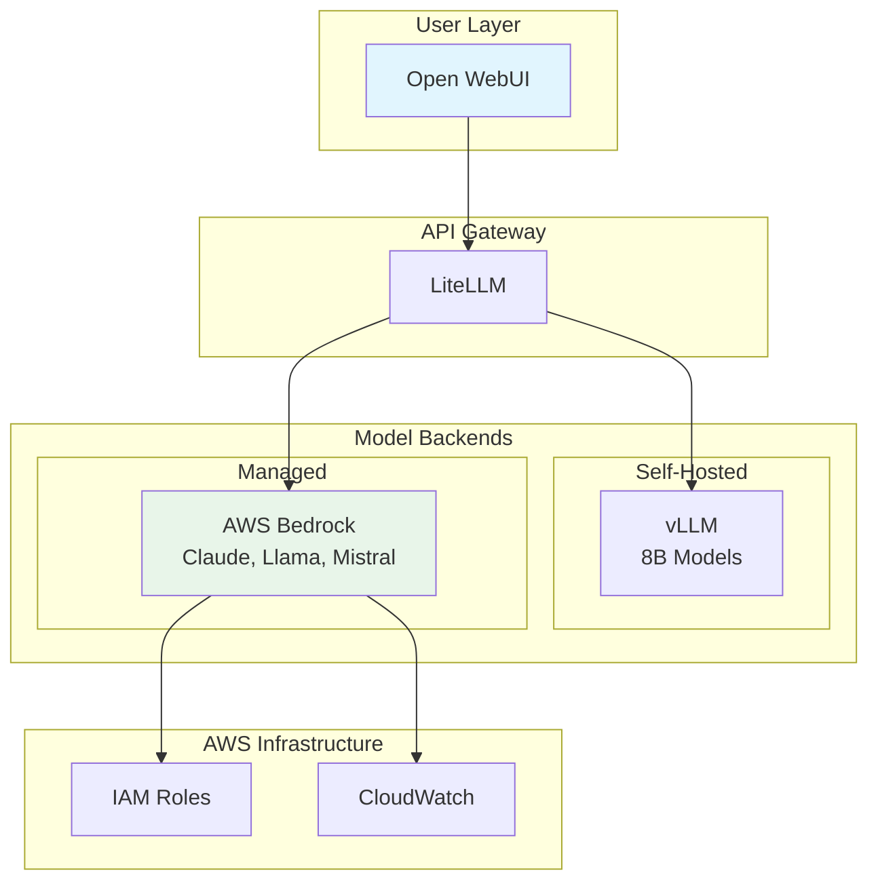

# AWS Bedrock - Managed AI Services

AWS Bedrock is a fully managed service that provides access to high-performing foundation models from leading AI companies through a single API. In this section, you'll configure access to Claude 3.7 Sonnet and experience the performance difference compared to self-hosted models.

## What is AWS Bedrock?

Amazon Bedrock offers:

- 🚀 **Instant Access**: No infrastructure to manage or models to deploy
- 🎯 **Top-Tier Models**: Claude (Anthropic), Llama (Meta), Mistral, Amazon Titan, and more
- 💰 **Pay-Per-Use**: Only pay for tokens processed, no idle costs
- 🔒 **Enterprise Security**: Data privacy, compliance, and governance built-in
- ⚡ **High Performance**: Optimized infrastructure with consistent low latency
- 🛠️ **Additional Features**: Fine-tuning, RAG, agents, and guardrails

## Why Use Bedrock in This Workshop?

While self-hosting models on EKS provides full control and customization, Bedrock offers:

1. **Superior Performance**: No cold starts, instant responses
2. **Latest Models**: Access to Claude 3.7 Sonnet with 200K context window
3. **No Resource Constraints**: Not limited by workshop hardware
4. **Cost Efficiency**: For intermittent use, pay-per-token is often cheaper

::alert[**Recommendation**: After trying both vLLM and Bedrock, we recommend using Bedrock (Claude 3.7 Sonnet) for the remainder of the workshop due to its superior performance and capabilities.]{type="success"}

## Enabling Bedrock Model Access

Before using Bedrock models, you need to enable access in your AWS account. Follow these steps:

### Step 1: Access AWS Console

:::code{language=bash showCopyAction=true}
# Get your AWS Console URL (provided by Workshop Studio)
echo "AWS Console: https://console.aws.amazon.com"

# Verify your current region
aws configure get region
:::

### Step 2: Navigate to Bedrock

1. In the AWS Console, search for **"Bedrock"** in the top search bar
2. Click on **"Amazon Bedrock"** service
3. You'll land on the Bedrock console homepage

### Step 3: Request Model Access

1. In the left sidebar, click **"Model access"** under "Bedrock configurations"
2. You'll see a list of available model providers
3. Find **"Anthropic"** section
4. Click **"Manage model access"** button (top right)

### Step 4: Enable Claude Models

1. In the model access page, locate **Claude 3.7 Sonnet**
2. Check the box next to:
   - ✅ **Claude 3.7 Sonnet** (us.anthropic.claude-3-7-sonnet-20250219-v1:0)
3. Scroll down and click **"Request model access"**
4. Review and click **"Submit"**

::alert[**Note**: Model access is typically granted instantly. You should see "Access granted" status within seconds.]{type="info"}

### Step 5: Verify Access

:::code{language=bash showCopyAction=true}
# List available Bedrock models
aws bedrock list-foundation-models \
  --query "modelSummaries[?contains(modelId, 'claude')].{ID:modelId, Name:modelName}" \
  --output table

# Test Claude 3.7 Sonnet directly
aws bedrock-runtime invoke-model \
  --model-id us.anthropic.claude-3-7-sonnet-20250219-v1:0 \
  --content-type application/json \
  --accept application/json \
  --body '{
    "anthropic_version": "bedrock-2023-05-31",
    "max_tokens": 100,
    "messages": [
      {
        "role": "user",
        "content": "Hello! Please respond with a brief greeting."
      }
    ]
  }' \
  response.json

# View the response
cat response.json | jq -r '.content[0].text'
:::

## Using Bedrock Models in Open WebUI

Once model access is enabled, Bedrock models automatically appear in Open WebUI through LiteLLM:

### Step 1: Access Open WebUI

1. Navigate to `https://openwebui.${DOMAIN}`
2. Log in with your credentials

### Step 2: Select Bedrock Model

1. Click the model dropdown at the top of the chat
2. Look for **"claude-3.7-sonnet"** (it should appear automatically)
3. Select it as your active model

### Step 3: Test Claude 3.7 Sonnet

Try these prompts to experience Claude's capabilities:

:::code{language=markdown showCopyAction=true}
# Test advanced reasoning
"Explain the concept of Kubernetes operators and provide a simple example of when you would create a custom operator."

# Test code generation with explanation
"Write a Python class that implements a simple LRU cache with get and put methods. Explain the time complexity of each operation."

# Test long-form content
"Create a detailed comparison table between self-hosted LLMs on Kubernetes and managed services like AWS Bedrock. Include at least 8 comparison criteria."

# Test creative + technical
"Write a haiku about Kubernetes, then explain what makes it technically accurate."
:::

## Performance Comparison

Let's compare the performance between self-hosted vLLM and Bedrock:

### Quick Benchmark

Try this same prompt on both models:

:::code{language=markdown showCopyAction=true}
"Generate a Python script that:
1. Connects to a Kubernetes cluster
2. Lists all pods in all namespaces
3. Outputs their status in a formatted table
Include error handling and comments."
:::

### Measure the Differences

| Metric | vLLM (Llama 3.1 8B) | Bedrock (Claude 3.7) |
|--------|---------------------|---------------------|
| **First Token Latency** | 3-5 seconds | <1 second |
| **Tokens per Second** | 10-15 | 50-80 |
| **Context Window** | 8,192 tokens | 200,000 tokens |
| **Response Quality** | Good | Excellent |
| **Code Accuracy** | Good | Excellent |
| **Availability** | 99% (if pods running) | 99.99% |

### Why Such a Difference?

1. **Hardware**: Bedrock runs on optimized infrastructure vs our inf2.xlarge
2. **Model Size**: Claude 3.7 is a much larger, more capable model
3. **Optimization**: Bedrock's infrastructure is highly optimized for inference
4. **No Cold Starts**: Models are always warm in Bedrock

## Advanced Features: RAG in Open WebUI

Open WebUI includes basic RAG (Retrieval Augmented Generation) capabilities. Let's try it:

### Step 1: Enable RAG

1. In Open WebUI, click the **"+"** button next to the message input
2. Select **"Upload Files"**
3. You can upload PDF, TXT, or MD files

### Step 2: Test Document Q&A

1. Create a test document locally:

:::code{language=bash showCopyAction=true}
cat > kubernetes-basics.txt << 'EOF'
Kubernetes Components:

Master Node Components:
- API Server: Central management point, exposes Kubernetes API
- etcd: Distributed key-value store for cluster data
- Scheduler: Assigns pods to nodes based on resource requirements
- Controller Manager: Runs controller processes

Worker Node Components:
- Kubelet: Ensures containers are running in pods
- Container Runtime: Docker, containerd, or CRI-O
- Kube-proxy: Maintains network rules for pod communication

Key Resources:
- Pod: Smallest deployable unit, contains one or more containers
- Service: Provides stable network endpoint for pods
- Deployment: Manages replica sets and pod updates
- ConfigMap: Stores configuration data
- Secret: Stores sensitive data like passwords
EOF
:::

2. Upload this file to Open WebUI
3. Ask questions about the document:

:::code{language=markdown showCopyAction=true}
"Based on the document, what is the role of the Kubernetes Scheduler?"

"What are the main components that run on a worker node?"

"Explain the difference between a ConfigMap and a Secret."
:::

### Step 3: Compare RAG Performance

- **With vLLM**: RAG works but responses are slower
- **With Bedrock**: Fast retrieval and high-quality synthesis

## Cost Considerations

### Bedrock Pricing (Claude 3.7 Sonnet)
- **Input**: $0.003 per 1K tokens
- **Output**: $0.015 per 1K tokens
- **Example**: A typical workshop session (~10K tokens) costs ~$0.15

### Self-Hosted vLLM
- **inf2.xlarge**: ~$0.75/hour
- **Break-even**: Need to process >500K tokens/hour to justify self-hosting
- **Additional costs**: Storage, networking, management overhead

For workshop purposes, Bedrock is significantly more cost-effective!

## Best Practices with Bedrock

### 1. **Model Selection**
- Use Claude 3.7 Sonnet for complex reasoning and code
- Consider Claude 3.5 Haiku for simple, fast responses
- Use Llama models for open-source compatibility

### 2. **Prompt Engineering**
Claude responds well to:
- Clear, structured instructions
- Examples (few-shot prompting)
- XML tags for organization
- Chain-of-thought reasoning

### 3. **Token Optimization**
- Be concise in prompts
- Use system prompts efficiently
- Set appropriate max_tokens limits

## Integration Architecture

Here's how Bedrock integrates with our stack:



## Troubleshooting

::::tabs

:::tab{label="Model Not Appearing"}
```bash
# Check if model access is granted
aws bedrock list-foundation-models \
  --query "modelSummaries[?contains(modelId, 'claude-3-7')]"

# Restart LiteLLM to refresh model list
kubectl rollout restart deployment/litellm -n litellm

# Check LiteLLM logs
kubectl logs -n litellm deployment/litellm --tail=50
```
:::

:::tab{label="Access Denied"}
```bash
# Verify IAM permissions
aws sts get-caller-identity

# Check if Bedrock InvokeModel permission exists
aws iam get-role-policy --role-name <your-role> --policy-name <policy>

# Required permission:
# bedrock:InvokeModel on resource: arn:aws:bedrock:*::foundation-model/*
```
:::

:::tab{label="Slow Responses"}
- Check your AWS region - use the closest region
- Verify network connectivity
- Consider token limits in your requests
- Check CloudWatch for throttling
:::

::::

## Key Takeaways

✅ **Instant Deployment**: No infrastructure to manage, models ready immediately

✅ **Superior Performance**: 5-10x faster than self-hosted on workshop hardware

✅ **Latest Models**: Access to Claude 3.7 with 200K context window

✅ **Cost Effective**: Pay-per-use model ideal for variable workloads

✅ **Enterprise Ready**: Built-in security, compliance, and governance

## Module Summary

Congratulations! You've now experienced three different approaches to model deployment:

1. **Open WebUI**: Unified chat interface for all models
2. **vLLM**: Self-hosted models with full control but hardware constraints
3. **Bedrock**: Managed service with superior performance and capabilities

### Recommendation for Remaining Workshops

**Use Bedrock (Claude 3.7 Sonnet)** for the best experience:
- Faster responses for better productivity
- Higher quality outputs for complex tasks
- No infrastructure concerns
- Cost-effective for workshop usage

### What You've Learned

- How to deploy and configure LLM infrastructure on Kubernetes
- The trade-offs between self-hosted and managed models
- How to integrate multiple model providers through a unified API
- The importance of hardware selection for AI workloads
- Cost and performance optimization strategies

---

**[Back to Module Overview](../) | [Continue to Module 2 →](../../module2-genai-platform-components)**
