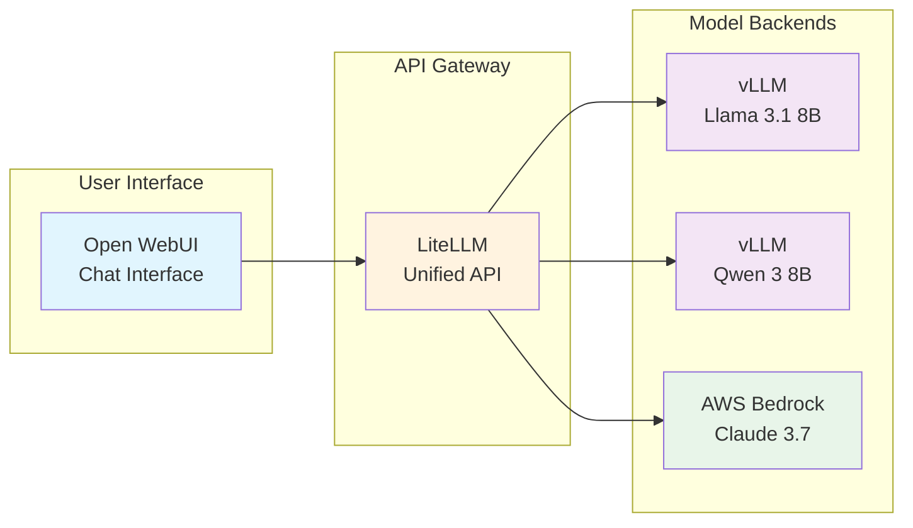

Welcome to the first hands-on module of the EKS GenAI Workshop! In this module, you'll learn how to interact with Large Language Models (LLMs) through different deployment patterns on Amazon EKS. You'll explore both self-hosted models running on specialized AWS hardware and cloud-managed models through AWS Bedrock.

## Learning Objectives

By the end of this module, you will:

- 🎯 **Understand model deployment patterns** on Kubernetes
- 💬 **Interact with LLMs** through a modern chat interface (Open WebUI)
- ⚡ **Deploy and optimize models** using vLLM on AWS Neuron hardware
- ☁️ **Integrate cloud-managed models** via AWS Bedrock
- 🔧 **Understand the Kubernetes resources** required for LLM hosting

## Module Overview

This module is structured into three progressive sections:

#### 1. [Open WebUI - Your Chat Interface](./openwebui)
Start by exploring the user interface that connects you to various LLM backends. Learn how we deployed Open WebUI using Helm charts and configured it to work with our model infrastructure.

#### 2. [vLLM - Self-Hosted Model Serving](./vllm)
Dive deep into hosting your own LLMs on EKS. Examine the Kubernetes manifests, understand Neuron optimization, and interact with Llama 3.1 8B running on AWS Inferentia chips.

#### 3. [AWS Bedrock - Managed AI Services](./bedrock)
Experience the power of fully-managed AI services. Configure access to Claude 3.7 Sonnet and compare its performance with self-hosted models.

## Architecture Context

## Prerequisites Check

Before starting, let's verify your environment is ready:

:::code{language=bash showCopyAction=true}
# Check that all components are running
kubectl get pods -n openwebui
kubectl get pods -n vllm
kubectl get pods -n litellm

# Get the Open WebUI URL
echo "Open WebUI URL: http://$(kubectl get ingress -n openwebui openwebui -o jsonpath='{.status.loadBalancer.ingress[0].hostname}')"
:::

## Let's Get Started!

Ready to interact with cutting-edge AI models? Let's begin by exploring the Open WebUI interface that will be your gateway to these powerful language models.

::alert[**Tip**: Keep Open WebUI open in a browser tab throughout this module - you'll use it to test each model backend as we explore them.]{type="info"}

---

**[Next: Open WebUI - Your Chat Interface →](./openwebui)**
