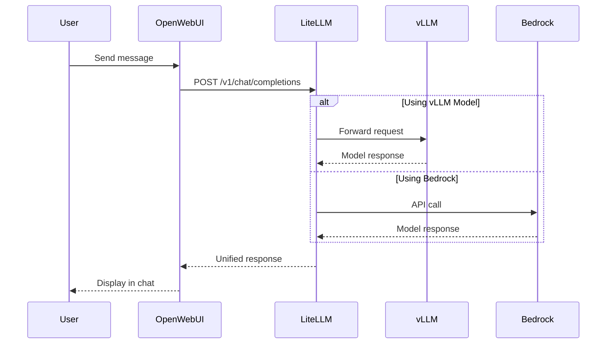

# Open WebUI - Your Chat Interface

Open WebUI is a feature-rich, self-hosted web interface for interacting with Large Language Models. In this workshop, we've deployed Open WebUI to provide you with an intuitive chat interface that connects to multiple model backends through LiteLLM.

## What is Open WebUI?

Open WebUI (formerly known as Ollama WebUI) is an open-source project that provides:

- 🎨 **Modern Chat Interface**: Clean, responsive design similar to ChatGPT
- 🔄 **Multi-Model Support**: Switch between different models seamlessly
- 💾 **Conversation Management**: Save, organize, and search chat histories
- 📎 **File Uploads**: Support for documents and images (when models support it)
- 🎯 **Prompt Templates**: Pre-configured prompts for common tasks
- 👥 **Multi-User Support**: Individual accounts with personalized settings

## How We Deployed Open WebUI

Let's examine how Open WebUI was deployed in your workshop environment using Helm charts.

### Helm Chart Configuration

We used the official Open WebUI Helm chart with custom values to integrate it with our infrastructure:

:::code{language=yaml showCopyAction=true}
# values.template.yaml - Key configurations
nameOverride: openwebui

# Ingress configuration for AWS Load Balancer
ingress:
  enabled: true
  annotations:
    alb.ingress.kubernetes.io/target-type: ip
    alb.ingress.kubernetes.io/listen-ports: '[{"HTTPS":443}]'
  host: openwebui.${DOMAIN}

# Connection to LiteLLM API Gateway
openaiBaseApiUrl: http://litellm.litellm:4000/v1
extraEnvVars:
  - name: OPENAI_API_KEY
    value: ${LITELLM_API_KEY}

# Disable local Ollama (using external models)
ollama:
  enabled: false
pipelines:
  enabled: false

# Persistent storage for conversations
persistence:
  enabled: true
  size: 100Gi

# Resource allocation
resources:
  requests:
    cpu: 1 
    memory: 2Gi
  limits:
    memory: 2Gi
:::

### Key Configuration Decisions

#### 1. **LiteLLM Integration**
Instead of connecting directly to model endpoints, Open WebUI connects to LiteLLM:
- **Unified API**: Single endpoint for all models
- **Load Balancing**: Automatic distribution across model replicas
- **Fallback Support**: Seamless switching between models

::alert[LiteLLM acts as an API gateway, providing a unified OpenAI-compatible interface to all our models. We'll explore LiteLLM in detail in Module 2.]{type="info"}

#### 2. **AWS Load Balancer Integration**
The ingress configuration creates an Application Load Balancer (ALB):
- **HTTPS Termination**: SSL/TLS handled at the load balancer
- **Target Type IP**: Direct pod networking for better performance
- **Custom Domain**: Accessible at `https://openwebui.${DOMAIN}`

#### 3. **Persistent Storage**
100Gi of EFS storage ensures:
- **Conversation History**: All chats are preserved
- **User Settings**: Preferences persist across sessions
- **Shared Access**: Multiple pods can access the same data

### Deployment Process

The actual deployment was executed using Helm:

:::code{language=bash showCopyAction=true}
# Add the Open WebUI Helm repository
helm repo add open-webui https://open-webui.github.io/helm-charts
helm repo update

# Install Open WebUI with custom values
helm upgrade --install openwebui open-webui/open-webui \
  --namespace openwebui \
  --create-namespace \
  -f values.rendered.yaml
:::

## Accessing Open WebUI

Let's access the Open WebUI interface:

:::code{language=bash showCopyAction=true}
# Get the Open WebUI URL
echo "Open WebUI URL: https://openwebui.${DOMAIN}"

# Check if the pod is running
kubectl get pods -n openwebui

# View the service details
kubectl get svc -n openwebui
:::

::alert[**First Time Access**: When you first access Open WebUI, you'll need to create an account. Use any email/password combination - this is local authentication within the workshop environment.]{type="warning"}

## Interface Tour

Once logged in, explore these key features:

### 1. **Model Selection**
- Click the model dropdown at the top of the chat
- You'll see available models from vLLM and Bedrock
- Models are automatically discovered through LiteLLM

### 2. **Chat Interface**
- **New Chat**: Click the "+" button to start fresh
- **Message Editing**: Hover over messages to edit or regenerate
- **Code Blocks**: Automatic syntax highlighting and copy buttons
- **Markdown Support**: Full markdown rendering in responses

### 3. **Settings & Customization**
Access settings through the gear icon:
- **Theme**: Light/dark mode toggle
- **Model Parameters**: Temperature, max tokens, etc.
- **System Prompts**: Default instructions for models

### 4. **Conversation Management**
- **Search**: Find previous conversations
- **Folders**: Organize chats by topic
- **Export**: Download conversations as JSON or Markdown

## Testing the Connection

Let's verify Open WebUI can communicate with our models:

1. **Open the Interface**: Navigate to `https://openwebui.${DOMAIN}`
2. **Create an Account**: Sign up with any credentials
3. **Start a Chat**: Click "New Chat"
4. **Select a Model**: Choose "llama-3-1-8b-int8-neuron" from the dropdown
5. **Send a Test Message**: Try "Hello! Can you tell me about yourself?"

::alert[The first response might be slow as the model loads into memory. Subsequent responses will be faster.]{type="info"}

## Architecture Integration

Here's how Open WebUI fits into our GenAI stack:



## Troubleshooting

If you encounter issues:

::::tabs

:::tab{label="Connection Issues"}
```bash
# Check if Open WebUI pod is running
kubectl get pods -n openwebui

# View pod logs
kubectl logs -n openwebui deployment/openwebui

# Test internal connectivity
kubectl run test-curl --image=curlimages/curl -it --rm -- \
  curl http://openwebui.openwebui:80
```
:::

:::tab{label="Model Not Appearing"}
```bash
# Verify LiteLLM connection
kubectl exec -n openwebui deployment/openwebui -- \
  curl http://litellm.litellm:4000/v1/models

# Check LiteLLM is running
kubectl get pods -n litellm
```
:::

:::tab{label="Slow Performance"}
- First requests are slow due to model loading
- Check if vLLM pods are running: `kubectl get pods -n vllm`
- Consider switching to Bedrock models for faster responses
:::

::::

## Key Takeaways

✅ **Helm Deployment**: Open WebUI deployed via official Helm chart with custom values

✅ **LiteLLM Integration**: Connected to unified API gateway instead of direct model endpoints

✅ **AWS Integration**: Uses ALB for ingress and EFS for persistent storage

✅ **Production Patterns**: Configuration follows best practices for Kubernetes deployments

## What's Next?

Now that you understand the chat interface, let's explore the model serving infrastructure behind it. In the next section, we'll dive deep into vLLM and see how Llama 3.1 is served on AWS Neuron hardware.

---

**[Next: vLLM - Self-Hosted Model Serving →](../vllm)**
