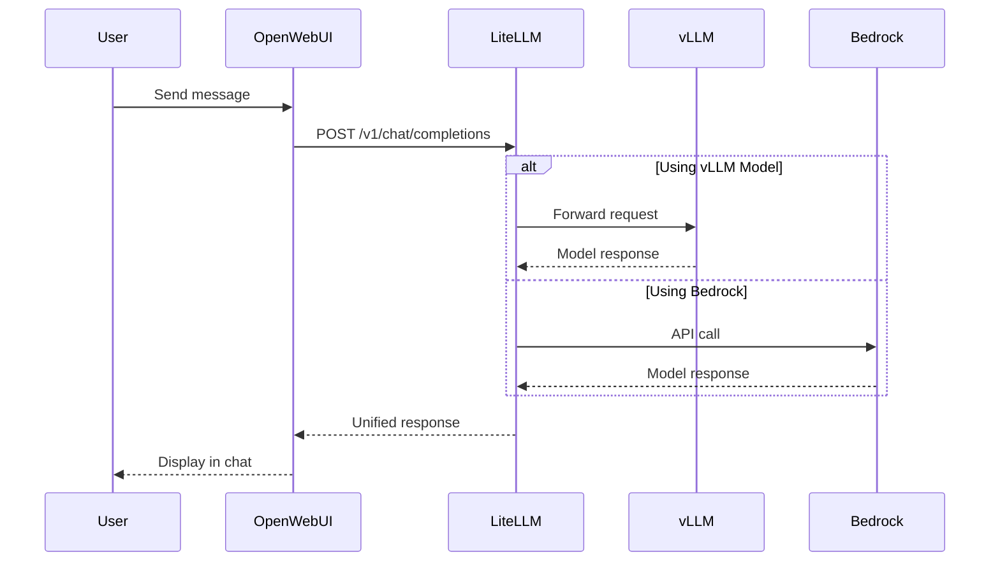

Open WebUI is a feature-rich, self-hosted web interface for interacting with Large Language Models. In this workshop, we've deployed Open WebUI to provide you with an intuitive chat interface that connects to multiple model backends through LiteLLM.

## What is Open WebUI?

Open WebUI (formerly known as Ollama WebUI) is an open-source project that provides:

- 🎨 **Modern Chat Interface**: Clean, responsive design similar to ChatGPT
- 🔄 **Multi-Model Support**: Switch between different models seamlessly
- 💾 **Conversation Management**: Save, organize, and search chat histories
- 📎 **File Uploads**: Support for documents and images (when models support it)
- 🎯 **Prompt Templates**: Pre-configured prompts for common tasks
- 👥 **Multi-User Support**: Individual accounts with personalized settings

## How We Deployed Open WebUI

We used the official [Open Webui Helm chart](https://github.com/open-webui/helm-charts) to deploy Open Webui on our EKS Automode cluster.

::alert[**Helm** is a package manager for Kubernetes that uses 'charts' as its package format. Charts are collections of YAML files that define Kubernetes resources, with support for Go template syntax to generate manifests dynamically. [Learn more about Helm →](https://helm.sh/)]{type="info"}

### Exploring the Helm Chart

You can examine the actual Helm chart configuration used in your VSC IDE:

:::code{language=bash showCopyAction=true}
# View the Open WebUI Helm chart values
cat /workshop/components/gui-app/openwebui/values.template.yaml

# Check deployed Helm releases
helm ls -A | grep openwebui
:::

### Helm Chart Configuration

We used the official Open WebUI Helm chart with custom values to integrate it with our infrastructure:

:::code{language=yaml showCopyAction=true}
# values.template.yaml - Key configurations
nameOverride: openwebui

# Ingress configuration for AWS Load Balancer
ingress:
  enabled: true
  annotations:
    alb.ingress.kubernetes.io/target-type: ip
    alb.ingress.kubernetes.io/listen-ports: '[{"HTTPS":443}]'
  host: openwebui.${DOMAIN}

# Connection to LiteLLM API Gateway
openaiBaseApiUrl: http://litellm.litellm:4000/v1
extraEnvVars:
  - name: OPENAI_API_KEY
    value: ${LITELLM_API_KEY}

# Disable local Ollama (using external models)
ollama:
  enabled: false
pipelines:
  enabled: false

# Persistent storage for conversations
persistence:
  enabled: true
  size: 100Gi

# Resource allocation
resources:
  requests:
    cpu: 1 
    memory: 2Gi
  limits:
    memory: 2Gi
:::

### Key Configuration Decisions

#### 1. **LiteLLM Integration**
Instead of connecting directly to model endpoints, Open WebUI connects to LiteLLM:
- **Unified API**: Single endpoint for all models
- **Load Balancing**: Automatic distribution across model replicas
- **Fallback Support**: Seamless switching between models

::alert[LiteLLM acts as an AI gateway, providing a unified OpenAI-compatible interface to all our models. We'll explore LiteLLM in detail in Module 2.]{type="info"}

#### 2. **AWS Load Balancer Integration**
The ingress configuration creates an Application Load Balancer (ALB):
- **HTTPS Termination**: SSL/TLS handled at the load balancer
- **Target Type IP**: Direct pod networking for better performance
- **Custom Domain**: Accessible at `https://openwebui.${DOMAIN}`. However, in this workshop we do not have a domain thus, we just fallback on the ALB URL.

#### 3. **Persistent Storage**
100Gi of EBS storage (automatically provisioned by EKS Auto Mode) ensures:
- **Conversation History**: All chats are preserved
- **User Settings**: Preferences persist across sessions
- **Reliable Performance**: Consistent I/O performance for the application

::alert[**EKS Auto Mode** automatically provisions EBS storage for persistent volume claims, eliminating the need for manual storage configuration.]{type="info"}

### Deployment Process

The deployment process involves several steps that were executed during infrastructure setup:

::alert[**Note**: These commands were already executed during your environment setup. You don't need to run them again.]{type="success"}

**Step 1: Add Helm Repository**
```bash
helm repo add open-webui https://open-webui.github.io/helm-charts
helm repo update
```

**Step 2: Install with Custom Values**
```bash
helm upgrade --install openwebui open-webui/open-webui \
  --namespace openwebui \
  --create-namespace \
  -f values.rendered.yaml
```

## 🛠️ Hands-On: Your First Chat with an LLM

Let's dive right into interacting with your first Large Language Model! This guided walkthrough will get you chatting with AI in minutes.

### Step 1: Access Open WebUI

:::code{language=bash showCopyAction=true}
# Get the Open WebUI URL
echo "Open WebUI URL: http://$(kubectl get ingress -n openwebui openwebui -o jsonpath='{.status.loadBalancer.ingress[0].hostname}')"
:::

Copy the URL and open it in your browser.

### Step 2: Create Your Account

When you first access Open WebUI, you'll be greeted by a landing page with some inspiring message like "Explore the cosmos wherever you are".


**Click the "Get started" button** at the bottom of the page to proceed to account creation.

This takes you to the account setup form where you'll create your admin account:


**Fill out the account creation form**:

1. **Name**: Enter your preferred display name (e.g., "Workshop User")
2. **Email**: Use any email address - it doesn't need to be real (e.g., `workshop@example.com`)
3. **Password**: Choose any password you'll remember for the workshop
4. **Click "Create Admin Account"** to complete the setup

::alert[**Admin Account**: You're creating the first admin account for this Open WebUI instance. This gives you full control over the interface and settings.]{type="info"}

### Step 3: Select Your Model

Once logged in, you'll see the model selection dropdown at the top:


**Important**: Select **vllm/mistral-7b-int8-neuron** from the dropdown. You'll see several options:
- ✅ **vllm/mistral-7b-int8-neuron** (use this one)
- ✅ **vllm/deepseek-r1-llama-8b-int8-neuron** (also available)
- ❌ **bedrock/claude-3.7-sonnet** (not configured yet - we'll enable this later)

::alert[**Model Selection**: Stick with the vLLM models for now. We'll configure Bedrock access in a future section of this module.]{type="warning"}

### Step 4: Start Your First Conversation

Now for the exciting part - let's chat with the AI!

1. **Click "New Chat"** (if not already in a new chat)
2. **Type your first message** in the "How can I help you today?" box
3. **Try this example**: "What is the strongest creature relative to body size?"
4. **Press Enter** or click the send button

You should see a response similar to this:


Notice how the model provides a detailed, well-structured response about Dung Beetles and Bacteria!

### Step 5: Explore Response Features

After receiving your first response, explore these interface features:

- **📝 Edit**: Hover over messages to edit them
- **📋 Copy**: Copy the response text
- **🔊 Speak**: Have the response read aloud
- **👍 👎**: Rate the response quality
- **➡️ Continue Response**: Ask the model to continue its response if it was cut off
- **🔄 Regenerate**: Get a different response to the same prompt
- **💬 Follow up**: Continue the conversation naturally

### Step 6: Try Model Comparison (Optional)

Want to see how different models respond to the same question?

1. **Click the "+" button** next to the model name
2. **Select a second model** (try "vllm/deepseek-r1-llama-8b-int8-neuron")
3. **Ask the same question** to both models
4. **Compare their responses** side by side

This is a powerful feature for understanding model differences!

## 🎯 Interface Features Deep Dive

Now that you've had your first chat, let's explore the full interface:

### **Conversation Management**
- **Left Sidebar**: Browse your chat history
- **Search**: Find specific conversations
- **Export**: Download conversations as JSON, Plain Text or Markdown

### **Advanced Settings**
Click the gear icon to access:
- **Model Parameters**: Adjust temperature, max tokens, top-p
- **System Prompts**: Set default instructions for the AI
- **Valves**: Allows you to add tools & functions for your models to use

### **File Upload Capabilities**
- **Document Upload**: Upload PDFs, text files for analysis
- **Image Upload**: Share images with vision-capable models
- **Code Files**: Get help with programming projects

## 💡 Suggested Prompts to Try

Get familiar with the model's capabilities:

::::tabs

:::tab{label="General Knowledge"}
```
Explain quantum computing in simple terms
What are the key differences between Kubernetes and Docker?
How does machine learning differ from traditional programming?
```
:::

:::tab{label="Technical Help"}
```
Write a Python function to calculate fibonacci numbers
Explain the benefits of using microservices architecture
What are Kubernetes operators and when would you use them?
```
:::

:::tab{label="Creative Tasks"}
```
Write a haiku about cloud computing
Create a story about a robot learning to code
Explain AI concepts using cooking analogies
```
:::

::::

## Architecture Integration

Here's how Open WebUI fits into our GenAI stack:



## Key Takeaways

✅ **Helm Deployment**: Open WebUI deployed via official Helm chart with custom values

✅ **LiteLLM Integration**: Connected to unified API gateway instead of direct model endpoints

✅ **AWS Integration**: Uses ALB for ingress and EBS for persistent storage

## What's Next?

Now that you understand the chat interface, let's explore the model serving infrastructure behind it. In the next section, we'll dive deep into vLLM and see how Mistral 7b is served on AWS Neuron hardware.

---

**[Next: vLLM - Self-Hosted Model Serving →](../vllm)**
