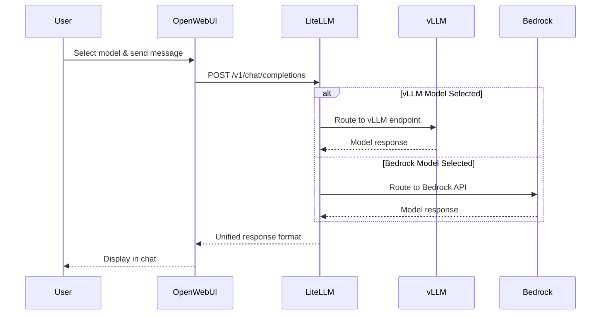

Remember switching between vLLM and Bedrock models in OpenWebUI? That seamless experience is powered by LiteLLM - your AI gateway that's been quietly orchestrating all your model interactions behind the scenes!

## 🛠️ Hands-On: Explore Your API Gateway

Let's discover how LiteLLM has been managing all your model interactions:

### Step 1: See LiteLLM in Action

:::code{language=bash showCopyAction=true}
# Check your running LiteLLM instance
kubectl get pods -n litellm

# Notice the complete stack: LiteLLM + PostgreSQL + Redis
kubectl get all -n litellm
:::

You should see three key components:
- **litellm-xxx**: The main API gateway
- **litellm-postgresql-0**: Database for storing model configurations and usage
- **litellm-redis-master-0**: Caching layer for improved performance

### Step 2: Explore the Real Configuration

In your VSC IDE, let's examine the actual configuration:

:::code{language=bash showCopyAction=true}
# Look at the actual LiteLLM Helm values
cat /workshop/components/ai-gateway/litellm/values.template.yaml

# See how models are dynamically discovered
grep -A 20 "model_list:" /workshop/components/ai-gateway/litellm/values.template.yaml
:::

Notice the Handlebars templating (`{{#each}}`) that automatically discovers and configures models from your vLLM deployments and Bedrock access!

### Step 3: Watch LiteLLM Route Your Requests

Open a second terminal in your VSC IDE and run:

:::code{language=bash showCopyAction=true}
# Monitor LiteLLM processing requests in real-time
kubectl logs -f --tail=0 -n litellm deployment/litellm
:::

Now go back to your OpenWebUI tab and switch between models, then send a message. Watch how LiteLLM routes each request to the appropriate backend!

## What is LiteLLM?

Now that you've seen it in action, let's understand what makes LiteLLM special:

LiteLLM is an open-source proxy that provides:

- 🔄 **Unified API**: Single OpenAI-compatible endpoint for all models
- 🎯 **Smart Routing**: Automatically routes requests to appropriate backends
- 📊 **Built-in Observability**: Integrated with Langfuse for comprehensive tracking
- 💾 **Persistent Storage**: PostgreSQL for configuration, Redis for caching
- 🔒 **Authentication**: Master key authentication and user management
- ⚡ **Load Balancing**: Distributes requests across multiple model replicas

## How LiteLLM Powers Your Experience

Here's what happened every time you switched models in OpenWebUI:



## 🔍 Explore Available Models

Let's see what models LiteLLM is currently managing:

:::code{language=bash showCopyAction=true}
# Get LiteLLM service URL
echo "LiteLLM URL: http://$(kubectl get ingress -n litellm litellm -o jsonpath='{.status.loadBalancer.ingress[0].hostname}')"

# Or use port-forward for direct access
kubectl port-forward -n litellm svc/litellm 4000:4000 &

# List all available models
curl -X GET http://localhost:4000/v1/models \
  -H "Authorization: Bearer $(kubectl get secret -n litellm litellm-secret -o jsonpath='{.data.masterkey}' | base64 -d)"
:::

You should see all the models you've been using:
- **vLLM models**: `vllm/llama-3-1-8b-int8-neuron`, `vllm/qwen3-8b-fp8-neuron`
- **Bedrock models**: `bedrock/claude-3-7-sonnet` (if you enabled it)

## 🎯 LiteLLM Web Interface

LiteLLM provides a web interface for monitoring and management:

:::code{language=bash showCopyAction=true}
# Access the LiteLLM UI (if port-forward is running)
echo "LiteLLM UI: http://localhost:4000"

# Get the UI credentials
echo "Username: $(kubectl get secret -n litellm litellm-secret -o jsonpath='{.data.ui_username}' | base64 -d)"
echo "Password: $(kubectl get secret -n litellm litellm-secret -o jsonpath='{.data.ui_password}' | base64 -d)"
:::

Open the UI in your browser to see:
- **Model Status**: Which models are healthy and available
- **Request Metrics**: Throughput, latency, and error rates
- **Cost Tracking**: Token usage and costs per model
- **Configuration**: Model routing and settings

## 🔍 Technical Deep Dive (Optional)

For those interested in how LiteLLM is configured:

::::tabs

:::tab{label="Architecture"}
**LiteLLM Stack Components**

LiteLLM runs as a complete stack:

:::code{language=yaml showCopyAction=true}
# Core components in the litellm namespace
- LiteLLM Proxy: Main API gateway
- PostgreSQL: Model configurations and usage data
- Redis: Caching layer for improved performance
:::

**Benefits of This Architecture:**
- **Persistence**: Model configurations survive restarts
- **Performance**: Redis caching reduces latency
- **Scalability**: Database-backed configuration supports multiple replicas
:::

:::tab{label="Model Discovery"}
**Dynamic Model Configuration**

LiteLLM uses Handlebars templating for dynamic model discovery:

:::code{language=yaml showCopyAction=true}
# Bedrock models discovered automatically
{{#each integration.bedrock.llm}}
- model_name: bedrock/{{{name}}}
  litellm_params:
    model: bedrock/{{{model}}}
    aws_region_name: {{{@root.integration.bedrock.region}}}
{{/each}}

# vLLM models discovered from running services
{{#each integration.llm-model.vllm}}
- model_name: vllm/{{@key}}
  litellm_params:
    model: openai/{{@key}}
    api_base: http://{{@key}}.vllm:8000/v1
{{/each}}
:::

This means new models are automatically available without manual configuration!
:::

:::tab{label="Observability"}
**Built-in Observability Integration**

LiteLLM is pre-configured with observability tools:

:::code{language=yaml showCopyAction=true}
envVars:
  LANGFUSE_HOST: http://langfuse-web.langfuse:3000
  LANGFUSE_PUBLIC_KEY: {{{LANGFUSE_PUBLIC_KEY}}}
  LANGFUSE_SECRET_KEY: {{{LANGFUSE_SECRET_KEY}}}
  PHOENIX_COLLECTOR_ENDPOINT: http://phoenix-svc.phoenix:4317/v1/traces
:::

**What This Means:**
- Every request is automatically traced in Langfuse
- Performance metrics are collected
- Cost tracking happens automatically
- No additional configuration needed!
:::

:::tab{label="Configuration"}
**Helm Configuration Details**

Key configuration settings:

:::code{language=yaml showCopyAction=true}
proxy_config:
  general_settings:
    store_model_in_db: true
    store_prompts_in_spend_logs: true
  litellm_settings:
    callbacks: ["langfuse"]
    success_callback: ["langfuse"]
    failure_callback: ["langfuse"]
    redact_user_api_key_info: true
:::

**Security & Performance Features:**
- Master key authentication
- API key redaction for security
- Automatic prompt logging for analysis
- Database persistence for reliability
:::

::::

## 🚀 Test the Unified API

Let's test LiteLLM's unified interface directly:

:::code{language=bash showCopyAction=true}
# Test the unified API with different models
# (Make sure port-forward is running: kubectl port-forward -n litellm svc/litellm 4000:4000)

# Test vLLM model
curl -X POST http://localhost:4000/v1/chat/completions \
  -H "Authorization: Bearer $(kubectl get secret -n litellm litellm-secret -o jsonpath='{.data.masterkey}' | base64 -d)" \
  -H "Content-Type: application/json" \
  -d '{
    "model": "vllm/llama-3-1-8b-int8-neuron",
    "messages": [{"role": "user", "content": "Hello from vLLM!"}],
    "max_tokens": 50
  }'

# Test Bedrock model (if enabled)
curl -X POST http://localhost:4000/v1/chat/completions \
  -H "Authorization: Bearer $(kubectl get secret -n litellm litellm-secret -o jsonpath='{.data.masterkey}' | base64 -d)" \
  -H "Content-Type: application/json" \
  -d '{
    "model": "bedrock/claude-3-7-sonnet",
    "messages": [{"role": "user", "content": "Hello from Bedrock!"}],
    "max_tokens": 50
  }'
:::

Notice how both requests use the exact same API format - that's the power of LiteLLM's unified interface!

## Key Benefits You've Experienced

✅ **Seamless Model Switching**: Switch between any model without changing your application

✅ **Automatic Discovery**: New models appear automatically when deployed

✅ **Built-in Observability**: Every request is tracked in Langfuse

✅ **Load Balancing**: Requests distributed across available model replicas

✅ **Fallback Support**: Automatic failover if a model becomes unavailable

## Troubleshooting

::::tabs

:::tab{label="Model Not Appearing"}
```bash
# Check LiteLLM logs for model discovery
kubectl logs -n litellm deployment/litellm --tail=50

# Verify model endpoints are accessible
kubectl get svc -n vllm
kubectl get svc -n bedrock
```
:::

:::tab{label="Connection Issues"}
```bash
# Test LiteLLM health
kubectl exec -n litellm deployment/litellm -- curl http://localhost:4000/health

# Check database connectivity
kubectl logs -n litellm litellm-postgresql-0 --tail=20
```
:::

:::tab{label="Authentication Errors"}
```bash
# Verify master key
kubectl get secret -n litellm litellm-secret -o yaml

# Test authentication
curl -X GET http://localhost:4000/v1/models \
  -H "Authorization: Bearer YOUR_MASTER_KEY"
```
:::

::::

## What's Next?

Now that you understand how LiteLLM unifies all your models, let's explore Langfuse - the observability platform that's been tracking every one of your interactions!

---

**[Next: Langfuse - Observability Platform →](../observability/)**
