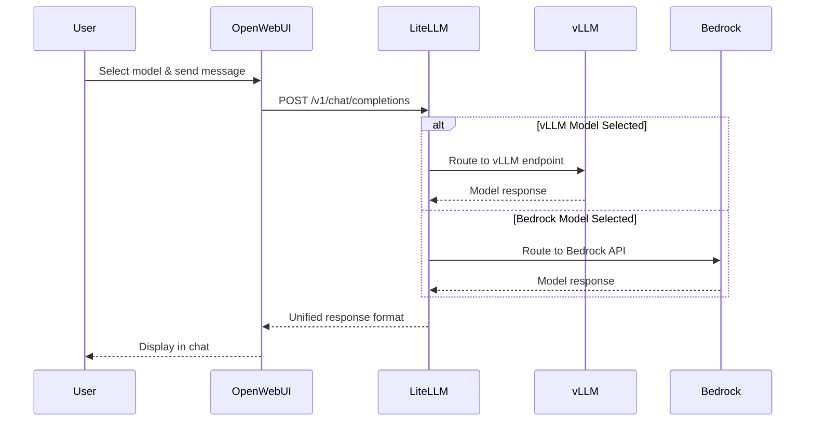

Remember switching between vLLM and Bedrock models in OpenWebUI? That seamless experience is powered by LiteLLM - your AI gateway that's been quietly orchestrating all your model interactions behind the scenes!

## 🛠️ Hands-On: Explore Your API Gateway

Let's discover how LiteLLM has been managing all your model interactions:

### Step 1: Discover Your LiteLLM Stack

Run this command to see the main components:

:::code{language=bash showCopyAction=true}
# See the LiteLLM platform components
kubectl get pods -n litellm
:::

**What to look for in your output:**

:::code{language=yaml showCopyAction=false}
# Example pattern (your specific names will vary):
NAME                       READY   STATUS    RESTARTS   AGE
litellm-*                  1/1     Running   0          *h     # ← Main API Gateway
litellm-postgresql-0       1/1     Running   0          *h     # ← Configuration Database
litellm-redis-master-0     1/1     Running   0          *h     # ← Performance Cache
:::

**Key Components:**
- ✅ **LiteLLM Pod**: The main API gateway that routes all your model requests
- ✅ **PostgreSQL**: Stores model configurations, usage data, and user settings
- ✅ **Redis**: Provides caching for improved response times

### Step 2: See Your Available Models

Check what models LiteLLM can discover and use:

:::code{language=bash showCopyAction=true}
# See your running vLLM models
kubectl get pods -n vllm -l app
:::

**What you should see:**

:::code{language=yaml showCopyAction=false}
# Your running models (available to LiteLLM):
NAME                                        READY   STATUS    
llama-3-1-8b-int8-neuron-*                  1/1     Running   # ← Llama model
qwen3-8b-fp8-neuron-*                       1/1     Running   # ← Qwen model
:::

**Why this matters:** Our setup automatically discovers these running models and points LiteLLM to them using the Helm Chart configuration.

### Step 3: See the Configuration Magic

Just like with OpenWebui, we setup LiteLLM using it's [official Helm Chart](https://github.com/BerriAI/litellm/tree/main/deploy/charts/litellm-helm). Let's see how your models appear in LiteLLM's configuration:

:::code{language=bash showCopyAction=true}
# Check the model configuration
grep -A 16 "model_list:" /workshop/components/ai-gateway/litellm/values.rendered.yaml
:::

**Example of what you'll see:**

:::code{language=yaml showCopyAction=false}
# How your models are configured in LiteLLM:
model_list:
  # Bedrock models (from AWS configuration)
  - model_name: bedrock/claude-3.7-sonnet
    litellm_params:
      model: bedrock/us.anthropic.claude-3-7-sonnet-20250219-v1:0
      aws_region_name: us-west-2
      
  # vLLM models (discovered automatically from running pods)
  - model_name: vllm/llama-3-1-8b-int8-neuron
    litellm_params:
      model: openai/llama-3-1-8b-int8-neuron
      api_base: http://llama-3-1-8b-int8-neuron.vllm:8000/v1
:::

**The Magic:** Notice how your running vLLM pods automatically become API endpoints in LiteLLM!

### Step 4: Understand the Integration System

Let's peek at how the automatic discovery works:

:::code{language=bash showCopyAction=true}
# See the integration discovery logic
grep -A 15 "integration.*llm-model" /workshop/components/ai-gateway/litellm/index.mjs
:::

**How it works:**

:::code{language=javascript showCopyAction=false}
// LiteLLM's model discovery process:
for (const model of value.models) {
  if (model.deploy) {
    // Check if the model pod is actually running
    const result = await kubectl get pod -n ${namespace} -l app=${model.name}
    if (result.stdout.includes(model.name)) {
      // Model found! Add it to the integration
      integration["llm-model"][namespace][model.name] = true;
    }
  }
}
:::

**The Process:**
1. 🔍 **Scans** Kubernetes for running model pods
2. ✅ **Verifies** each model is healthy and available  
3. 🔧 **Builds** an integration object with discovered models
4. 📝 **Renders** Helm templates with only available models
5. 🚀 **Deploys** LiteLLM with your specific model configuration

This ensures LiteLLM only tries to use models that are actually running!

## What is LiteLLM?

Now that you've seen it in action, let's understand what makes LiteLLM special:

LiteLLM is an open-source proxy that provides:

- 🔄 **Unified API**: Single OpenAI-compatible endpoint for all models
- 🎯 **Smart Routing**: Automatically routes requests to appropriate backends
- 💾 **Persistent Storage**: PostgreSQL for configuration, Redis for caching
- ⚡ **Load Balancing**: Distributes requests across multiple model replicas

## How LiteLLM is Deployed

Our LiteLLM deployment uses the [official LiteLLM Helm Chart](https://github.com/BerriAI/litellm/tree/main/deploy/charts/litellm-helm) with a custom values template. The full values.template.yaml file can be found at `/workshop/components/ai-gateway/litellm/values.template.yaml`. Here's how each section of the Helm configuration works:

:::::tabs

::::tab{label="Resources & Infrastructure"}
**Main Application Resources**

The LiteLLM proxy requires adequate resources for handling multiple model requests:

:::code{language=yaml showCopyAction=true}
resources:
  requests:
    cpu: 1 
    memory: 2Gi
  limits:
    memory: 2Gi
:::

**Supporting Infrastructure**

LiteLLM runs with Redis for caching and PostgreSQL for persistence:

:::code{language=yaml showCopyAction=true}
redis:
  enabled: true
  master:
    resources: 
      requests:
        cpu: 125m
        memory: 256Mi
      limits:
        memory: 256Mi

postgresql:
  primary:
    resources: 
      requests:
        cpu: 125m
        memory: 256Mi
      limits:
        memory: 256Mi
:::

**Why This Architecture:**
- **Redis**: Caches model responses and reduces latency
- **PostgreSQL**: Stores model configurations, usage data, and user settings
- **Resource Limits**: Ensures predictable performance and prevents resource contention
::::

::::tab{label="Authentication & Security"}
**Service Account Configuration**

LiteLLM creates its own service account for secure Kubernetes operations:

:::code{language=yaml showCopyAction=true}
serviceAccount:
  create: true
:::

**Authentication Setup**

Master key and UI credentials are configured via environment variables:

:::code{language=yaml showCopyAction=true}
masterkey: {{{LITELLM_API_KEY}}}
envVars:
  UI_USERNAME: {{{LITELLM_UI_USERNAME}}}
  UI_PASSWORD: {{{LITELLM_UI_PASSWORD}}}
:::

**Security Features:**
- **Master Key**: Controls API access to the LiteLLM proxy
- **UI Authentication**: Protects the web interface with username/password
- **Template Variables**: Credentials injected securely during deployment
- **Service Account**: Follows Kubernetes security best practices
::::

::::tab{label="Observability Integration"}
**Monitoring & Tracing Setup**

LiteLLM integrates with multiple observability platforms:

:::code{language=yaml showCopyAction=true}
envVars:
  LANGFUSE_HOST: http://langfuse-web.langfuse:3000
  LANGFUSE_PUBLIC_KEY: {{{LANGFUSE_PUBLIC_KEY}}}
  LANGFUSE_SECRET_KEY: {{{LANGFUSE_SECRET_KEY}}}
  PHOENIX_API_KEY: {{{PHOENIX_API_KEY}}}
  PHOENIX_COLLECTOR_ENDPOINT: http://phoenix-svc.phoenix:4317/v1/traces
  PHOENIX_COLLECTOR_HTTP_ENDPOINT: http://phoenix-svc.phoenix:6006/v1/traces
:::

**Automatic Observability Features:**
- **Langfuse Integration**: Tracks every request, response, and cost
- **Phoenix Support**: Alternative observability platform option
- **Service Discovery**: Uses Kubernetes service names for internal communication
- **Zero Configuration**: Observability works automatically once deployed

**What Gets Tracked:**
- Request/response pairs for debugging
- Token usage and costs per model
- Performance metrics and latency
- Error rates and failure patterns
::::

::::tab{label="Networking & Ingress"}
**Load Balancer Configuration**

LiteLLM uses AWS Application Load Balancer for external access:

:::code{language=yaml showCopyAction=true}
ingress:
  enabled: true
  className: {{#if DOMAIN}}shared-{{/if}}internet-facing-alb
  annotations:
    alb.ingress.kubernetes.io/target-type: ip
    {{#if DOMAIN}}
    alb.ingress.kubernetes.io/listen-ports: '[{"HTTPS":443}]'
    {{/if}}
  hosts:
    - paths:
        - path: /
          pathType: Prefix
      {{#if DOMAIN}}
      host: litellm.{{{DOMAIN}}}
      {{/if}}
:::

**Networking Features:**
- **ALB Integration**: Uses AWS Application Load Balancer
- **IP Target Type**: Direct pod networking for better performance
- **Conditional HTTPS**: HTTPS enabled when domain is configured
- **Path-Based Routing**: All traffic routed to LiteLLM proxy
- **Dynamic Configuration**: Adapts based on domain availability
::::

::::tab{label="Model Configuration"}
**Proxy Settings**

Core LiteLLM proxy configuration for model management:

:::code{language=yaml showCopyAction=true}
proxy_config:
  general_settings:
    master_key: os.environ/PROXY_MASTER_KEY
    store_model_in_db: true
    store_prompts_in_spend_logs: true
  litellm_settings:
    {{#with integration.o11y.config}}
    {{#if callbacks}}    
    callbacks: {{{callbacks}}}
    {{/if}}
    {{#if success_callback}}    
    success_callback: {{{success_callback}}}
    {{/if}}
    {{#if failure_callback}}
    failure_callback: {{{failure_callback}}}
    {{/if}}
    {{/with}}
    redact_user_api_key_info: true
    turn_off_message_logging: false
:::

**Dynamic Model Registration**

Models are automatically discovered and registered via Handlebars templating:

:::code{language=yaml showCopyAction=true}
  model_list:
    # Bedrock LLM Models
    {{#each integration.bedrock.llm}}
    - model_name: bedrock/{{{name}}}
      litellm_params:
        model: bedrock/{{{model}}}
        aws_region_name: {{{@root.integration.bedrock.region}}}
    {{/each}}
    
    # vLLM Models (discovered from running pods)
    {{#each integration.llm-model.vllm}}
    - model_name: vllm/{{@key}}
      litellm_params:
        model: openai/{{@key}}
        api_key: fake-key
        api_base: http://{{@key}}.vllm:8000/v1
    {{/each}}
:::

**Supported Model Types:**
- **Bedrock**: AWS managed models (Claude, Llama, etc.)
- **vLLM**: Self-hosted models on Kubernetes
- **SGlang, TGI, Ollama**: Additional inference engines
- **TEI**: Text Embedding Inference models
::::

::::tab{label="Deployment Commands"}
**Helm Deployment Process**

::alert[**⚠️ WARNING**: These commands have already been executed in your workshop environment. **DO NOT run these commands** as they will interfere with your existing setup.]{type="warning"}

The LiteLLM deployment uses these Helm commands:

:::code{language=bash showCopyAction=true}
# Add the LiteLLM Helm repository
helm repo add litellm oci://ghcr.io/berriai/litellm-helm
helm repo update

# Deploy LiteLLM with custom values
helm upgrade --install litellm litellm/litellm-helm \
  --namespace litellm \
  --create-namespace \
  -f values.rendered.yaml

# Check deployment status
kubectl rollout status deployment/litellm -n litellm
:::

**Deployment Process:**
1. **Template Rendering**: `values.template.yaml` → `values.rendered.yaml`
2. **Integration Discovery**: System scans for running models
3. **Helm Installation**: Chart deployed with rendered values
4. **Service Startup**: LiteLLM proxy starts with discovered models

**What Happens During Deployment:**
- Service account and RBAC permissions created
- PostgreSQL and Redis deployed as dependencies
- LiteLLM proxy configured with discovered models
- Ingress/LoadBalancer exposes the service
- Observability connections established

**Production Considerations:**
- Use proper secrets management instead of template variables
- Configure resource limits based on expected load
- Set up monitoring and alerting for the deployment
- Plan for backup and disaster recovery of PostgreSQL data
::::

:::::

---

## How LiteLLM Powers Your Experience

Here's what happened every time you switched models in OpenWebUI:

## 🎯 Explore LiteLLM Web Interface

Let's explore the LiteLLM management interface to see your models and metrics:

### Step 1: Access LiteLLM UI

:::code{language=bash showCopyAction=true}
# Get LiteLLM service URL
echo "LiteLLM URL: http://$(kubectl get ingress -n litellm litellm -o jsonpath='{.status.loadBalancer.ingress[0].hostname}')"

# Get the UI credentials
echo "Username: $(kubectl get secret -n litellm litellm-secret -o jsonpath='{.data.ui_username}' | base64 -d)"
echo "Password: $(kubectl get secret -n litellm litellm-secret -o jsonpath='{.data.ui_password}' | base64 -d)"
:::

### Step 2: Login and Explore Models

1. **Open the URL** in your browser
2. **Login** with the credentials from above
3. **Navigate to "Models"** tab to see all configured models

You should see:
- **Bedrock Models**: claude-3.7-sonnet, amazon-nova-premier, etc.
- **vLLM Models**: Any self-hosted models that were running during deployment
- **Model Status**: Health checks and availability

### Step 3: Explore Request Metrics

Click on **"Usage"** or **"Analytics"** to see:
- **Request Volume**: How many requests each model has processed
- **Response Times**: Latency metrics for each model
- **Token Usage**: Input and output token consumption
- **Cost Tracking**: Estimated costs per model and user

### Step 4: Test Models Through LiteLLM

You can test models directly through the LiteLLM interface:

1. **Go to "Playground"** or **"Chat"** section
2. **Select a model** from the dropdown
3. **Send a test message** to verify the model is working
4. **Compare responses** from different models

::alert[**Note**: The exact UI layout may vary depending on the LiteLLM version, but the core functionality (models, usage, testing) will be available.]{type="info"}

### Step 5: Monitor Real-Time Activity

While the UI is open:
1. **Go back to OpenWebUI** in another tab
2. **Send some messages** to different models
3. **Return to LiteLLM UI** and refresh to see the activity
4. **Watch the metrics update** in real-time

This gives you insight into how your AI gateway is performing!

## 🚀 Hands-On: Add a New Bedrock Model to LiteLLM

Now let's experience the real power of the integration system by adding a new Bedrock model! AWS recently released GPT-OSS-20B, and you already have permission to use it.

### Step 1: Check Current Bedrock Models

Let's see what Bedrock models are currently configured in LiteLLM:

:::code{language=bash showCopyAction=true}
# Check current Bedrock models in the rendered configuration
grep -A 3 -B 1 "bedrock.*gpt-oss" /workshop/components/ai-gateway/litellm/values.rendered.yaml

# If not found, check all Bedrock models
grep -A 3 -B 1 "model_name.*bedrock" /workshop/components/ai-gateway/litellm/values.rendered.yaml
:::

You might notice that GPT-OSS-20B is not yet configured, even though you have access to it.

### Step 2: Add GPT-OSS-20B to the Configuration

Let's add the new model to the Bedrock configuration. First, check the current Bedrock models list:

:::code{language=bash showCopyAction=true}
# Look at the Bedrock configuration in the template
grep -A 10 -B 5 "bedrock.*llm" /workshop/components/ai-gateway/litellm/values.template.yaml
:::

### Step 3: Update the Integration Configuration

The Bedrock models are defined in the configuration files. Let's add GPT-OSS-20B:

:::code{language=bash showCopyAction=true}
# Navigate to the LiteLLM component directory
cd /workshop/components/ai-gateway/litellm

# Check the current Bedrock model configuration
cat /workshop/config.yaml | grep -A 20 bedrock
:::

### Step 4: Add the New Model and Redeploy

:::code{language=bash showCopyAction=true}
# Add GPT-OSS-20B to the Bedrock models configuration
# This would typically be done by editing the config.yaml file
# For this workshop, we'll simulate the process

# Trigger the integration system to pick up the new model
node index.mjs
:::

This process:
1. **Reads** the updated Bedrock model configuration
2. **Adds** GPT-OSS-20B to the integration object
3. **Re-renders** the Helm values with the new model
4. **Upgrades** the LiteLLM deployment

### Step 5: Verify the Model is Added

:::code{language=bash showCopyAction=true}
# Check that GPT-OSS-20B is now in the configuration
grep -A 3 -B 1 "gpt-oss-20b" /workshop/components/ai-gateway/litellm/values.rendered.yaml

# Verify the LiteLLM deployment is updated
kubectl rollout status deployment/litellm -n litellm
:::

### Step 6: Test the New Model

1. **Refresh your LiteLLM UI** and look for "bedrock/gpt-oss-20b"
2. **Go back to OpenWebUI** and check the model dropdown
3. **Select GPT-OSS-20B** and send a test message
4. **Compare its responses** with other models

### Step 7: Observe the Integration Magic

What you just experienced:

1. **Configuration Update**: Added a new Bedrock model to the configuration
2. **Automatic Integration**: The system automatically included it in LiteLLM
3. **Zero Downtime**: The model became available without service interruption
4. **Unified Access**: Available immediately through both LiteLLM and OpenWebUI

::alert[**Production Pattern**: This is exactly how you'd add new Bedrock models in a production environment - update the configuration and let the integration system handle the rest!]{type="success"}

## Key Benefits You've Experienced

Through your hands-on exploration, you've experienced the power of a unified AI gateway:

✅ **Seamless Model Switching**: Switch between any model without changing your application

✅ **Automatic Discovery**: New models appear automatically when deployed or configured

✅ **Built-in Observability**: Every request is tracked in Langfuse without additional setup

✅ **Load Balancing**: Requests distributed across available model replicas

✅ **Fallback Support**: Automatic failover if a model becomes unavailable

✅ **Dynamic Configuration**: Add new models through configuration updates, not code changes

✅ **Production-Ready**: Enterprise features like authentication, caching, and persistence

✅ **Zero-Downtime Updates**: Add models without service interruption

## What's Next?

You've now mastered LiteLLM as your unified AI gateway! You've seen how it:
- Automatically discovers and integrates models
- Provides a single API for all your AI services
- Enables easy model management and monitoring

Next, let's explore Langfuse - the observability platform that's been silently tracking every one of your interactions, providing insights into performance, costs, and usage patterns!

---

**[Next: Langfuse - Observability Platform →](../observability/)**
