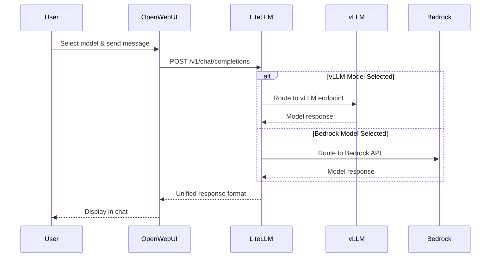

Remember switching between vLLM and Bedrock models in OpenWebUI? That seamless experience is powered by LiteLLM - your AI gateway that's been quietly orchestrating all your model interactions behind the scenes!

## 🛠️ Hands-On: Explore Your API Gateway

Let's discover how LiteLLM has been managing all your model interactions:

### Step 1: Discover Your LiteLLM Stack

Run this command to see the main components:

:::code{language=bash showCopyAction=true}
# See the LiteLLM platform components
kubectl get pods -n litellm
:::

**What to look for in your output:**

:::code{language=yaml showCopyAction=false}
# Example pattern (your specific names will vary):
NAME                       READY   STATUS    RESTARTS   AGE
litellm-*                  1/1     Running   0          *h     # ← Main API Gateway
litellm-postgresql-0       1/1     Running   0          *h     # ← Configuration Database
litellm-redis-master-0     1/1     Running   0          *h     # ← Performance Cache
:::

**Key Components:**
- ✅ **LiteLLM Pod**: The main API gateway that routes all your model requests
- ✅ **PostgreSQL**: Stores model configurations, usage data, and user settings
- ✅ **Redis**: Provides caching for improved response times

### Step 2: See Your Available Models

Check what models LiteLLM can discover and use:

:::code{language=bash showCopyAction=true}
# See your running vLLM models
kubectl get pods -n vllm -l app
:::

**What you should see:**

:::code{language=yaml showCopyAction=false}
# Your running models (available to LiteLLM):
NAME                                        READY   STATUS    
mistral-7b-int8-neuron-*                    1/1     Running   # ← Mistral model
deepseek-r1-llama-8b-int8-neuron-*         1/1     Running   # ← DeepSeek model
:::

**Why this matters:** Our setup automatically discovers these running models and points LiteLLM to them using the Helm Chart configuration.

### Step 3: See the Configuration Magic

Just like with OpenWebui, we setup LiteLLM using it's [official Helm Chart](https://github.com/BerriAI/litellm/tree/main/deploy/charts/litellm-helm). Let's see how your models appear in LiteLLM's configuration:

:::code{language=bash showCopyAction=true}
# Check the model configuration
grep -A 16 "model_list:" /workshop/components/ai-gateway/litellm/values.rendered.yaml
:::

**Example of what you'll see:**

:::code{language=yaml showCopyAction=false}
# How your models are configured in LiteLLM:
model_list:
  # Bedrock models (from AWS configuration)
  - model_name: bedrock/claude-3.7-sonnet
    litellm_params:
      model: bedrock/us.anthropic.claude-3-7-sonnet-20250219-v1:0
      aws_region_name: us-west-2
      
  # vLLM models (discovered automatically from running pods)
  - model_name: vllm/deepseek-r1-llama-8b-int8-neuron
    litellm_params:
      model: openai/deepseek-r1-llama-8b-int8-neuron
      api_key: fake-key
      api_base: http://deepseek-r1-llama-8b-int8-neuron.vllm:8000/v1
  - model_name: vllm/mistral-7b-int8-neuron
    litellm_params:
      model: openai/mistral-7b-int8-neuron
      api_key: fake-key
      api_base: http://mistral-7b-int8-neuron.vllm:8000/v1
:::

**The Magic:** Notice how your running vLLM pods automatically become API endpoints in LiteLLM!

### Step 4: Understand the Integration System

Let's peek at how the automatic discovery works:

:::code{language=bash showCopyAction=true}
# See the integration discovery logic
grep -A 15 "integration.*llm-model" /workshop/components/ai-gateway/litellm/index.mjs
:::

**How it works:**

:::code{language=javascript showCopyAction=false}
// LiteLLM's model discovery process:
for (const model of value.models) {
  if (model.deploy) {
    // Check if the model pod is actually running
    const result = await kubectl get pod -n ${namespace} -l app=${model.name}
    if (result.stdout.includes(model.name)) {
      // Model found! Add it to the integration
      integration["llm-model"][namespace][model.name] = true;
    }
  }
}
:::

**The Process:**
1. 🔍 **Scans** Kubernetes for running model pods
2. ✅ **Verifies** each model is healthy and available  
3. 🔧 **Builds** an integration object with discovered models
4. 📝 **Renders** Helm templates with only available models
5. 🚀 **Deploys** LiteLLM with your specific model configuration

This ensures LiteLLM only tries to use models that are actually running!

## What is LiteLLM?

Now that you've seen it in action, let's understand what makes LiteLLM special:

LiteLLM is an open-source proxy that provides:

- 🔄 **Unified API**: Single OpenAI-compatible endpoint for all models
- 🎯 **Smart Routing**: Automatically routes requests to appropriate backends
- 💾 **Persistent Storage**: PostgreSQL for configuration, Redis for caching
- ⚡ **Load Balancing**: Distributes requests across multiple model replicas

## How LiteLLM is Deployed

Our LiteLLM deployment uses the [official LiteLLM Helm Chart](https://github.com/BerriAI/litellm/tree/main/deploy/charts/litellm-helm) with a custom values template. The full values.template.yaml file can be found at `/workshop/components/ai-gateway/litellm/values.template.yaml`. Here's how each section of the Helm configuration works:

:::::tabs

::::tab{label="Resources & Infrastructure"}
**Main Application Resources**

The LiteLLM proxy requires adequate resources for handling multiple model requests:

:::code{language=yaml showCopyAction=true}
resources:
  requests:
    cpu: 1 
    memory: 2Gi
  limits:
    memory: 2Gi
:::

**Supporting Infrastructure**

LiteLLM runs with Redis for caching and PostgreSQL for persistence:

:::code{language=yaml showCopyAction=true}
redis:
  enabled: true
  master:
    resources: 
      requests:
        cpu: 125m
        memory: 256Mi
      limits:
        memory: 256Mi

postgresql:
  primary:
    resources: 
      requests:
        cpu: 125m
        memory: 256Mi
      limits:
        memory: 256Mi
:::

**Why This Architecture:**
- **Redis**: Caches model responses and reduces latency
- **PostgreSQL**: Stores model configurations, usage data, and user settings
- **Resource Limits**: Ensures predictable performance and prevents resource contention
::::

::::tab{label="Authentication & Security"}
**Service Account Configuration**

LiteLLM creates its own service account for secure Kubernetes operations:

:::code{language=yaml showCopyAction=true}
serviceAccount:
  create: true
:::

**Authentication Setup**

Master key and UI credentials are configured via environment variables:

:::code{language=yaml showCopyAction=true}
masterkey: {{{LITELLM_API_KEY}}}
envVars:
  UI_USERNAME: {{{LITELLM_UI_USERNAME}}}
  UI_PASSWORD: {{{LITELLM_UI_PASSWORD}}}
:::

**Security Features:**
- **Master Key**: Controls API access to the LiteLLM proxy
- **UI Authentication**: Protects the web interface with username/password
- **Template Variables**: Credentials injected securely during deployment
- **Service Account**: Follows Kubernetes security best practices
::::

::::tab{label="Observability Integration"}
**Monitoring & Tracing Setup**

LiteLLM integrates with multiple observability platforms:

:::code{language=yaml showCopyAction=true}
envVars:
  LANGFUSE_HOST: http://langfuse-web.langfuse:3000
  LANGFUSE_PUBLIC_KEY: {{{LANGFUSE_PUBLIC_KEY}}}
  LANGFUSE_SECRET_KEY: {{{LANGFUSE_SECRET_KEY}}}
  PHOENIX_API_KEY: {{{PHOENIX_API_KEY}}}
  PHOENIX_COLLECTOR_ENDPOINT: http://phoenix-svc.phoenix:4317/v1/traces
  PHOENIX_COLLECTOR_HTTP_ENDPOINT: http://phoenix-svc.phoenix:6006/v1/traces
:::

**Automatic Observability Features:**
- **Langfuse Integration**: Tracks every request, response, and cost
- **Phoenix Support**: Alternative observability platform option
- **Service Discovery**: Uses Kubernetes service names for internal communication
- **Zero Configuration**: Observability works automatically once deployed

**What Gets Tracked:**
- Request/response pairs for debugging
- Token usage and costs per model
- Performance metrics and latency
- Error rates and failure patterns
::::

::::tab{label="Networking & Ingress"}
**Load Balancer Configuration**

LiteLLM uses AWS Application Load Balancer for external access:

:::code{language=yaml showCopyAction=true}
ingress:
  enabled: true
  className: {{#if DOMAIN}}shared-{{/if}}internet-facing-alb
  annotations:
    alb.ingress.kubernetes.io/target-type: ip
    {{#if DOMAIN}}
    alb.ingress.kubernetes.io/listen-ports: '[{"HTTPS":443}]'
    {{/if}}
  hosts:
    - paths:
        - path: /
          pathType: Prefix
      {{#if DOMAIN}}
      host: litellm.{{{DOMAIN}}}
      {{/if}}
:::

**Networking Features:**
- **ALB Integration**: Uses AWS Application Load Balancer
- **IP Target Type**: Direct pod networking for better performance
- **Conditional HTTPS**: HTTPS enabled when domain is configured
- **Path-Based Routing**: All traffic routed to LiteLLM proxy
- **Dynamic Configuration**: Adapts based on domain availability
::::

::::tab{label="Model Configuration"}
**Proxy Settings**

Core LiteLLM proxy configuration for model management:

:::code{language=yaml showCopyAction=true}
proxy_config:
  general_settings:
    master_key: os.environ/PROXY_MASTER_KEY
    store_model_in_db: true
    store_prompts_in_spend_logs: true
  litellm_settings:
    {{#with integration.o11y.config}}
    {{#if callbacks}}    
    callbacks: {{{callbacks}}}
    {{/if}}
    {{#if success_callback}}    
    success_callback: {{{success_callback}}}
    {{/if}}
    {{#if failure_callback}}
    failure_callback: {{{failure_callback}}}
    {{/if}}
    {{/with}}
    redact_user_api_key_info: true
    turn_off_message_logging: false
:::

**Dynamic Model Registration**

Models are automatically discovered and registered via Handlebars templating:

:::code{language=yaml showCopyAction=true}
  model_list:
    # Bedrock LLM Models
    {{#each integration.bedrock.llm}}
    - model_name: bedrock/{{{name}}}
      litellm_params:
        model: bedrock/{{{model}}}
        aws_region_name: {{{@root.integration.bedrock.region}}}
    {{/each}}
    
    # vLLM Models (discovered from running pods)
    {{#each integration.llm-model.vllm}}
    - model_name: vllm/{{@key}}
      litellm_params:
        model: openai/{{@key}}
        api_key: fake-key
        api_base: http://{{@key}}.vllm:8000/v1
    {{/each}}
:::

**Supported Model Types:**
- **Bedrock**: AWS managed models (Claude, Llama, etc.)
- **vLLM**: Self-hosted models on Kubernetes
- **SGlang, TGI, Ollama**: Additional inference engines
- **TEI**: Text Embedding Inference models
::::

::::tab{label="Deployment Commands"}
**Helm Deployment Process**

::alert[**⚠️ WARNING**: These commands have already been executed in your workshop environment. **DO NOT run these commands** as they will interfere with your existing setup.]{type="warning"}

The LiteLLM deployment uses these Helm commands:

:::code{language=bash showCopyAction=true}
# Add the LiteLLM Helm repository
helm repo add litellm oci://ghcr.io/berriai/litellm-helm
helm repo update

# Deploy LiteLLM with custom values
helm upgrade --install litellm litellm/litellm-helm \
  --namespace litellm \
  --create-namespace \
  -f values.rendered.yaml

# Check deployment status
kubectl rollout status deployment/litellm -n litellm
:::

**Deployment Process:**
1. **Template Rendering**: `values.template.yaml` → `values.rendered.yaml`
2. **Integration Discovery**: System scans for running models
3. **Helm Installation**: Chart deployed with rendered values
4. **Service Startup**: LiteLLM proxy starts with discovered models

**What Happens During Deployment:**
- Service account and RBAC permissions created
- PostgreSQL and Redis deployed as dependencies
- LiteLLM proxy configured with discovered models
- Ingress/LoadBalancer exposes the service
- Observability connections established
::::

:::::

---

## How LiteLLM Powers Your Experience

Here's what happened every time you switched models in OpenWebUI:

## 🎯 Explore LiteLLM Web Interface

Let's explore the LiteLLM management interface to see your models, metrics, and test the API directly:

### Step 1: Access LiteLLM Interface

First, get the URL and credentials for your LiteLLM instance:

:::code{language=bash showCopyAction=true}
# Get LiteLLM service URL
echo "LiteLLM URL: http://$(kubectl get ingress -n litellm litellm -o jsonpath='{.status.loadBalancer.ingress[0].hostname}')"
:::

Open the URL in your browser. You'll see the LiteLLM API documentation page:

**What to notice:**
- 🔧 **LiteLLM Admin Panel on /ui** link (highlighted in orange) - this is where we're going
- 📊 **LiteLLM Model Cost Map** - for cost analysis
- 🔍 **LiteLLM Model Hub** - to see available models
- 🔐 **Authorize** button - for API authentication

### Step 2: Access the Admin Interface

Click on **"LiteLLM Admin Panel on /ui"** to access the management interface. You'll be taken to the login page:

**Login Process:**
1. **Username**: Enter `admin` 
2. **Password**: Enter `Pass@123` 
3. **Click "Login"** to access the admin interface

### Step 3: Explore Your Models Dashboard

After logging in, click on the **Models + Endpoints** to view the models configured for LiteLLM:

**What you're seeing:**
- 📊 **"Showing 3 results"** - Your configured models
- 🔍 **Model Table** with columns for Model ID, Public Model Name, Provider, and LiteLLM Model Name

**Your Models:**
- ✅ **bedrock/claude-3.7-sonnet** - AWS Bedrock model (bedrock provider)
- ✅ **vllm/mistral-7b-int8-neuron** - Self-hosted model (openai provider)
- ✅ **vllm/deepseek-r1-llama-8b-int8-neuron** - Self-hosted model (openai provider)

**Key Insight:** Notice how the vLLM models show "openai" as the provider - this is because LiteLLM presents them through an OpenAI-compatible API!

### Step 4: Monitor Usage & Costs

Click on **"Usage"** in the left sidebar to see comprehensive analytics:

**Usage Metrics Dashboard:**
- 💰 **Total Spend**: $0.1027 (your actual workshop usage!)
- 📈 **Total Requests**: 65 requests processed
- ✅ **Successful Requests**: 63 (96.9% success rate)
- ❌ **Failed Requests**: 2 (3.1% failure rate)
- 🔢 **Total Tokens**: 32,484 tokens processed
- 💵 **Average Cost per Request**: $0.0016

**What This Tells You:**
- Your models are performing well with high success rates
- Cost tracking is automatic and detailed
- You can monitor spending patterns over time
- Token usage gives insight into conversation complexity

::alert[**Cost Tracking Note**: The cost metrics shown here are primarily for Bedrock models. We did not configure cost visibility for locally hosted models (vLLM) in this workshop setup, as they don't have direct per-token pricing like managed services.]{type="info"}

### Step 5: Test Models Directly

Click on **"Test Key"** to access the interactive testing interface:

**Testing Features:**
- 🎯 **Model Selection**: Dropdown showing "bedrock/claude-3.7-s..." selected
- 💬 **Chat Interface**: Real conversation with the selected model
- 🔧 **Configuration Options**: API Key Source, Endpoint Type, Tags, MCP Tools
- 📝 **Sample Conversation**: Shows a question about dragon etymology with detailed response

**Try This:**
1. **Select different models** from the dropdown (try switching between Bedrock and vLLM models)
2. **Ask a question** like "Explain Kubernetes in simple terms"
3. **Compare responses** from different models

### Step 6: Connect to Your Workshop Experience

Now that you've explored the LiteLLM interface:

1. **Go back to OpenWebUI** in another tab
2. **Send some messages** to different models
3. **Return to LiteLLM Usage page** and refresh
4. **Watch your metrics update** - you'll see new requests, token usage, and costs appear!

**Real-Time Monitoring:** Every interaction you have in OpenWebUI flows through this LiteLLM interface, and you can see the metrics update in real-time.

This gives you visibility into how your AI gateway is performing and being used!

## 🚀 Hands-On: Add a New Bedrock Model to LiteLLM

Now let's add a new Bedrock model to LiteLLM! We'll add GPT-OSS-20B, a recently released model that you already have access to.

### Step 1: Discover Available GPT-OSS Models

First, let's see what GPT-OSS models are available in Bedrock:

:::code{language=bash showCopyAction=true}
# Check available Bedrock models you have access to
aws bedrock list-foundation-models --query "modelSummaries[?contains(modelId, 'gpt-oss')].{ModelId:modelId,ModelName:modelName}" --output table
:::

**You should see:**

:::code{language=yaml showCopyAction=false}
---------------------------------------------
|           ListFoundationModels            |
+--------------------------+----------------+
|          ModelId         |   ModelName    |
+--------------------------+----------------+
|  openai.gpt-oss-120b-1:0 |  gpt-oss-120b  |
|  openai.gpt-oss-20b-1:0  |  gpt-oss-20b   |
+--------------------------+----------------+
:::

We'll add the **gpt-oss-20b** model (ModelId: `openai.gpt-oss-20b-1:0`).

### Step 2: Check Current LiteLLM Configuration

Let's see what Bedrock models are currently configured in LiteLLM:

:::code{language=bash showCopyAction=true}
# See current Bedrock models in LiteLLM
grep -A 3 -B 1 "model_name.*bedrock" /workshop/components/ai-gateway/litellm/values.rendered.yaml
:::

You'll notice that GPT-OSS-20B is not currently configured.

### Step 3: Add GPT-OSS-20B to the Configuration

Now let's add the new model directly to the configuration file:

:::code{language=bash showCopyAction=true}
# Open our Values yaml file:
code /workshop/components/ai-gateway/litellm/values.rendered.yaml 
:::

**Add this YAML configuration** to the Bedrock models section in `values.rendered.yaml`:

:::code{language=yaml showCopyAction=true}
    - model_name: bedrock/gpt-oss-20b
      litellm_params:
        model: bedrock/openai.gpt-oss-20b-1:0
        aws_region_name: us-west-2
:::

Should look like this:

### Step 4: Apply the Configuration Changes

After adding the model to the configuration file, apply the changes:

:::code{language=bash showCopyAction=true}
# Apply the updated configuration
helm upgrade litellm oci://ghcr.io/berriai/litellm-helm \
  --namespace litellm \
  -f /workshop/components/ai-gateway/litellm/values.rendered.yaml

# Wait for the deployment to complete
kubectl rollout status deployment/litellm -n litellm
:::

### Step 5: Verify the Model is Available

Once rollout has been completed, check that it has been added to LiteLLM, by going back to the **Models + Endpoints** page:

Should see **bedrock/gpt-oss-20b** amongst the models.

### Step 6: Test in OpenWebUI

1. **Go back to OpenWebUI**
2. **Check the model dropdown** - you should see "bedrock/gpt-oss-20b"
3. **Select GPT-OSS-20B** and send a test message
4. **Compare its responses** with other models

::alert[**Production Note**: In production environments, you'd typically use the automated integration system we explored earlier. This manual approach is useful for understanding the underlying configuration and for one-off model additions.]{type="success"}

## 🔑 Hands-On: Create a Virtual Key for Module 3

In Module 3, you'll build an agentic application that needs secure access to your models. Let's create a dedicated Virtual Key that will power your agent's interactions with all available models.

### Step 1: Navigate to Virtual Keys

In the LiteLLM interface, click on **"Virtual Keys"** in the left sidebar:

**What you'll see:**
- 🔍 **"Virtual Keys"** highlighted in the sidebar (orange box)
- ➕ **"+ Create New Key"** button ready for action
- 📊 Empty results table (showing "1 - 0 of 0 results" initially)

### Step 2: Configure Your Agent Key

Click the **"+ Create New Key"** button to open the key creation dialog:

**Configure your key with these settings:**

**Key Ownership:**
- ✅ **Owned By**: Select "You" (default selection)
- 📁 **Team**: Leave as "Search or select a team" (optional)

**Key Details:**
- 📝 **Key Name**: Enter `agent-key`
- 🤖 **Models**: Select all available models:
  - `bedrock/claude-3.7-sonnet` ✓
  - `bedrock/gpt-oss-20b` ✓  
  - `vllm/deepseek-r1-llama-8b-int8-neuron` ✓
  - `vllm/mistral-7b-int8-neuron` ✓
- 🔧 **Key Type**: Keep as "Default"
- ⚙️ **Optional Settings**: Leave expanded but unchanged

Click **"Create Key"** to generate your Virtual Key.

### Step 3: Save Your API Key

A popup will appear with your newly created key:

**Critical Security Notice:**
::alert[**⚠️ IMPORTANT**: This is your only chance to copy this key! For security reasons, **you will not be able to view it again** through your LiteLLM account. If you lose this secret key, you will need to generate a new one.]{type="warning"}

**Save your key:**
1. Click **"Copy API Key"** button
2. Store it securely for Module 3:

:::code{language=bash showCopyAction=true}
# Save in your environment or notes
export AGENT_KEY="sk-aUM4QuQjObwI4nGcNoBYPw"  # Your actual key will be different
:::

### Step 4: Verify Key Access

Let's test that your Virtual Key has access to all models:

1. Navigate to **"Test Key"** in the sidebar
2. Configure the test interface:

**Test Configuration:**
- 🔑 **API Key Source**: Select "Virtual Key" from dropdown
- 🔐 **Key Input**: Paste your `sk-` key in the field that appears
- 🤖 **Select Model**: Choose any model (e.g., "bedrock/claude-3.7-sonnet")

### Step 5: Validate Model Access

Send a test message to confirm your key works:

**What you're validating:**
- ✅ **Authentication**: Your Virtual Key is accepted
- ✅ **Model Access**: The key can access the selected model
- ✅ **Response Generation**: Models respond correctly
- ✅ **Multi-Model Support**: Try switching models to verify access to all

**Example test:**
- **Question**: "Why is most of the landmass in the world above the equator?"
- **Response**: You should see a detailed geological explanation
- **Model Used**: Shows which model responded (e.g., "us.anthropic.claude-3-7-sonnet")

::alert[**Success!** Your Virtual Key is now ready for Module 3's agentic application. This key provides unified access to all your models through a single authentication token.]{type="success"}

You'll use this Virtual Key in Module 3 to build an intelligent agent that can seamlessly switch between models based on task requirements!

## Key Benefits You've Experienced

Through your hands-on exploration, you've experienced the power of a unified AI gateway:

✅ **Seamless Model Switching**: Switch between any model without changing your application

✅ **Automatic Discovery**: New models appear automatically when deployed or configured

✅ **Built-in Observability**: Every request is tracked in Langfuse without additional setup

✅ **Load Balancing**: Requests distributed across available model replicas

✅ **Fallback Support**: Automatic failover if a model becomes unavailable

✅ **Dynamic Configuration**: Add new models through configuration updates, not code changes

✅ **Production-Ready**: Enterprise features like authentication, caching, and persistence

✅ **Zero-Downtime Updates**: Add models without service interruption

## What's Next?

You've now mastered LiteLLM as your unified AI gateway! You've seen how it:
- Automatically discovers and integrates models
- Provides a single API for all your AI services
- Enables easy model management and monitoring

Next, let's explore Langfuse - the observability platform that's been silently tracking every one of your interactions, providing insights into performance, costs, and usage patterns!

---

**[Next: Langfuse - Observability Platform →](../observability/)**
