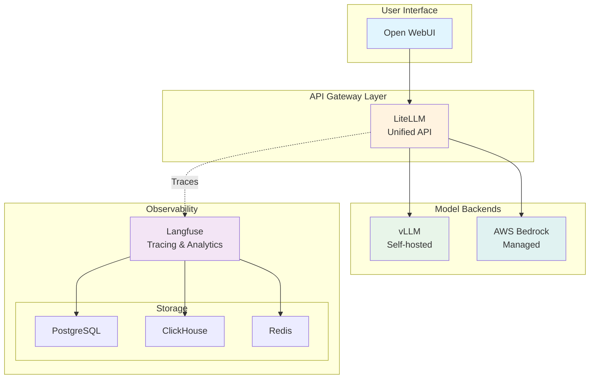

# Module 2: GenAI Platform Components

Welcome to Module 2! In this module, you'll explore the core platform components that enable production-ready GenAI applications on EKS. You'll learn how LiteLLM provides a unified API gateway for multiple model providers and how Langfuse enables comprehensive observability for your AI workloads.

## Learning Objectives

By the end of this module, you will:

- 🔄 **Deploy and configure LiteLLM** as a unified API gateway
- 📊 **Set up Langfuse** for LLM observability and tracing
- 🔧 **Add new models** to LiteLLM through Helm upgrades
- 🔍 **Explore observability features** in the Langfuse UI
- 🏗️ **Understand the integration** between all platform components

## Module Architecture

Here's how the platform components work together:



## What Makes This Module Special?

This module focuses on **real-world deployment patterns** using Helm charts and Kubernetes best practices:

- **Dynamic Configuration**: See how Helm templates enable flexible deployments
- **Automatic Integration**: Learn how components discover and connect to each other
- **Production Patterns**: Understand resource management, ingress, and security
- **Hands-on Practice**: Add new models and explore observability features

## Module Sections

### 1. [LiteLLM - Unified API Gateway](./ai-gateway/)
Deploy LiteLLM to provide a single API endpoint for multiple LLM providers. Learn how to:
- Configure model routing
- Add new Bedrock models through Helm
- Understand the integration templating system

### 2. [Langfuse - Observability Platform](./observability/)
Set up comprehensive observability for your GenAI applications. Explore:
- Tracing and monitoring capabilities
- Cost tracking and analytics
- The complete observability stack

### 3. [Platform Integration](./integration/)
Understand how all components work together:
- Request flow through the system
- Observability data collection
- Best practices for production deployments

## Prerequisites Check

Before starting, verify your environment from Module 1:

:::code{language=bash showCopyAction=true}
# Check that Module 1 components are running
kubectl get pods -n openwebui
kubectl get pods -n vllm
kubectl get pods -n litellm
kubectl get pods -n langfuse

# Verify you have Bedrock access
aws bedrock list-foundation-models --query "modelSummaries[?contains(modelId, 'claude')].modelId" --output table
:::

::alert[If any components are missing, please complete Module 1 first or notify your instructor.]{type="warning"}

## Time Allocation

- **LiteLLM Setup & Exercise**: 30 minutes
- **Langfuse Deployment & Exploration**: 30 minutes
- **Integration Understanding**: 20 minutes

Total estimated time: **80 minutes**

## Key Concepts We'll Cover

### Helm Templating
You'll see how Helm templates enable dynamic configuration:
```yaml
{{#each integration.bedrock.llm}}
- model_name: bedrock/{{{name}}}
  litellm_params:
    model: bedrock/{{{model}}}
{{/each}}
```

### Component Discovery
Learn how services find each other in Kubernetes:
```yaml
LANGFUSE_HOST: http://langfuse-web.langfuse:3000
api_base: http://vllm-service.vllm:8000/v1
```

### Observability Integration
Understand how tracing flows through the system:
```yaml
callbacks: ["langfuse"]
success_callback: ["langfuse"]
failure_callback: ["langfuse"]
```

## Let's Get Started!

Ready to build a production-ready GenAI platform? Let's begin with deploying LiteLLM as our unified API gateway.

::alert[**Tip**: Keep the terminal open alongside this guide - you'll be running commands throughout the module.]{type="info"}

---

**[Next: LiteLLM - Unified API Gateway →](./ai-gateway/)**
