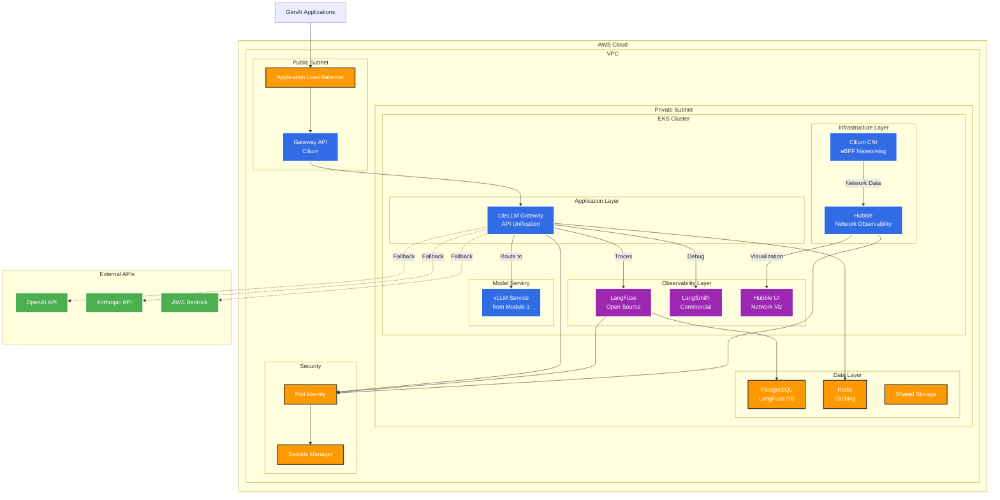

# Module 2: GenAI Application Components

Welcome to Module 2! In this module, you'll learn how to build a robust GenAI platform architecture with essential components for scalable agentic applications.

## Module Architecture Overview

This module implements a comprehensive GenAI platform with modern observability, security, and gateway components:



### Key Components

1. **Gateway API with Cilium**: Modern Kubernetes-native traffic management using eBPF
2. **LiteLLM Gateway**: Unified API interface supporting multiple LLM providers
3. **Dual Observability**: LangFuse (open-source) + LangSmith (commercial) for comprehensive monitoring
4. **Network Observability**: Hubble for L7 network analysis and security
5. **Modern Security**: Pod Identity + Secrets Manager for secure AWS integration
6. **High Availability**: Multi-AZ deployment with managed databases

### Platform Features

- **API Unification**: Single endpoint for multiple LLM providers
- **Comprehensive Monitoring**: Application, network, and infrastructure observability
- **Advanced Debugging**: Step-by-step chain analysis and prompt optimization
- **Network Security**: eBPF-based policies and real-time threat detection
- **Cost Optimization**: Intelligent routing between self-hosted and external APIs

## Learning Objectives

By the end of this module, you will be able to:
- Design and implement a comprehensive GenAI platform architecture
- Set up complete platform infrastructure with all necessary components
- Integrate LangFuse for observability and tracing of GenAI applications
- Set up LangSmith for advanced debugging and prompt optimization
- Deploy Hubble for network-level observability and security analysis
- Deploy LiteLLM as a unified AI gateway for multiple LLM providers
- Monitor and troubleshoot GenAI platform components at all levels

## Module Overview

### 1. Platform Architecture
- Understanding GenAI platform components
- Designing scalable architecture patterns
- Infrastructure requirements and considerations

### 2. Platform Setup
- Deploying core platform components
- Configuration management
- Service mesh and networking

### 3. Observability with LangFuse
- Setting up LangFuse for GenAI observability
- Tracing and monitoring agentic workflows
- Performance metrics and analytics

### 4. Advanced Debugging with LangSmith
- LangSmith setup and configuration
- Chain debugging and step-by-step analysis
- Prompt optimization and engineering
- Comparative analysis with LangFuse

### 5. Network Observability with Hubble
- Cilium and Hubble deployment
- Network topology visualization
- Inter-agent communication monitoring
- Network performance analysis

### 6. AI Gateway with LiteLLM
- Unified API management across LLM providers
- Load balancing and failover strategies
- Cost optimization and rate limiting

## Platform Architecture Overview

Our GenAI platform follows a layered architecture approach:

```
┌─────────────────────────────────────────────────────────────┐
│                    Application Layer                        │
│  ┌─────────────┐  ┌─────────────┐  ┌─────────────┐        │
│  │   Agents    │  │  Workflows  │  │   Tools     │        │
│  └─────────────┘  └─────────────┘  └─────────────┘        │
└─────────────────────────────────────────────────────────────┘
┌─────────────────────────────────────────────────────────────┐
│                    Platform Layer                           │
│  ┌─────────────┐  ┌─────────────┐  ┌─────────────┐        │
│  │  LiteLLM    │  │  LangFuse   │  │ Vector DB   │        │
│  │  Gateway    │  │Observability│  │             │        │
│  └─────────────┘  └─────────────┘  └─────────────┘        │
└─────────────────────────────────────────────────────────────┘
┌─────────────────────────────────────────────────────────────┐
│                   Infrastructure Layer                      │
│  ┌─────────────┐  ┌─────────────┐  ┌─────────────┐        │
│  │    vLLM     │  │   Storage   │  │  Networking │        │
│  │   Serving   │  │   (EFS/RDS) │  │   (ALB/NLB) │        │
│  └─────────────┘  └─────────────┘  └─────────────┘        │
└─────────────────────────────────────────────────────────────┘
```

## Prerequisites

Before starting this module, ensure you have:
- Completed [Module 1: LLM Optimization](/module1-llm-optimization/)
- Working EKS cluster with GPU nodes
- Basic understanding of microservices architecture
- Familiarity with observability concepts

## Technology Stack

### Core Components
- **LiteLLM**: Unified API gateway for multiple LLM providers
- **LangFuse**: Open-source observability platform for LLM applications
- **PostgreSQL**: Database for metadata and observability data
- **Redis**: Caching and session management
- **Prometheus/Grafana**: Infrastructure monitoring

### Supporting Technologies
- **Helm**: Package management for Kubernetes
- **Istio/Linkerd**: Service mesh for advanced networking
- **Cert-Manager**: TLS certificate management
- **External Secrets**: Secure secrets management

## Key Benefits

### Observability
- **Complete Tracing**: End-to-end visibility into agentic workflows
- **Performance Monitoring**: Track latency, throughput, and errors
- **Cost Tracking**: Monitor token usage and costs per request
- **Quality Metrics**: Evaluate response quality and user satisfaction

### Scalability
- **Horizontal Scaling**: Auto-scale based on demand
- **Load Balancing**: Distribute traffic across multiple models
- **Failover**: Automatic failover between providers
- **Caching**: Reduce latency with intelligent caching

### Security
- **API Authentication**: Secure access to platform components
- **Rate Limiting**: Prevent abuse and control costs
- **Data Privacy**: Protect sensitive information
- **Compliance**: Meet regulatory requirements

## Estimated Time

- **Total Duration**: 2 hours
- **Platform Setup**: 45 minutes
- **Observability Integration**: 45 minutes
- **AI Gateway Configuration**: 30 minutes

## Module Sections

1. **[Platform Setup](/module2-genai-components/platform-setup/)** - Deploy core platform infrastructure
2. **[Observability](/module2-genai-components/observability/)** - Implement LangFuse for monitoring
3. **[AI Gateway](/module2-genai-components/ai-gateway/)** - Configure LiteLLM for unified API access

## Let's Get Started!

Ready to build your GenAI platform? Let's begin with [Platform Setup](/module2-genai-components/platform-setup/). 