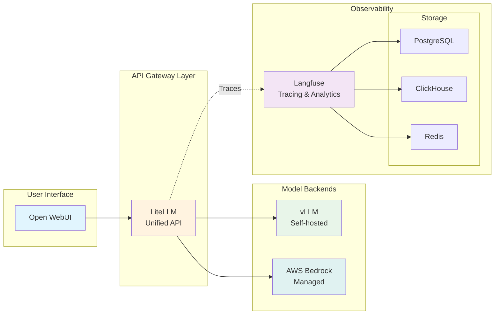

You've just experienced individual AI models - now let's transform them into a unified platform! In this module, you'll build the infrastructure that powers enterprise GenAI applications by connecting LiteLLM as a unified API gateway and Langfuse for comprehensive observability.

## Learning Objectives

By the end of this module, you will:

- 🔄 **Explore and configure LiteLLM** as a unified API gateway
- 📊 **Understand and use Langfuse** for LLM observability and tracing
- 🔧 **Add new models** to LiteLLM through Helm upgrades
- 🔍 **Explore observability features** in the Langfuse UI
- 🏗️ **Understand the integration** between all platform components

## Module Architecture

Here's how the platform components work together:

## What Makes This Module Special?

This module focuses on **real-world deployment patterns** using Helm charts and Kubernetes best practices:

- **Dynamic Configuration**: See how Helm templates enable flexible deployments
- **Automatic Integration**: Learn how components discover and connect to each other
- **Production Patterns**: Understand resource management, ingress, and security
- **Hands-on Practice**: Add new models and explore observability features

## Module Sections

#### 1. [LiteLLM - Unified API Gateway](./ai-gateway/)
Explore LiteLLM, which provides a single API endpoint for multiple LLM providers. Learn how to:
- Configure model routing
- Add new Bedrock models through Helm
- Understand the integration templating system

#### 2. [Langfuse - Observability Platform](./observability/)
Discover comprehensive observability for your GenAI applications. Explore:
- Tracing and monitoring capabilities
- Cost tracking and analytics
- The complete observability stack

## Prerequisites Check

Before starting, verify your environment from Module 1:

:::code{language=bash showCopyAction=true}
# Check that Module 1 components are running
kubectl get pods -n openwebui
kubectl get pods -n vllm
kubectl get pods -n litellm
kubectl get pods -n langfuse

# Verify you have Bedrock access
aws bedrock list-foundation-models --query "modelSummaries[?contains(modelId, 'claude')].modelId" --output table
:::

::alert[If any components are missing, please complete Module 1 first.]{type="warning"}

## Let's Get Started!

Ready to explore your GenAI platform on EKS? Let's begin by examining LiteLLM, your unified API gateway that's already running and connecting all your models.

---

**[Next: LiteLLM - Unified API Gateway →](./ai-gateway/)**
