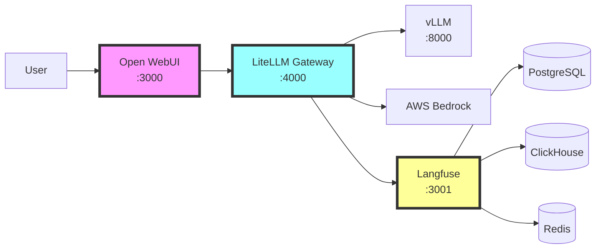

## Overview

In this section, we'll explore how Open WebUI, LiteLLM, and Langfuse work together as an integrated GenAI platform on EKS. We'll trace a complete request flow and demonstrate the full system capabilities.

## System Architecture



## Complete Request Flow

Let's trace a request through the entire system:

### 1. User Interaction
- User opens Open WebUI at http://localhost:3000
- Selects a model (e.g., Claude 3.5 Haiku)
- Types a prompt and hits send

### 2. Open WebUI Processing
- Formats the request in OpenAI API format
- Adds authentication headers
- Sends to LiteLLM endpoint

### 3. LiteLLM Routing
- Receives the OpenAI-formatted request
- Identifies the target model
- Routes to appropriate backend (Bedrock/vLLM)
- Initiates Langfuse trace

### 4. Model Inference
- Backend processes the request
- Generates response tokens
- Streams back through LiteLLM

### 5. Observability Capture
- Langfuse records the complete interaction
- Stores metrics, tokens, and timing
- Calculates costs

### 6. Response Delivery
- LiteLLM streams response to Open WebUI
- Open WebUI displays to user
- Conversation history updated

## 🛠️ Hands-On: Complete System Test

Let's test the entire integrated system with a comprehensive example.

### Step 1: Verify All Components

```bash
# Check all pods are running
kubectl get pods -n genai

# Expected components:
# - open-webui-*
# - litellm-*
# - langfuse-*
# - vllm-*
# - PostgreSQL, ClickHouse, Redis pods
```

### Step 2: Set Up Port Forwarding

Open three terminal windows and run:

```bash
# Terminal 1: Open WebUI
kubectl port-forward -n genai svc/open-webui 3000:80

# Terminal 2: LiteLLM
kubectl port-forward -n genai svc/litellm 4000:4000

# Terminal 3: Langfuse
kubectl port-forward -n genai svc/langfuse 3001:3000
```

### Step 3: Configure Trace Correlation

Update Open WebUI to include trace IDs:

```javascript
// In Open WebUI settings, add custom headers:
{
  "X-Trace-Id": "workshop-{{timestamp}}",
  "X-User-Id": "workshop-user",
  "X-Session-Id": "workshop-session-{{date}}"
}
```

### Step 4: Execute Test Scenarios

#### Scenario 1: Model Comparison

Test the same prompt across different models:

```text
Prompt: "Explain quantum computing in exactly 3 sentences."
```

1. In Open WebUI, send this prompt to:
   - Llama 3.2 1B (vLLM)
   - Claude 3 Sonnet (Bedrock)
   - Claude 3.5 Haiku (Bedrock)

2. Compare in Langfuse:
   - Response quality
   - Latency
   - Token usage
   - Cost

#### Scenario 2: RAG Pipeline Test

Test with document context:

1. Upload a document in Open WebUI
2. Ask: "Summarize the key points from the uploaded document"
3. Observe in Langfuse:
   - Document chunking
   - Embedding generation
   - Context retrieval
   - Final response generation

#### Scenario 3: Multi-Turn Conversation

Test conversation memory:

```text
Turn 1: "My name is Alex and I work on Kubernetes."
Turn 2: "What's my name?"
Turn 3: "What do I work on?"
```

Track in Langfuse how context is maintained across turns.

### Step 5: Analyze Results

In Langfuse dashboard, examine:

```sql
-- Query to analyze model performance
SELECT 
  model,
  COUNT(*) as requests,
  AVG(completion_tokens) as avg_output_tokens,
  AVG(prompt_tokens) as avg_input_tokens,
  AVG(latency_ms) as avg_latency,
  SUM(cost_usd) as total_cost
FROM traces
WHERE session_id LIKE 'workshop-%'
GROUP BY model
ORDER BY avg_latency ASC;
```

## Advanced Integration Patterns

### Load Balancing Across Models

Configure LiteLLM for intelligent load balancing:

```yaml
# litellm-loadbalance.yaml
router_settings:
  routing_strategy: "usage-based-routing"
  
  # Define model tiers
  model_tiers:
    tier1:  # Fast, expensive
      - "claude-3.5-haiku"
      - "claude-3-sonnet"
    tier2:  # Slower, cheaper
      - "meta-llama/Llama-3.2-1B-Instruct"
  
  # Routing rules
  routing_rules:
    - condition: "prompt_tokens < 100"
      use_tier: "tier2"  # Use cheaper model for short prompts
    - condition: "user_priority == 'high'"
      use_tier: "tier1"  # Premium users get fast models
    - condition: "time_of_day >= 22 OR time_of_day <= 6"
      use_tier: "tier2"  # Use cheaper models during off-hours
```

### Caching Strategy

Implement response caching for common queries:

```yaml
# Enable caching in LiteLLM
cache_settings:
  enabled: true
  backend: "redis"
  ttl: 3600  # 1 hour
  
  # Cache rules
  cache_rules:
    - pattern: "^(What is|Define|Explain).*"
      cache: true
    - pattern: ".*personal|private|confidential.*"
      cache: false
```

### Cost Optimization

Set up cost controls:

```python
# cost_monitor.py
import requests
from datetime import datetime, timedelta

LANGFUSE_API = "http://localhost:3001/api"
COST_LIMIT_HOURLY = 10.0  # $10 per hour

def check_costs():
    # Get costs for last hour
    end_time = datetime.now()
    start_time = end_time - timedelta(hours=1)
    
    response = requests.get(
        f"{LANGFUSE_API}/traces",
        params={
            "from": start_time.isoformat(),
            "to": end_time.isoformat()
        },
        headers={"Authorization": "Bearer YOUR_KEY"}
    )
    
    total_cost = sum(t.get('cost_usd', 0) for t in response.json())
    
    if total_cost > COST_LIMIT_HOURLY:
        # Switch to cheaper models
        switch_to_economy_mode()
        
def switch_to_economy_mode():
    # Update LiteLLM to use only cheap models
    requests.post(
        "http://localhost:4000/config/update",
        json={"default_model": "meta-llama/Llama-3.2-1B-Instruct"}
    )
```

## Monitoring Dashboard

Create a unified monitoring view:

### Grafana Dashboard Configuration

```json
{
  "dashboard": {
    "title": "GenAI Platform Metrics",
    "panels": [
      {
        "title": "Request Rate",
        "targets": [
          {
            "expr": "rate(litellm_requests_total[5m])"
          }
        ]
      },
      {
        "title": "Model Latency",
        "targets": [
          {
            "expr": "histogram_quantile(0.95, litellm_request_duration_seconds)"
          }
        ]
      },
      {
        "title": "Token Usage",
        "targets": [
          {
            "expr": "sum(rate(litellm_tokens_total[5m])) by (model)"
          }
        ]
      },
      {
        "title": "Cost per Hour",
        "targets": [
          {
            "expr": "sum(increase(litellm_cost_dollars[1h]))"
          }
        ]
      }
    ]
  }
}
```

## Troubleshooting Integration Issues

### Common Problems and Solutions

#### 1. Open WebUI Can't Connect to LiteLLM

```bash
# Test connectivity
kubectl exec -n genai deployment/open-webui -- \
  curl -v http://litellm:4000/v1/models

# Check DNS resolution
kubectl exec -n genai deployment/open-webui -- \
  nslookup litellm.genai.svc.cluster.local
```

#### 2. Missing Traces in Langfuse

```bash
# Verify LiteLLM callback configuration
kubectl exec -n genai deployment/litellm -- \
  env | grep LANGFUSE

# Check Langfuse worker logs
kubectl logs -n genai -l app=langfuse-worker --tail=50
```

#### 3. Model Responses Timing Out

```bash
# Increase timeout in LiteLLM
kubectl set env deployment/litellm -n genai \
  LITELLM_REQUEST_TIMEOUT=120

# Check model endpoint health
kubectl exec -n genai deployment/litellm -- \
  curl http://vllm-llama3-2-1b:8000/health
```

## Performance Optimization

### Optimize Request Routing

```yaml
# Performance-optimized routing
performance_config:
  # Batch similar requests
  batching:
    enabled: true
    max_batch_size: 10
    max_wait_ms: 100
  
  # Connection pooling
  connection_pool:
    max_connections: 100
    keepalive_timeout: 30
  
  # Request prioritization
  priority_queues:
    high: 
      max_queue_size: 50
      timeout_ms: 5000
    normal:
      max_queue_size: 200
      timeout_ms: 30000
```

### Scale Components

```bash
# Scale based on load
# Scale LiteLLM for more concurrent requests
kubectl scale deployment litellm -n genai --replicas=3

# Scale Langfuse workers for faster processing
kubectl scale deployment langfuse-worker -n genai --replicas=2

# Add HPA for auto-scaling
kubectl autoscale deployment litellm -n genai \
  --min=2 --max=10 --cpu-percent=70
```

## Security Best Practices

### 1. API Key Management

```yaml
# Use Kubernetes secrets for API keys
apiVersion: v1
kind: Secret
metadata:
  name: genai-api-keys
  namespace: genai
type: Opaque
stringData:
  litellm-master-key: "$(openssl rand -hex 32)"
  langfuse-public-key: "pk_lf_prod_xxxxx"
  langfuse-secret-key: "sk_lf_prod_xxxxx"
  bedrock-access-key: "AKIA..."
  bedrock-secret-key: "..."
```

### 2. Network Policies

```yaml
# Restrict traffic between components
apiVersion: networking.k8s.io/v1
kind: NetworkPolicy
metadata:
  name: genai-network-policy
  namespace: genai
spec:
  podSelector:
    matchLabels:
      app: litellm
  policyTypes:
  - Ingress
  - Egress
  ingress:
  - from:
    - podSelector:
        matchLabels:
          app: open-webui
    ports:
    - protocol: TCP
      port: 4000
```

### 3. RBAC Configuration

```yaml
# Limit permissions for service accounts
apiVersion: rbac.authorization.k8s.io/v1
kind: Role
metadata:
  name: genai-reader
  namespace: genai
rules:
- apiGroups: [""]
  resources: ["pods", "services"]
  verbs: ["get", "list"]
```

## Testing the Complete Integration

### End-to-End Test Script

```python
#!/usr/bin/env python3
# test_integration.py

import requests
import json
import time

# Configuration
OPENWEBUI_URL = "http://localhost:3000"
LITELLM_URL = "http://localhost:4000"
LANGFUSE_URL = "http://localhost:3001"

def test_model_availability():
    """Test that all models are available"""
    response = requests.get(
        f"{LITELLM_URL}/v1/models",
        headers={"Authorization": "Bearer sk-1234"}
    )
    models = response.json()['data']
    print(f"✓ Found {len(models)} models")
    return models

def test_inference(model_id):
    """Test inference through LiteLLM"""
    response = requests.post(
        f"{LITELLM_URL}/v1/chat/completions",
        headers={
            "Authorization": "Bearer sk-1234",
            "Content-Type": "application/json"
        },
        json={
            "model": model_id,
            "messages": [
                {"role": "user", "content": "Say 'test successful' in 3 words"}
            ]
        }
    )
    result = response.json()
    print(f"✓ Model {model_id}: {result['choices'][0]['message']['content']}")
    return result

def test_trace_recording():
    """Verify traces are recorded in Langfuse"""
    time.sleep(2)  # Wait for async processing
    
    response = requests.get(
        f"{LANGFUSE_URL}/api/public/traces",
        headers={"Authorization": "Bearer YOUR_SECRET_KEY"},
        params={"limit": 1}
    )
    
    if response.json():
        print("✓ Traces recorded in Langfuse")
        return True
    return False

def main():
    print("Starting integration tests...\n")
    
    # Test 1: Model availability
    print("1. Testing model availability...")
    models = test_model_availability()
    
    # Test 2: Inference for each model
    print("\n2. Testing inference...")
    for model in models[:3]:  # Test first 3 models
        test_inference(model['id'])
    
    # Test 3: Trace recording
    print("\n3. Testing observability...")
    if test_trace_recording():
        print("\n✅ All integration tests passed!")
    else:
        print("\n⚠️ Trace recording needs verification")

if __name__ == "__main__":
    main()
```

Run the test:

```bash
python3 test_integration.py
```

## Summary

You've successfully integrated:

✅ **Open WebUI** - User-friendly interface for LLM interactions  
✅ **LiteLLM** - Unified gateway supporting multiple model providers  
✅ **Langfuse** - Comprehensive observability and analytics  
✅ **vLLM** - Self-hosted model inference on AWS Neuron  
✅ **AWS Bedrock** - Managed model access  

This integrated platform provides:

- **Flexibility**: Switch between models seamlessly
- **Observability**: Track every interaction and metric
- **Cost Control**: Monitor and optimize spending
- **Scalability**: Handle increasing loads with Kubernetes
- **Reliability**: Fallback options and health monitoring

## Next Steps

Consider these enhancements:

1. **Add More Models**: Integrate additional providers (OpenAI, Anthropic API, etc.)
2. **Implement RAG**: Add vector databases for document search
3. **Fine-tune Models**: Deploy custom fine-tuned models
4. **Add Guardrails**: Implement content filtering and safety checks
5. **Enable Multi-tenancy**: Separate environments for different teams

## Congratulations! 🎉

You've completed Module 2 and now have a fully integrated GenAI platform running on EKS. You can:

- Deploy and manage LLM applications at scale
- Monitor and optimize AI workloads
- Switch between different model providers
- Track costs and performance metrics
- Debug and improve model interactions

[← Back to Module Overview](../) | [Continue to Module 3 →](../../module3-advanced-topics/)
