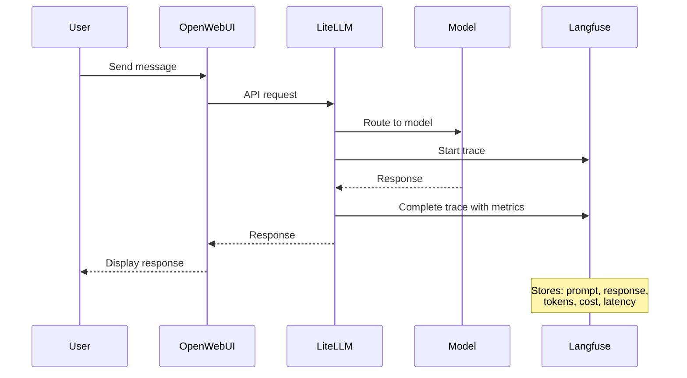

Remember all those conversations you had with vLLM and Bedrock models? Langfuse has been quietly tracking every single interaction - capturing prompts, responses, performance metrics, and costs. Let's explore the treasure trove of data it's collected about your AI usage!

## 🛠️ Hands-On: See Your AI Interactions Tracked

Let's discover what Langfuse has been learning about your AI usage:

### Step 1: Explore Your Observability Stack

:::code{language=bash showCopyAction=true}
# See the complete observability stack
kubectl get all -n langfuse
:::

You should see a comprehensive observability platform:
- **langfuse-clickhouse-0**: Analytics database for performance data
- **langfuse-postgresql-0**: Database for trace metadata
- **langfuse-redis-master-0**: Caching layer
- **langfuse-s3-xxx**: Object storage for large data
- **langfuse-web-xxx**: Main Langfuse application

### Step 2: Explore the Real Configuration

In your VSC IDE, let's examine the actual configuration:

:::code{language=bash showCopyAction=true}
# Look at the actual Langfuse Helm values
cat /workshop/components/o11y/langfuse/values.template.yaml

# See the complete stack configuration
grep -A 5 "postgresql:\|clickhouse:\|redis:" /workshop/components/o11y/langfuse/values.template.yaml
:::

Notice how Langfuse is pre-configured with your project settings and automatically initialized!

## What is Langfuse?

Langfuse is an open-source LLM observability platform that provides:

- 📊 **Comprehensive Tracing**: Every LLM interaction captured with full context
- 💰 **Cost Tracking**: Token usage and costs across all models
- ⚡ **Performance Analytics**: Latency, throughput, and quality metrics
- 🔍 **Debugging Tools**: Detailed request/response inspection
- 📈 **Usage Analytics**: Patterns, trends, and optimization insights
- 🏗️ **Multi-Database Architecture**: PostgreSQL + ClickHouse + Redis for scale

## How Langfuse is Deployed

Our Langfuse deployment uses the [official Langfuse Helm Chart](https://langfuse.com/self-hosting/deployment/kubernetes-helm) with a comprehensive observability stack. The full values.template.yaml file can be found at `/workshop/components/o11y/langfuse/values.template.yaml`. Here's how each section of the Helm configuration works:

:::::tabs

::::tab{label="Resources & Architecture"}
**Main Application Resources**

Langfuse requires adequate resources for processing and analyzing LLM traces:

:::code{language=yaml showCopyAction=true}
langfuse:
  resources:
    requests:
      cpu: 1 
      memory: 2Gi
    limits:
      memory: 2Gi
:::

**Multi-Database Architecture**

Langfuse uses a sophisticated multi-database setup for optimal performance:

:::code{language=yaml showCopyAction=true}
postgresql:  # Metadata and user data
  auth:
    username: admin
    password: password123
  primary:
    resources: 
      requests:
        cpu: 125m
        memory: 256Mi

clickhouse:  # Analytics and time-series data
  auth:
    password: password123
  resources:
    requests:
      cpu: 1    
      memory: 3Gi

redis:  # Caching and sessions
  auth:
    password: password123
  primary:
    resources: 
      requests:
        cpu: 125m
        memory: 256Mi

s3:  # Object storage for large traces
  auth:
    rootPassword: password123
  resources:
    requests:
      cpu: 250m    
      memory: 256Mi
:::

**Why This Architecture:**
- **PostgreSQL**: Fast queries for recent traces and user management
- **ClickHouse**: Optimized for analytics and large-scale aggregations
- **Redis**: High-speed caching for UI responsiveness
- **S3**: Cost-effective storage for historical trace data
::::

::::tab{label="Authentication & Initialization"}
**Automatic Project Setup**

Langfuse is pre-configured with your workshop project and user account:

:::code{language=yaml showCopyAction=true}
langfuse:
  additionalEnv:
    - name: LANGFUSE_INIT_ORG_ID
      value: my-org
    - name: LANGFUSE_INIT_PROJECT_ID
      value: my-project
    - name: LANGFUSE_INIT_PROJECT_PUBLIC_KEY
      value: {{{LANGFUSE_PUBLIC_KEY}}}
    - name: LANGFUSE_INIT_PROJECT_SECRET_KEY
      value: {{{LANGFUSE_SECRET_KEY}}}
    - name: LANGFUSE_INIT_USER_EMAIL
      value: {{{LANGFUSE_USERNAME}}}
    - name: LANGFUSE_INIT_USER_PASSWORD
      value: {{{LANGFUSE_PASSWORD}}}
:::

**Initialization Features:**
- **Organization**: Automatically creates "my-org" organization
- **Project**: Sets up "my-project" with API keys
- **User Account**: Creates admin user with workshop credentials
- **API Keys**: Generates keys for LiteLLM integration
- **Zero Setup**: Everything ready to use immediately
::::

::::tab{label="Security Configuration"}
**Authentication & Security**

Langfuse security configuration:

:::code{language=yaml showCopyAction=true}
langfuse:
  salt:
    value: salt
  nextauth:
    secret:
      value: secret
:::

**Database Security**

All databases are configured with authentication:

:::code{language=yaml showCopyAction=true}
postgresql:
  auth:
    username: admin
    password: password123

clickhouse:
  auth:
    password: password123

redis:
  auth:
    password: password123

s3:
  auth:
    rootPassword: password123
:::

**Security Features:**
- **Password Protection**: All database components secured
- **NextAuth Integration**: Secure session management
- **Salt Configuration**: Password hashing security
- **API Key Management**: Secure key generation and storage
::::

::::tab{label="Networking & Ingress"}
**Load Balancer Configuration**

Langfuse uses AWS Application Load Balancer for external access:

:::code{language=yaml showCopyAction=true}
langfuse:
  ingress:
    enabled: true
    annotations:
      alb.ingress.kubernetes.io/target-type: ip
      {{#if DOMAIN}}
      alb.ingress.kubernetes.io/listen-ports: '[{"HTTPS":443}]'
      {{/if}}
    hosts:
      - paths:
          - path: /
            pathType: Prefix
        {{#if DOMAIN}}
        host: langfuse.{{{DOMAIN}}}
        {{/if}}
:::

**Networking Features:**
- **ALB Integration**: Uses AWS Application Load Balancer
- **IP Target Type**: Direct pod networking for better performance
- **Conditional HTTPS**: HTTPS enabled when domain is configured
- **Path-Based Routing**: All traffic routed to Langfuse web interface
- **Dynamic Configuration**: Adapts based on domain availability
::::

::::tab{label="Deployment Commands"}
**Helm Deployment Process**

::alert[**⚠️ WARNING**: These commands have already been executed in your workshop environment. **DO NOT run these commands** as they will interfere with your existing setup.]{type="warning"}

The Langfuse deployment uses these Helm commands:

:::code{language=bash showCopyAction=true}
# Add the Langfuse Helm repository
helm repo add langfuse https://langfuse.github.io/langfuse-k8s
helm repo update

# Deploy Langfuse with custom values
helm upgrade --install langfuse langfuse/langfuse \
  --namespace langfuse \
  --create-namespace \
  -f values.rendered.yaml

# Check deployment status
kubectl rollout status deployment/langfuse-web -n langfuse
:::

**Deployment Process:**
1. **Template Rendering**: `values.template.yaml` → `values.rendered.yaml`
2. **Helm Installation**: Chart deployed with rendered values
3. **Database Initialization**: PostgreSQL, ClickHouse, Redis, S3 setup
4. **Project Setup**: Organization and project automatically created
5. **Integration Ready**: API keys configured for LiteLLM connection

**What Happens During Deployment:**
- Multi-database stack deployed (PostgreSQL, ClickHouse, Redis, S3)
- Langfuse web application started
- Organization and project automatically initialized
- User account created with workshop credentials
- Ingress/LoadBalancer exposes the service
- LiteLLM integration configured automatically
::::

:::::

---

## 🎯 Explore Langfuse Interface

Let's explore the Langfuse observability interface to see your AI interactions, metrics, and detailed traces:

### Step 1: Access Langfuse

Get the URL for your Langfuse instance:

:::code{language=bash showCopyAction=true}
# Get Langfuse URL
echo "Langfuse URL: http://$(kubectl get ingress -n langfuse langfuse -o jsonpath='{.status.loadBalancer.ingress[0].hostname}')"
:::

Open the URL in your browser. You'll see the Langfuse login page:

**Login Process:**
- **Email**: `admin@example.com` (pre-filled)
- **Password**: `Pass@123` (pre-filled)
- **Click "Sign in"** to access the interface

### Step 2: Navigate to Your Project

After logging in, you'll see the organizations page:

**What to do:**
- **Click "Go to project"** button for the "Provisioned Project"
- This takes you to your workshop project with all your AI interaction data

### Step 3: Explore Your AI Usage Dashboard

You'll now see the main Langfuse dashboard with comprehensive analytics:

**Key Metrics You'll See:**
- 📊 **71 Total traces tracked** - Every AI interaction from your workshop
- 💰 **$0.10957 Total cost** - Your actual workshop spending
- 🔍 **Model Breakdown**:
  - `us.anthropic.claude-3-7-sonnet`: 20.63K tokens, $0.106486
  - `openai.gpt-oss-20b-1:0`: 7.52K tokens, $0.001084  
  - `llama-3-1-8b-int8-neuron`: 12.86K tokens, $0 (self-hosted)
- 📈 **Usage Timeline**: Chart showing your interaction patterns over time

**What This Tells You:**
- Most of your cost comes from Claude 3.7 Sonnet
- GPT-OSS-20B is very cost-effective
- Self-hosted models have no per-token costs
- Your usage has clear patterns over time

### Step 4: Browse Your Traces

Click on **"Tracing"** in the left sidebar to see all your interactions:

**What you're seeing:**
- 📋 **Complete trace history** - Every AI conversation you've had
- 🕐 **Timestamps** - When each interaction occurred
- 💬 **Input/Output preview** - Snippets of your conversations
- 🔍 **Search and filter** capabilities for finding specific interactions

**Your Actual Conversations:**
You can see traces of questions like:
- "Did snakes or sea snakes come first?"
- "Where did the word dragon come from?"
- "Generate 1-3 broad tags..."

### Step 5: Examine Individual Traces

Click on any trace to see detailed information:

**Trace Details:**
- 🎯 **Trace ID**: Unique identifier for this interaction
- ⏱️ **Latency**: 5.91s response time
- 💰 **Total Cost**: $0.000459 for this specific interaction
- 🔢 **Token Usage**: 63 input → 1,514 output tokens (1,577 total)
- 💬 **Full Conversation**: Complete user question and AI response

**Click the expand button** (orange icon in top right) to see more details.

### Step 6: Deep Dive into Trace Analytics

The expanded view shows comprehensive trace information:

**Advanced Metrics:**
- 📊 **Performance Details**: Environment, latency breakdown
- 💰 **Cost Analysis**: Exact cost calculation
- 🔢 **Token Breakdown**: Input vs output token usage
- 📝 **Full Context**: Complete conversation with formatting

### Step 7: Analyze Generation Details

Click on the generation section to see the deepest level of detail:

**Generation Analytics:**
- ⚡ **Latency**: 5.91s total, 5.90s time to first token
- 🎯 **Model**: openai.gpt-oss-20b-1:0 (the exact model used)
- 💰 **Cost**: $0.000459 for this generation
- 🔢 **Tokens**: 63 prompt → 1,514 completion tokens
- 📊 **Additional Parameters**: Stream settings, region, retry configuration

**What You Learn:**
- Exact model performance characteristics
- Cost breakdown per interaction
- Token efficiency patterns
- Response quality and speed trade-offs

### Step 8: Watch New Traces Appear

Now go back to your OpenWebUI tab and send a message to any model. Watch the trace appear in Langfuse in real-time!

### Step 9: Advanced Features

Langfuse also supports advanced evaluation capabilities like:

**LLM-as-a-Judge**: Langfuse can automatically evaluate response quality using AI models as judges. This powerful feature allows you to:

- 🎯 **Automated Scoring**: Let AI models rate response quality, accuracy, and helpfulness
- 📊 **Consistency Evaluation**: Compare responses across different models objectively
- 📈 **Quality Benchmarking**: Track improvement over time with standardized metrics
- 🔄 **Continuous Evaluation**: Automatically assess every interaction for quality patterns

**Use Cases:**
- **Model Comparison**: Which model gives better responses for specific tasks?
- **Prompt Optimization**: Which prompts generate higher-quality responses?
- **Quality Monitoring**: Detect when model performance degrades
- **A/B Testing**: Compare different model configurations objectively

[Learn more about LLM-as-a-Judge →](https://langfuse.com/docs/evaluation/evaluation-methods/llm-as-a-judge)

## How Langfuse Powers Your Insights

Here's what happens every time you send a message:

## Key Insights You Can Discover

✅ **Model Performance**: Compare response times between your models

✅ **Cost Analysis**: See exactly how much each interaction cost

✅ **Usage Patterns**: Understand your AI interaction habits

✅ **Quality Tracking**: Identify which models gave better responses

✅ **Token Efficiency**: See which prompts were most effective

## What's Next?

Now that you've explored both LiteLLM (your API gateway) and Langfuse (your observability platform), you have a complete GenAI platform running on EKS! 

In the next module, we'll use this platform foundation to build sophisticated AI applications with agents, memory, and advanced reasoning capabilities.

---

**[Continue to Module 3: Building GenAI Applications →](../../module3-genai-applications/)**
