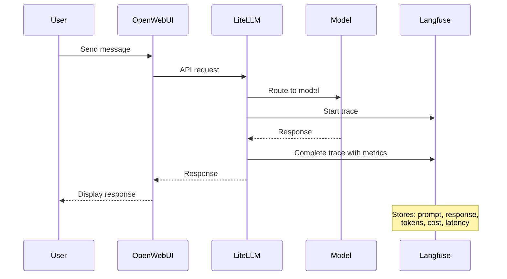

Remember all those conversations you had with vLLM and Bedrock models? Langfuse has been quietly tracking every single interaction - capturing prompts, responses, performance metrics, and costs. Let's explore the treasure trove of data it's collected about your AI usage!

## 🛠️ Hands-On: See Your AI Interactions Tracked

Let's discover what Langfuse has been learning about your AI usage:

### Step 1: Explore Your Observability Stack

:::code{language=bash showCopyAction=true}
# Check your running Langfuse instance
kubectl get pods -n langfuse

# See the complete observability stack
kubectl get all -n langfuse
:::

You should see a comprehensive observability platform:
- **langfuse-web-xxx**: Main Langfuse application
- **langfuse-postgresql-0**: Database for trace metadata
- **langfuse-clickhouse-0**: Analytics database for performance data
- **langfuse-redis-master-0**: Caching layer
- **langfuse-s3-xxx**: Object storage for large data

### Step 2: Explore the Real Configuration

In your VSC IDE, let's examine the actual configuration:

:::code{language=bash showCopyAction=true}
# Look at the actual Langfuse Helm values
cat /workshop/components/o11y/langfuse/values.template.yaml

# See the complete stack configuration
grep -A 5 "postgresql:\|clickhouse:\|redis:" /workshop/components/o11y/langfuse/values.template.yaml
:::

Notice how Langfuse is pre-configured with your project settings and automatically initialized!

### Step 3: Access Your Traces

:::code{language=bash showCopyAction=true}
# Get Langfuse URL
echo "Langfuse URL: http://$(kubectl get ingress -n langfuse langfuse -o jsonpath='{.status.loadBalancer.ingress[0].hostname}')"

# Get pre-configured credentials
echo "Email: $(kubectl get secret -n langfuse langfuse-secret -o jsonpath='{.data.username}' | base64 -d)"
echo "Password: $(kubectl get secret -n langfuse langfuse-secret -o jsonpath='{.data.password}' | base64 -d)"
:::

Open Langfuse in your browser and log in - you should see traces from all your Module 1 interactions already captured!

### Step 4: Watch New Traces Appear

Open a second terminal in your VSC IDE and run:

:::code{language=bash showCopyAction=true}
# Monitor Langfuse processing new traces
kubectl logs -f --tail=0 -n langfuse deployment/langfuse-web
:::

Now go back to your OpenWebUI tab and send a message to any model. Watch the trace appear in Langfuse in real-time!

## What is Langfuse?

Now that you've seen your data, let's understand what makes Langfuse powerful:

Langfuse is an open-source LLM observability platform that provides:

- 📊 **Comprehensive Tracing**: Every LLM interaction captured with full context
- 💰 **Cost Tracking**: Token usage and costs across all models
- ⚡ **Performance Analytics**: Latency, throughput, and quality metrics
- 🔍 **Debugging Tools**: Detailed request/response inspection
- 📈 **Usage Analytics**: Patterns, trends, and optimization insights
- 🏗️ **Multi-Database Architecture**: PostgreSQL + ClickHouse + Redis for scale

## 🔍 Explore Your AI Usage Data

Let's dive into the insights Langfuse has gathered:

### Your Conversation History

In the Langfuse UI, explore:

1. **Traces Tab**: See every model interaction from Module 1
2. **Sessions**: Grouped conversations and their context
3. **Models**: Performance comparison between vLLM and Bedrock
4. **Users**: Your usage patterns and preferences

### Performance Insights

Look for these patterns in your data:
- **Model Response Times**: Compare vLLM vs Bedrock latency
- **Token Usage**: See which prompts used more tokens
- **Cost Analysis**: Track spending across different models
- **Quality Patterns**: Which models gave better responses

### Real-Time Dashboard

:::code{language=bash showCopyAction=true}
# Generate some test data to see live updates
curl -X POST http://localhost:4000/v1/chat/completions \
  -H "Authorization: Bearer $(kubectl get secret -n litellm litellm-secret -o jsonpath='{.data.masterkey}' | base64 -d)" \
  -H "Content-Type: application/json" \
  -d '{
    "model": "vllm/llama-3-1-8b-int8-neuron",
    "messages": [{"role": "user", "content": "Analyze my usage patterns in this workshop"}],
    "max_tokens": 100
  }'
:::

Watch this request appear in your Langfuse dashboard within seconds!

## How Langfuse Powers Your Insights

Here's what happens every time you send a message:



## 🎯 Langfuse Features You Can Use

### Trace Analysis

Click on any trace in Langfuse to see:
- **Full conversation context**
- **Token breakdown** (input/output)
- **Response time** and performance metrics
- **Cost calculation** for that specific interaction
- **Model parameters** used

### Model Comparison

Use Langfuse to compare your models:
1. Go to **Analytics** → **Models**
2. Compare metrics between:
   - `vllm/llama-3-1-8b-int8-neuron`
   - `vllm/qwen3-8b-fp8-neuron`
   - `bedrock/claude-3-7-sonnet` (if you used it)

### Cost Tracking

Monitor your AI spending:
- **Total costs** across all interactions
- **Cost per model** comparison
- **Token efficiency** analysis
- **Usage trends** over time

## 🔍 Technical Deep Dive (Optional)

For those interested in Langfuse's architecture:

::::tabs

:::tab{label="Architecture"}
**Langfuse Observability Stack**

Langfuse runs as a complete observability platform:

:::code{language=yaml showCopyAction=true}
# Core components in the langfuse namespace
- Langfuse Web: Main application and UI
- PostgreSQL: Trace metadata and user data
- ClickHouse: Analytics and time-series data
- Redis: Caching and session management
- S3: Object storage for large traces
:::

**Why This Architecture?**
- **PostgreSQL**: Fast queries for recent traces and metadata
- **ClickHouse**: Optimized for analytics and aggregations
- **Redis**: Fast caching for UI responsiveness
- **S3**: Cost-effective storage for historical data
:::

:::tab{label="Integration"}
**Automatic LiteLLM Integration**

Langfuse is pre-integrated with LiteLLM:

:::code{language=yaml showCopyAction=true}
# From LiteLLM configuration
envVars:
  LANGFUSE_HOST: http://langfuse-web.langfuse:3000
  LANGFUSE_PUBLIC_KEY: {{{LANGFUSE_PUBLIC_KEY}}}
  LANGFUSE_SECRET_KEY: {{{LANGFUSE_SECRET_KEY}}}
:::

**What This Means:**
- Every LiteLLM request is automatically traced
- No additional configuration needed
- Real-time data collection
- Automatic cost calculation
:::

:::tab{label="Initialization"}
**Pre-Configured Setup**

Langfuse is initialized with your workshop project:

:::code{language=yaml showCopyAction=true}
additionalEnv:
  - name: LANGFUSE_INIT_ORG_ID
    value: my-org
  - name: LANGFUSE_INIT_PROJECT_ID
    value: my-project
  - name: LANGFUSE_INIT_USER_EMAIL
    value: {{{LANGFUSE_USERNAME}}}
  - name: LANGFUSE_INIT_USER_PASSWORD
    value: {{{LANGFUSE_PASSWORD}}}
:::

**Benefits:**
- No manual setup required
- Project automatically created
- User account pre-configured
- Ready to use immediately
:::

:::tab{label="Storage"}
**Multi-Database Strategy**

Different data types stored optimally:

:::code{language=yaml showCopyAction=true}
postgresql:  # Metadata, users, projects
  auth:
    username: admin
    password: password123

clickhouse:  # Analytics, aggregations
  auth:
    password: password123
  resources:
    memory: 3Gi

redis:  # Caching, sessions
  auth:
    password: password123

s3:  # Large objects, historical data
  auth:
    rootPassword: password123
:::
:::

::::

## 🚀 Explore Your Data

Let's dive into the insights Langfuse has collected:

### Your Model Usage Patterns

In Langfuse, explore:

1. **Dashboard**: Overview of your AI interactions
2. **Traces**: Every conversation from Module 1
3. **Sessions**: Grouped interactions by topic
4. **Models**: Performance comparison of models you used

### Generate More Data

:::code{language=bash showCopyAction=true}
# Create some varied interactions for analysis
curl -X POST http://localhost:4000/v1/chat/completions \
  -H "Authorization: Bearer $(kubectl get secret -n litellm litellm-secret -o jsonpath='{.data.masterkey}' | base64 -d)" \
  -H "Content-Type: application/json" \
  -d '{
    "model": "vllm/llama-3-1-8b-int8-neuron",
    "messages": [{"role": "user", "content": "What are the benefits of observability in AI systems?"}],
    "max_tokens": 150
  }'
:::

Watch this new trace appear in your Langfuse dashboard!

## Key Insights You Can Discover

✅ **Model Performance**: Compare response times between your models

✅ **Cost Analysis**: See exactly how much each interaction cost

✅ **Usage Patterns**: Understand your AI interaction habits

✅ **Quality Tracking**: Identify which models gave better responses

✅ **Token Efficiency**: See which prompts were most effective

## Troubleshooting

::::tabs

:::tab{label="No Traces Appearing"}
```bash
# Check LiteLLM → Langfuse connection
kubectl logs -n litellm deployment/litellm | grep -i langfuse

# Verify Langfuse is accessible
kubectl exec -n litellm deployment/litellm -- curl http://langfuse-web.langfuse:3000/health
```
:::

:::tab{label="UI Access Issues"}
```bash
# Check Langfuse web service
kubectl get svc -n langfuse

# Check ingress status
kubectl get ingress -n langfuse

# Use port-forward as backup
kubectl port-forward -n langfuse svc/langfuse-web 3000:3000
```
:::

:::tab{label="Missing Data"}
```bash
# Check Langfuse worker processing
kubectl logs -n langfuse deployment/langfuse-worker --tail=50

# Verify database connections
kubectl logs -n langfuse langfuse-postgresql-0 --tail=20
```
:::

::::

## What's Next?

Now that you've explored both LiteLLM (your API gateway) and Langfuse (your observability platform), you have a complete GenAI platform running on EKS! 

In the next module, we'll use this platform foundation to build sophisticated AI applications with agents, memory, and advanced reasoning capabilities.

---

**[Continue to Module 3: Building GenAI Applications →](../../module3-genai-applications/)**
