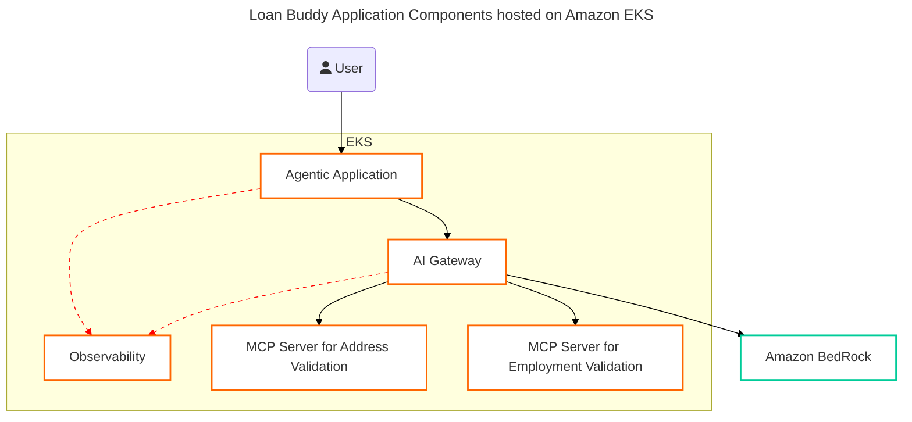

Now you understand the use-case, let's explore how the application components are connected and examine the actual code that makes it work.

## 🛠️ Hands-On: Discover Your Application Stack

### The Big Picture

In the previous module, you worked with AI Gateway (LiteLLM) and Observability (LangFuse). The Loan Buddy application consists of an Agentic module and several MCP Servers that will be deployed alongside your existing platform components on EKS.

You will deploy the application components onto Amazon EKS using pods for each component - one for the agentic module, and one each for the MCP servers. Two important things to notice: first, all calls from the agentic application to LLMs and MCP Servers are routed through your AI Gateway, providing consistent security and routing control. Second, all ecosystem components send observability data to LangFuse, capturing not only individual call metrics but complete end-to-end workflow interactions.

Let's start by examining the deployment configuration and then explore each component:

:::code{language=bash showCopyAction=true}
# Open the deployment file in VSC to see what will be deployed
code /workshop/workshops/eks-genai-workshop/static/code/module3/credit-validation/agentic-application-deployment.yaml
:::

Here is the component diagram where black arrows show the call flow while the red dotted arrows showcase the observability hooks:

<!-- 
*Loan Buddy Application Components* -->

## 🔍 Explore the Application Components

Now let's examine each component in detail using your VSC IDE:

### Step 1: Examine the Main Agent

:::code{language=bash showCopyAction=true}
# Open the main agent file in VSC
code /workshop/workshops/eks-genai-workshop/static/code/module3/credit-validation/credit-underwriting-agent.py
:::

**What to look for in the agent code:**
- **System Prompt** (around line 50): The instructions that drive the entire workflow
- **Platform Integration** (lines 25-45): How it connects to your LiteLLM gateway and Langfuse
- **MCP Server Configuration** (lines 35-50): How the agent discovers and uses tools
- **Langfuse Integration** (line 40): The `run_name` that will appear in your traces

### Step 2: Explore the MCP Servers

The MCP servers provide specialized tools that extend the agent's capabilities:

:::code{language=bash showCopyAction=true}
# Open the address validator MCP server
code /workshop/workshops/eks-genai-workshop/static/code/module3/credit-validation/mcp-address-validator.py

# Open the employment validator MCP server  
code /workshop/workshops/eks-genai-workshop/static/code/module3/credit-validation/mcp-income-employment-validator.py

# Open the image processor MCP server
code /workshop/workshops/eks-genai-workshop/static/code/module3/credit-validation/mcp-image-processor.py
:::

**Key things to notice in the MCP servers:**
- **@mcp.tool decorators**: How tools are exposed to AI agents with descriptions
- **Business Logic**: Address validation, employment verification, document processing
- **Mock Databases**: Sample data for workshop testing
- **Structured Responses**: JSON format that agents can understand

### Step 3: Understanding the Image Processing Optimization

Since we're using images of loan applications in our workflow, there's an important optimization to understand. Adding the full image to every AI call would cost more in input tokens. Instead, our agent uploads the file to S3 and the image processor MCP server downloads and processes it separately. This approach:

- **Reduces token costs** by not sending images with every request
- **Provides flexibility** to use different models for image processing
- **Improves performance** by caching processed results

### Step 4: Examine the Kubernetes Deployment

:::code{language=bash showCopyAction=true}
# See how the components will be deployed as Kubernetes pods
grep -A 10 "kind: Deployment" /workshop/workshops/eks-genai-workshop/static/code/module3/credit-validation/agentic-application-deployment.yaml
:::

**Deployment Structure:**
- **4 Deployments**: Main agent + 3 MCP servers
- **4 Services**: Kubernetes services for internal communication
- **Environment Variables**: Connections to your platform components
- **Resource Allocation**: Proper CPU and memory limits

## 🎯 Platform Integration Deep Dive

### Connection to Your GenAI Platform

Notice how Loan Buddy integrates with the platform you built in Modules 1 & 2:

**Environment Variables in the Deployment:**
- `GATEWAY_URL`: Points to your LiteLLM service
- `LANGFUSE_URL`: Points to your Langfuse service  
- `LANGFUSE_PUBLIC_KEY` & `LANGFUSE_SECRET_KEY`: For trace integration

**This means:**
- All AI requests go through **your LiteLLM gateway**
- All workflows are tracked in **your Langfuse instance**
- The agent uses **Claude 3.7 Sonnet** from your Module 1 setup

## Key Takeaways

✅ **Platform Reuse**: Loan Buddy leverages all the infrastructure you built in Modules 1 & 2

✅ **MCP Tool Architecture**: Servers expose capabilities through simple decorators and descriptions

✅ **Cost Optimization**: Image processing separated to reduce token usage

✅ **Complete Observability**: Every agent decision tracked in your existing Langfuse

✅ **Kubernetes Native**: Deployed using standard patterns you've learned

## 💡 Challenge Question

How would you modify the application to validate that 25% of the total income should be greater than 4% of the loan amount?

**Hint**: Look at the system prompt in the agent code and the business logic in the MCP servers. The validation logic can be added either in the agent's prompt or as a new MCP tool function.

## What's Next?

Now that you've explored the architecture and examined the code, let's deploy Loan Buddy on your EKS cluster and see it process real loan applications!
