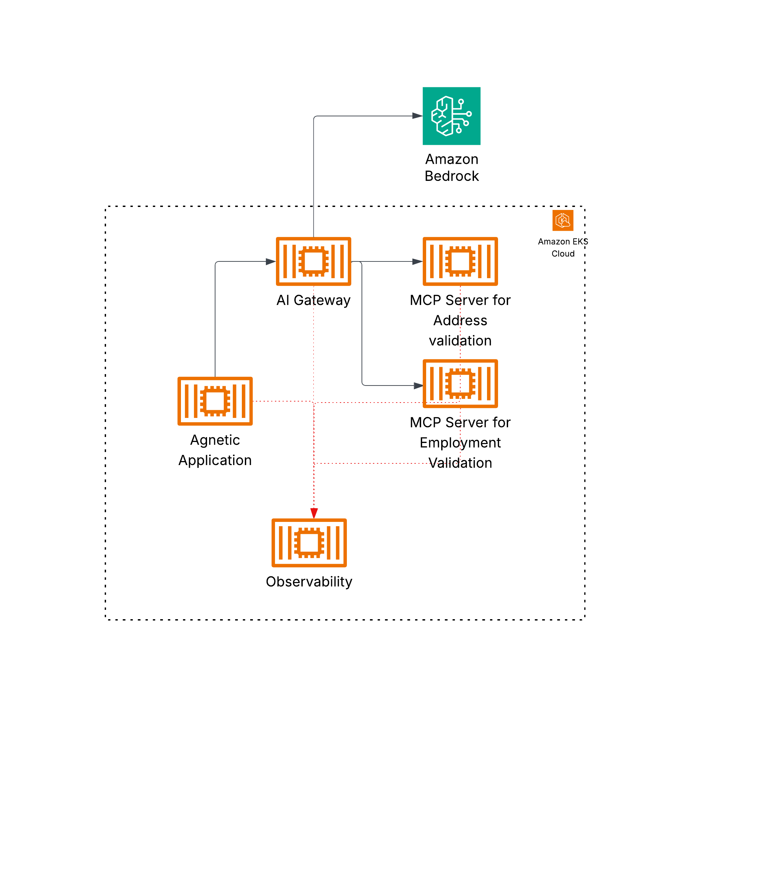
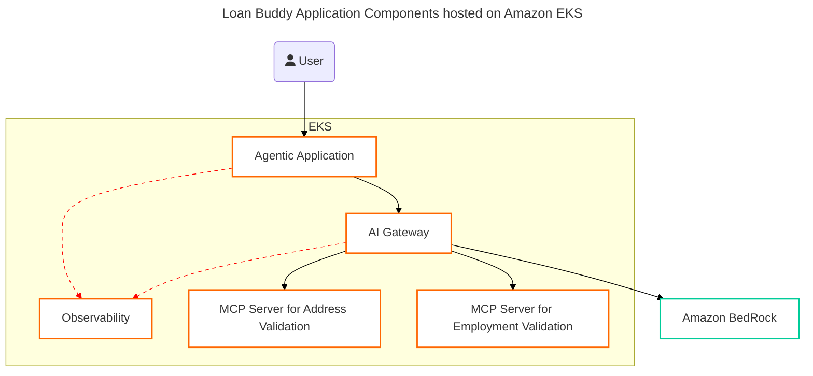

Now you understand the use-case, let's understand a little bit how the application components are connected.

### The Big Picture

In the previous module, you have been working with AI Gateway (LiteLLM) and Observability (LangFuse). And you know from the previous section that application consists of Agentic module and a couple of MCP Servers. You have hosted both AI Gateway and Observability components onto EKS to get the benefits of just in time scaling (via Karpenter) and reliability through Kubernetes Scheduler.

You will also deploy the application components onto Amazon EKS using pods for each application component. One for the agentic module, and one each for the MCP server. The following diagram shows how they are all deployed and connected with each other. Two important things to notice here is that first, all the calls from agentic application to LLM and the MCP Servers are routed through the AI Gateway, providing consistent security and routing control. Secondly, all the eco-system components such as Agentic Application and AI Gateway are sending observability data to the LangFuse, resulting in nt only capturing metrics for individual calls but capturing end to end interaction for each workflow also.

Here is the component diagram where black arrows shows the call flow while the red dotted arrows showcase the observability hooks.

<!-- 
*Loan Buddy Application Components* -->

## Application Components

- The file [`accounting-agent-demo.py`](../../static/code/accounting-agent-demo.py) consists of the agentic workflow prompt, the list of tools to call and the observability integration. Make sure you can identify each part of the agentic application.
- The files [`mcp-address-validator`](../../static/code/mcp-company-validatior.py) and [`mcp-address-validator`](../../static/code/mcp-company-validatior.py) are the MCP servers. See how they are exposing what they can do via the description of the mcp annotation.
- The deployment files where they are deployed to Amazon EKS as pods.

### Challenge

How do you change your application to validate that the 25% of the total income should be greater than the 4% of the loan amount?
