# 🛠️ The AI Assembly Line for John's Loan

Now that you've seen John Michael Doe's loan application and understand the business problem, let's explore HOW the AI actually processes it. Think of this as an assembly line where each component has a specialized job.

  

*The application we're about to process automatically*

## 🧠 The Brain: Understanding LangGraph and LangChain

Before diving into the components, let's understand the AI frameworks that power Loan Buddy:

### **LangGraph - The Workflow Orchestrator**

Think of [LangGraph](https://github.com/langchain-ai/langgraph) as the **project manager** of our AI system. It:
- **Manages state** across multiple AI calls (remembers what's been done)
- **Orchestrates workflows** (decides what to do next based on results)
- **Handles errors** gracefully (retries, fallbacks, alternative paths)
- **Tracks progress** through complex multi-step processes

:::code{language=python showCopyAction=true}
# In our agent, LangGraph creates the workflow:
from langgraph.prebuilt import create_react_agent

# This creates an agent that can:
# 1. React to inputs
# 2. Use tools (MCP servers)
# 3. Maintain state across steps
# 4. Make decisions
graph = create_react_agent(model, tools, debug=True)
:::

### **LangChain - The Foundation**

[LangChain](https://github.com/langchain-ai/langchain) provides the building blocks:
- **LLM integration** (connects to Claude via your LiteLLM gateway)
- **Tool abstractions** (standardizes how AI uses external tools)
- **Memory management** (keeps context across interactions)
- **Prompt templates** (structures instructions to the AI)

:::code{language=python showCopyAction=true}
# LangChain connects to your platform:
from langchain_openai import ChatOpenAI

model = ChatOpenAI(
    model="bedrock/claude-3.7-sonnet",
    api_key=model_key,
    base_url="http://litellm.litellm.svc.cluster.local:4000"  # Your gateway!
)
:::

## 📦 The Specialized Workers: MCP Servers Explained

**MCP (Model Context Protocol)** servers are like specialized employees, each expert at one task. Let's meet the team that processes John's application:

### **1. Image Processor MCP - "The Document Reader" 📸**

**Job**: Extract structured data from John's loan application image

:::code{language=bash showCopyAction=true}
# Let's examine this MCP server's code:
code /workshop/workshops/eks-genai-workshop/static/code/module3/credit-validation/mcp-image-processor.py
:::

**How it works:**
1. **Receives** John's application image ID
2. **Retrieves** the image from S3 storage
3. **Uses Claude's vision** to read and understand the document
4. **Extracts** structured JSON data

**What it extracts from John's application:**
:::code{language=json showCopyAction=true}
{
    "name": "John Michael Doe",
    "date_of_birth": "March 15, 1985",
    "ssn_last_4": "7890",
    "email": "john.doe@email.com",
    "employer": "Tech Solutions Inc",
    "job_title": "Software Engineer",
    "annual_income": 75000,
    "address": "123 Main Street",
    "city": "Anytown",
    "state": "CA",
    "zip": "90210",
    "loan_amount": 8500,
    "loan_purpose": "Home Improvement"
}
:::

**Key insight**: The image isn't sent with every AI call (expensive!). Instead, it's stored once in S3 and referenced by ID.

### **2. Address Validator MCP - "The Detective" 🏠**

**Job**: Verify John's address is real and assess risk

:::code{language=bash showCopyAction=true}
# Examine the address validator:
code /workshop/workshops/eks-genai-workshop/static/code/module3/credit-validation/mcp-address-validator.py
:::

**What it does with "123 Main Street, Anytown, CA 90210":**
1. **Validates** the address format and ZIP code
2. **Checks** if it's residential (not a PO Box)
3. **Assesses** fraud risk indicators
4. **Verifies** ownership status (John owns the home)
5. **Calculates** stability score (4 years = high stability)

**Returns for John:**
:::code{language=python showCopyAction=true}
{
    "validation_status": "VALID",
    "is_residential": True,
    "address_type": "Single Family",
    "occupancy_status": "Owner Occupied",
    "risk_score": 15,  # Low risk
    "years_at_address": 4,
    "recommendation": "Address verified successfully. Proceed with application."
}
:::

### **3. Employment Validator MCP - "The Background Checker" 💼**

**Job**: Verify John's employment and income claims

:::code{language=bash showCopyAction=true}
# Examine the employment validator:
code /workshop/workshops/eks-genai-workshop/static/code/module3/credit-validation/mcp-income-employment-validator.py
:::

**What it verifies about Tech Solutions Inc:**
1. **Employment status** (Full-time Software Engineer)
2. **Income accuracy** ($75,000 annual / $6,250 monthly)
3. **Employment duration** (3.5 years)
4. **Stability assessment** (consistent employment history)

**Returns for John:**
:::code{language=python showCopyAction=true}
{
    "validation_status": "PASSED",
    "employment_verified": True,
    "income_verified": True,
    "verified_employer": "Tech Solutions Inc",
    "verified_income": 75000,
    "employment_years": 3.5,
    "stability_score": 85,  # High stability
    "recommendation": "Employment and income verified successfully."
}
:::

## 🎭 The Orchestrator: How the Agent Brings It All Together

The Loan Processing Agent is the conductor of this orchestra. Let's see how it processes John's application:

:::code{language=bash showCopyAction=true}
# Open the main agent to see the orchestration:
code /workshop/workshops/eks-genai-workshop/static/code/module3/credit-validation/credit-underwriting-agent.py
:::

### **The Agent's Workflow for John:**

```mermaid
graph TD
    A[📄 John's Application Uploaded] --> B[🤖 Agent Receives Image ID]
    B --> C[📸 Call Image Processor MCP]
    C --> D[Extract John's Data]
    D --> E[🏠 Call Address Validator MCP]
    E --> F[Verify 123 Main St]
    F --> G[💼 Call Employment Validator MCP]
    G --> H[Verify Tech Solutions Inc]
    H --> I[🧮 Calculate Ratios]
    I --> J{Decision Logic}
    J -->|All Checks Pass| K[✅ APPROVED]
    J -->|Issues Found| L[❌ REJECTED]
    K --> M[📊 Log to Langfuse]
    L --> M
    
    style K fill:#90EE90
    style L fill:#FFB6C1
    style M fill:#87CEEB
```



### **The System Prompt - The Agent's Instructions**

The agent follows instructions written in plain English:

:::code{language=python showCopyAction=true}
system_prompt = """You are a helpful AI assistant for credit underwriting.

Your task is to process credit applications by:
1. First, extract credit application data from the uploaded document
2. Then validate the extracted information using validation tools
3. Make a final credit decision based on all validation results
4. Present a comprehensive credit assessment

You have access to these MCP tools:
- extract_credit_application_data: Extract applicant information
- validate_address: Verify address information
- validate_income_employment: Verify employment and income
"""
:::

**Key Insight**: No complex programming - just clear instructions in English!

## 🔌 Platform Integration: How It All Connects

Let's examine the deployment configuration to see how everything connects:

:::code{language=bash showCopyAction=true}
# Open the deployment file:
code /workshop/workshops/eks-genai-workshop/static/code/module3/credit-validation/agentic-application-deployment.yaml
:::

### **Key Integration Points:**

::::tabs

:::tab{label="LiteLLM Gateway"}
```yaml
- name: GATEWAY_URL
  value: "http://litellm.litellm.svc.cluster.local:4000"
- name: GATEWAY_MODEL_ACCESS_KEY
  value: "your-api-key"
```
**All AI requests route through your gateway** - no direct model calls!
:::

:::tab{label="Langfuse Observability"}
```yaml
- name: LANGFUSE_URL
  value: "http://langfuse-web.langfuse.svc.cluster.local:3000"
- name: LANGFUSE_PUBLIC_KEY
  value: "your-public-key"
```
**Every decision is tracked** - complete audit trail!
:::

:::tab{label="MCP Communication"}
```yaml
- name: MCP_ADDRESS_VALIDATOR
  value: "http://mcp-address-validator:8000"
- name: MCP_EMPLOYMENT_VALIDATOR
  value: "http://mcp-employment-validator:8000"
```
**Internal Kubernetes networking** - secure and fast!
:::

:::tab{label="S3 Storage"}
```yaml
- name: S3_BUCKET_NAME
  value: "langfuse"
- name: S3_ENDPOINT_URL
  value: "http://langfuse-s3.langfuse.svc.cluster.local:9000"
```
**Images stored once** - referenced by ID for efficiency!
:::

::::

## 🎯 Why This Architecture Matters

### **Separation of Concerns**
- Each MCP server has ONE job and does it well
- Agent orchestrates but doesn't implement business logic
- Platform components (LiteLLM, Langfuse) handle infrastructure

### **Scalability**
- MCP servers can be scaled independently
- Multiple agents can share the same MCP servers
- Platform components handle load balancing

### **Maintainability**
- Update business rules in MCP servers without touching the agent
- Add new validation tools without changing existing code
- Complete observability makes debugging easy

### **Cost Optimization**
- Images processed once and cached
- Efficient token usage (no image in every call)
- Shared infrastructure reduces overhead

## 💡 Challenge: Extend the System

**Question**: How would you add a new validation rule that requires the monthly payment to be less than 25% of monthly income?

**Hint**: You could either:
1. Add logic to the Employment Validator MCP to check this ratio
2. Create a new "Debt Ratio Calculator" MCP server
3. Add the check to the agent's system prompt

Think about the trade-offs of each approach!

## What's Next?

Now that you understand how all the components work together to process John's loan application, it's time to deploy everything and see it in action! In the next section, you'll:

1. Deploy all four components to your EKS cluster
2. Process John's actual application
3. Watch the real-time logs as the AI makes decisions
4. Explore the complete workflow in Langfuse

---

**[Next: Deploy and Test Your Application →](../running-application/)**
