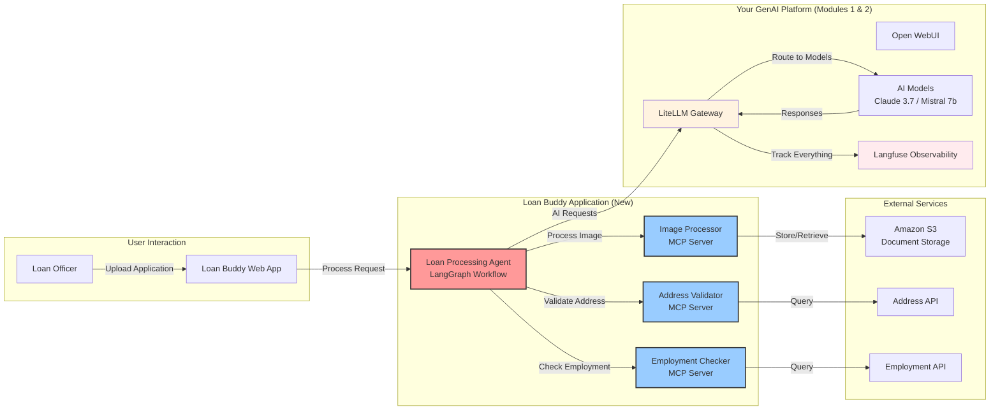

You've built an amazing GenAI platform with models, gateway, and observability - now let's put it to work! In this module, you'll use your platform to build "Loan Buddy" an intelligent loan processing application that demonstrates how AI agents can automate complex business workflows.

::alert[**Platform Required**: This module builds on your GenAI platform from Modules 1 & 2. Please complete those modules first if you haven't already.]{type="warning"}

## Learning Objectives

By the end of this module, you will:

- 🎯 **Build a real AI application** using your platform from Modules 1 & 2
- 🤖 **Deploy intelligent agents** that make business decisions automatically
- 🔧 **Use Model Context Protocol (MCP)** to give AI agents external tools and capabilities
- 📊 **Track agent workflows** in Langfuse with complete observability
- 🏗️ **Understand application architecture** for AI agents on Kubernetes
- 💼 **See business value** of AI automation in action

## Application Architecture

**Loan Buddy** demonstrates how AI agents can transform manual loan processing into intelligent automation using your GenAI platform.
Here's how Loan Buddy uses your GenAI platform:

**Key Integration Points:**
- **Uses your LiteLLM Gateway** from Module 2 for all AI requests
- **Tracked in Langfuse** from Module 2 for complete observability
- **Leverages your models** from Module 1 (Claude 3.7 recommended)
- **Deployed on EKS** using the same patterns you've learned

## Module Structure

This module is organized into three hands-on sections:

#### 1. [Understanding the Use Case](./usecase/)
**Business Context and Requirements**
- Explore the loan processing business problem
- Understand the AI solution architecture
- Preview the application components and workflow

#### 2. [Application Components](./application-components/)
**Technical Deep Dive**
- Examine the LangGraph agent workflow
- Explore MCP servers and their capabilities
- Understand how components integrate with your platform

#### 3. [Running the Application](./running-application/)
**Hands-On Deployment and Testing**
- Deploy Loan Buddy on your EKS cluster
- Test the application with sample loan documents
- Watch the complete workflow in Langfuse observability

## What Makes This Module Special?

This module demonstrates **real-world AI application patterns**:

- **Platform Integration**: Uses the infrastructure you built in previous modules
- **Business Value**: Solves actual business problems with measurable outcomes
- **Complete Observability**: Every agent decision tracked and auditable
- **Modern AI Frameworks**: LangGraph for workflow orchestration, MCP for tool integration
- **Kubernetes Native**: Deployed using the same patterns as your platform components

## Key Technologies You'll Use

::::tabs

:::tab{label="AI Frameworks"}
- **LangGraph** - Workflow orchestration for AI agents
- **LangChain** - Foundation for building AI applications
- **Model Context Protocol** - Tool integration standard
- **Pydantic** - Data validation and serialization
:::

:::tab{label="Platform Integration"}
- **Your LiteLLM Gateway** - Routes all AI requests
- **Your Langfuse Instance** - Tracks all agent activities
- **Your EKS Cluster** - Hosts the application components
- **Claude 3.7 Sonnet** - Recommended model for complex reasoning
:::

:::tab{label="Application Components"}
- **Loan Processing Agent** - Main workflow orchestrator
- **Address Validator** - MCP server for address verification
- **Employment Checker** - MCP server for employment validation
- **Image Processor** - MCP server for document analysis
:::

::::

## Expected Outcomes

By completing this module, you will have:

✅ **A working AI application** deployed on your EKS cluster

✅ **Complete workflow visibility** in Langfuse showing every agent decision

✅ **Understanding of AI agent patterns** for business automation

✅ **Experience with MCP integration** for extending AI capabilities

✅ **Practical knowledge** of deploying AI applications on Kubernetes

## Let's Get Started!

Ready to build your first intelligent application? Let's begin by understanding the business use case and seeing how AI agents can transform loan processing workflows.

::alert[**Tip**: Keep Langfuse open in a browser tab throughout this module - you'll watch your agent workflows appear in real-time as the application processes loan applications.]{type="info"}

---

**[Next: Understanding the Use Case →](./usecase/)**
