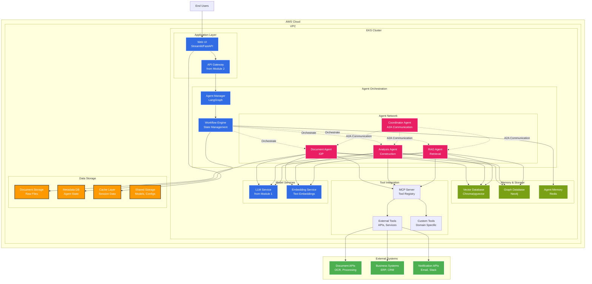

# Module 3: Building GenAI Applications

Welcome to Module 3! In this module, you'll build practical GenAI applications using modern frameworks and learn to create sophisticated agentic systems.

## Module Architecture Overview

This module implements sophisticated agentic applications with multi-agent orchestration, memory systems, and tool integration:



### Key Components

1. **Agent Orchestration**: LangGraph-based workflow engine with state management
2. **Multi-Agent Network**: Specialized agents with A2A communication patterns
3. **Memory Systems**: Vector, graph, and cache layers for persistent agent memory
4. **Tool Integration**: MCP-based universal tool registry and custom integrations
5. **Dual Storage**: Structured (RDS) and unstructured (S3, Vector DB) data management

### Application Patterns

- **Intelligent Document Processing (IDP)**: End-to-end document analysis workflow
- **Construction Defect Management**: Industry-specific multi-agent collaboration
- **Agentic RAG**: Advanced retrieval with agent-driven query planning
- **A2A Communication**: Direct agent messaging and event-driven coordination

## Learning Objectives

By the end of this module, you will be able to:
- Build GenAI applications using LangChain and LangGraph frameworks
- Implement vector databases and persistent memory solutions
- Integrate Model Context Protocol (MCP) for external tool access
- Design and implement multi-agent orchestration systems
- Create practical use cases for IDP and construction defect management
- Build advanced agentic RAG systems with sophisticated retrieval patterns

## Module Overview

### 1. Application Frameworks
- **LangChain**: Building blocks for LLM applications
- **LangGraph**: Workflow orchestration for complex agents
- **Integration Patterns**: Connecting components effectively

### 2. Memory and Storage
- **Vector Databases**: Chroma, Pinecone, and pgvector
- **Persistent Memory**: Long-term agent memory solutions
- **Knowledge Management**: Organizing and retrieving information

### 3. Tool Integration
- **Model Context Protocol (MCP)**: Universal tool integration standard
- **External APIs**: Connecting to external services
- **Custom Tools**: Building domain-specific tools

### 4. Multi-Agent Systems
- **Agent Communication**: Protocols and patterns
- **Orchestration**: Coordinating multiple agents
- **Scaling Patterns**: From single to multiple agents

### 5. Practical Use Cases
- **Intelligent Document Processing**: End-to-end document workflows
- **Construction Defect Management**: Industry-specific solutions
- **Agentic RAG**: Advanced retrieval-augmented generation

## Application Architecture

Our GenAI applications follow a modular architecture:

```
┌─────────────────────────────────────────────────────────────┐
│                    User Interface Layer                     │
│  ┌─────────────┐  ┌─────────────┐  ┌─────────────┐        │
│  │   Web UI    │  │   API       │  │   CLI       │        │
│  └─────────────┘  └─────────────┘  └─────────────┘        │
└─────────────────────────────────────────────────────────────┘
┌─────────────────────────────────────────────────────────────┐
│                   Agent Orchestration Layer                │
│  ┌─────────────┐  ┌─────────────┐  ┌─────────────┐        │
│  │ Agent       │  │ Workflow    │  │ Task        │        │
│  │ Manager     │  │ Engine      │  │ Scheduler   │        │
│  └─────────────┘  └─────────────┘  └─────────────┘        │
└─────────────────────────────────────────────────────────────┘
┌─────────────────────────────────────────────────────────────┐
│                   Application Logic Layer                  │
│  ┌─────────────┐  ┌─────────────┐  ┌─────────────┐        │
│  │ LangChain   │  │ LangGraph   │  │ Custom      │        │
│  │ Chains      │  │ Workflows   │  │ Agents      │        │
│  └─────────────┘  └─────────────┘  └─────────────┘        │
└─────────────────────────────────────────────────────────────┘
┌─────────────────────────────────────────────────────────────┐
│                    Tool Integration Layer                   │
│  ┌─────────────┐  ┌─────────────┐  ┌─────────────┐        │
│  │ MCP Tools   │  │ External    │  │ Custom      │        │
│  │             │  │ APIs        │  │ Tools       │        │
│  └─────────────┘  └─────────────┘  └─────────────┘        │
└─────────────────────────────────────────────────────────────┘
┌─────────────────────────────────────────────────────────────┐
│                     Storage Layer                          │
│  ┌─────────────┐  ┌─────────────┐  ┌─────────────┐        │
│  │ Vector      │  │ Graph       │  │ Document    │        │
│  │ Database    │  │ Database    │  │ Store       │        │
│  └─────────────┘  └─────────────┘  └─────────────┘        │
└─────────────────────────────────────────────────────────────┘
```

## Prerequisites

Before starting this module, ensure you have:
- Completed [Module 2: GenAI Platform Components](/module2-genai-components/)
- Working LiteLLM gateway and LangFuse observability
- Basic understanding of agent architectures
- Familiarity with Python programming

## Technology Stack

### Core Frameworks
- **LangChain**: LLM application development framework
- **LangGraph**: Workflow orchestration for agents
- **CrewAI**: Multi-agent collaboration framework
- **AutoGen**: Conversational AI framework

### Memory and Storage
- **ChromaDB**: Open-source vector database
- **Pinecone**: Managed vector database service
- **pgvector**: PostgreSQL extension for vector storage
- **Neo4j**: Graph database for knowledge graphs

### Tool Integration
- **Model Context Protocol (MCP)**: Universal tool integration
- **LangChain Tools**: Pre-built tool integrations
- **Custom Tools**: Domain-specific tool development

### Supporting Technologies
- **FastAPI**: Web framework for API development
- **Streamlit**: Interactive web applications
- **Gradio**: Machine learning interfaces
- **Docker**: Containerization for deployment

## Key Concepts

### Agent Architecture Patterns

1. **ReAct Pattern**: Reasoning and Acting in synergy
2. **Tool-Using Agents**: Agents that can use external tools
3. **Multi-Agent Collaboration**: Coordinated agent systems
4. **Hierarchical Agents**: Supervisor-worker patterns

### Memory Systems

1. **Short-term Memory**: Conversation context and recent interactions
2. **Long-term Memory**: Persistent knowledge and learned behaviors
3. **Episodic Memory**: Specific events and experiences
4. **Semantic Memory**: General knowledge and concepts

### Workflow Orchestration

1. **Sequential Workflows**: Step-by-step processing
2. **Parallel Workflows**: Concurrent task execution
3. **Conditional Workflows**: Decision-based branching
4. **Iterative Workflows**: Feedback loops and refinement

## Development Approach

### 1. Start Simple
- Begin with basic chains and single agents
- Gradually add complexity and capabilities
- Test each component thoroughly

### 2. Modular Design
- Create reusable components
- Implement clear interfaces
- Enable easy testing and maintenance

### 3. Observability First
- Instrument all components with tracing
- Monitor performance and costs
- Implement comprehensive logging

### 4. User-Centric Design
- Focus on user experience
- Provide clear feedback and error handling
- Enable easy customization

## Estimated Time

- **Total Duration**: 2.5 hours
- **Frameworks**: 30 minutes
- **Memory Stores**: 30 minutes
- **MCP Integration**: 20 minutes
- **Multi-Agent Systems**: 30 minutes
- **Use Cases**: 40 minutes
- **Agentic RAG**: 30 minutes

## Module Sections

1. **[Frameworks](/module3-genai-applications/frameworks/)** - LangChain and LangGraph fundamentals
2. **[Memory Stores](/module3-genai-applications/memory-stores/)** - Vector databases and persistent memory
3. **[MCP Integration](/module3-genai-applications/mcp-integration/)** - Model Context Protocol for tool access
4. **[Multi-Agent](/module3-genai-applications/multi-agent/)** - Agent orchestration and communication
5. **[Use Cases](/module3-genai-applications/use-cases/)** - Practical applications and examples
6. **[Agentic RAG](/module3-genai-applications/agentic-rag/)** - Advanced RAG patterns and implementations

## Expected Outcomes

By the end of this module, you will have built:
- A complete GenAI application using modern frameworks
- Multi-agent systems with proper orchestration
- Persistent memory solutions for long-term context
- Real-world use cases demonstrating practical applications
- Advanced RAG systems with sophisticated retrieval patterns

## Best Practices

1. **Start with MVPs**: Build minimum viable products first
2. **Test Early and Often**: Implement comprehensive testing
3. **Monitor Everything**: Use observability tools throughout
4. **Design for Scale**: Consider performance and scalability
5. **User Experience**: Focus on intuitive interfaces

## Let's Get Started!

Ready to build your first GenAI application? Let's begin with [Application Frameworks](/module3-genai-applications/frameworks/). 