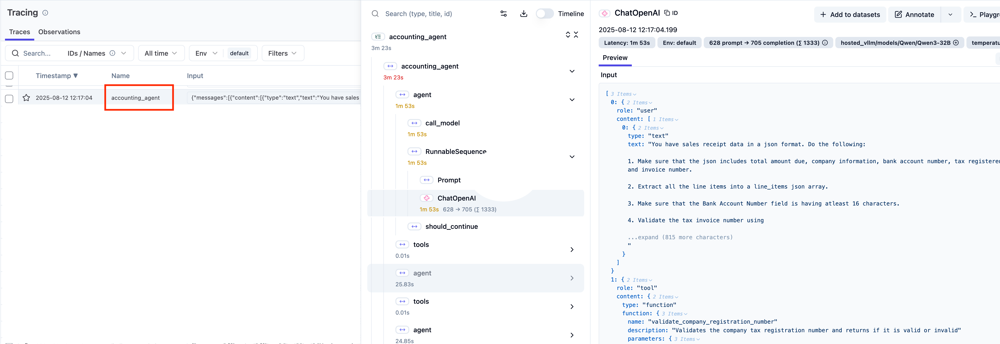

All is left to deploy this application and test it out.

### Pre-requisite

From module 2, validate that you can access your AI Gateway and the LangFuse observability dashboard.

### Preparing the deployment

Go to your vscode and open a local file named `.env`. This file contains the location and the access keys for your LiteLLM andd the LangFuse components. The agentic application needs these information to connect and validate the platform components you have created in the earlier module.

Note down the values for `LITELLM_API_KEY`, `LANGFUSE_PUBLIC_KEY`, and `LANGFUSE_PRIVATE_KEY`.

In the next step you will add these values in the ['agentic-application-deploy.yaml'](../../static/code/module3/credit-validation/agentic-application-deployment.yaml) file so the application can connect to your platform components.

### Deploy Application Components

Open the ['agentic-application-deploy.yaml'](../../static/code/module3/credit-validation/agentic-application-deployment.yaml) file and locate the env variable named `GATEWAY_MODEL_ACCESS_KEY` variable and replace its value with the value of `LITELLM_API_KEY`.

Similarly locate the `LANGFUSE_PUBLIC_KEY`, and `LANGFUSE_PRIVATE_KEY` in the yaml file and replace their values as per your .env file.

Save your ['agentic-application-deploy.yaml'](../../static/code/module3/credit-validation/agentic-application-deployment.yaml).

Create the namespace named `workshop` where the loan-buddy app will be deployed.

```bash
kubectl create ns workshop
```

Using the file ['agentic-application-deploy.yaml'](../../static/code/module3/credit-validation/agentic-application-deployment.yaml) to deploy the application components onto the EKS. You can use the following command.
> **Important**
> Before running this deployment yaml file, edit the file and replace the keys for `LANGFUSE_PUBLIC_KEY`, `LANGFUSE_SECRET_KEY` and `GATEWAY_MODEL_ACCESS_KEY` as per your environment.

```bash
kubectl create -f agentic-application-deploy.yaml -n workshop
```

Check of all the components are deployed and in the running state using the list of pods following command.

```bash
kubectl get pods -n workshop
```

### Calling the application

Before calling the application, tail the log from application pod in a separate terminal using the following command.

```bash
kubectl logs -f <POD_NAME> -n workshop
```

The [loan application](../../static/code/module3/credit-validation/example1.png) is an example loan application. You will use this file to make a call to the agentic application. Use the following command to expose the running agentic application on the local port and make a cURL call to start the process. Before running the cURL call, make sure that you are in the credit-validation folder where the example1.png exists.

```bash

kubectl port-forward service/loan-buddy-agent 8080:8080 -n workshop &

curl -X POST -F "file=@./example1.png" http://localhost:8080//api/process_credit_application_with_upload
```

Track the logs from the application pod and see how the LLM is executing the workflow. Remember that you have not coded any workflow or calls to MCP servers. All is done for you by the LLM using the prompt that you have provided.

### Validating in LangFuse

Go to LangFuse page and open the Traces section. Find our your agent call, you can get the identity of your call by opening up the [`credit-underwriting-agent.py`](../../static/code/module3/credit-validation/credit-underwriting-agent.py) and look for the string `run_name` which is a LangFuse pointer to record your traces against.

You shall see a flow similar to the picture below with the `run_name` key captured in a red rectangle. Notice that how a full trace with multiple calls to your tool and LLM are captured. Validate following:

- The flow has been executed as per your prompt
- See the input and out of each LLM and MCP calls and familiarise yourself with the data captured
- See the Metrics for LLM such as Time to First Token and LAtency capture by the LangFuse.


*Observability*
