# 🏦 Sarah's Friday Night Problem

It's 5 PM on a Friday. Sarah, a loan officer at Community Bank, looks at her computer screen. A loan application just came in from John Michael Doe...

 

*A typical personal loan application - Form CLA-2024-001*

Sarah sighs. To process this application, she needs to:

- **Extract data**: Type in John's name, DOB (March 15, 1985), SSN ending in 7890
- **Verify employment**: Call Tech Solutions Inc to confirm John's Software Engineer position  
- **Validate income**: Verify the $75,000 annual income ($6,250/month)
- **Check address**: Confirm 123 Main Street, Anytown, CA 90210 is a real address
- **Assess stability**: Note he's been there 4 years, owns the home, employed 3.5 years
- **Calculate ratios**: $8,500 loan for home improvement, 36-month term, $275/month payment
- **Make decision**: Approve or deny based on all factors

**This takes 2-3 hours. But what if AI could do it in 2 minutes?**

## 🤖 Enter Loan Buddy: Sarah's AI Assistant

**Loan Buddy** uses your GenAI platform to automate the entire loan review process. Let's see how it would handle John's application:

### What Loan Buddy Does in Minutes:
1. **Reads the Application** using vision language models to extract all data from the image
2. **Validates Information** using external services (address verification, employment checks)
3. **Applies Business Rules** automatically (loan limits, income ratios, risk assessment)
4. **Makes Decisions** with complete audit trails in Langfuse
5. **Documents Everything** for compliance and future reference

### The Business Impact:
- ⚡ **Processing Time**: 2-3 hours → 2 minutes (99% faster!)
- 🎯 **Consistency**: Same criteria applied every time, no human variance
- 💰 **Cost Savings**: Fewer manual review hours needed
- 📊 **Complete Audit Trail**: Every decision tracked and explainable in Langfuse
- 😊 **Better Experience**: Quick responses for applicants like John

## 📋 Let's Look at John's Application in Detail

### What Needs Processing:

::::tabs

:::tab{label="Personal Information"}
- **Full Name**: John Michael Doe
- **Date of Birth**: March 15, 1985  
- **SSN**: ***-**-7890 (last 4 digits)
- **Phone**: (555) 123-4567
- **Email**: john.doe@email.com
:::

:::tab{label="Employment Details"}
- **Employer**: Tech Solutions Inc
- **Position**: Software Engineer
- **Status**: Full-time
- **Years Employed**: 3.5 years
- **Annual Income**: $75,000
- **Monthly Income**: $6,250
:::

:::tab{label="Address Information"}
- **Street**: 123 Main Street
- **City**: Anytown, **State**: CA, **ZIP**: 90210
- **Housing Status**: Own
- **Years at Address**: 4 years
:::

:::tab{label="Loan Request"}
- **Amount**: $8,500
- **Purpose**: Home Improvement
- **Term**: 36 months
- **Estimated Payment**: $275/month
:::

::::

**The Challenge:** Imagine processing hundreds of these applications weekly, each requiring manual verification of every detail!

## 🔧 How Your GenAI Platform Powers This

Remember the platform you built in Modules 1 & 2? Here's how Loan Buddy leverages it:

```mermaid
graph LR
    subgraph "John's Application"
        APP[📄 Loan Application<br/>Form CLA-2024-001]
    end
    
    subgraph "Your GenAI Platform"
        GATEWAY[🚪 LiteLLM Gateway<br/>Routes AI Requests]
        LANGFUSE[📊 Langfuse<br/>Tracks Everything]
        CLAUDE[🧠 Claude 3.7 Sonnet<br/>Processes & Decides]
        MCP1[🏠 Address Validator<br/>Verifies 123 Main St]
        MCP2[💼 Employment Checker<br/>Confirms Tech Solutions Inc]
        MCP3[📸 Image Processor<br/>Extracts John's Data]
    end
    
    subgraph "Loan Buddy Components"
        AGENT[🤖 Loan Processing Agent<br/>Orchestrates Workflow]
    end
    
    APP --> AGENT
    AGENT --> GATEWAY
    GATEWAY --> CLAUDE
    CLAUDE --> GATEWAY
    GATEWAY --> LANGFUSE
    
    GATEWAY --> MCP1
    GATEWAY --> MCP2
    GATEWAY --> MCP3

    AGENT --> LANGFUSE
    
    style AGENT fill:#ff9999,stroke:#333,stroke-width:2px
    style GATEWAY fill:#fff3e0
    style LANGFUSE fill:#ffebee
```

**Key Integration Points:**
- **Uses your LiteLLM Gateway** for all AI requests (no direct model calls)
- **Tracked in Langfuse** for complete observability and compliance
- **Leverages Claude 3.7 Sonnet** for complex reasoning and decision-making
- **Deployed on your EKS cluster** using the same patterns you've learned

## 🎯 What You'll Experience

When you deploy and test Loan Buddy with John's application, you'll see:

1. **Upload John's application image** → AI extracts all his personal, employment, and loan data
2. **Watch real-time processing** → See the agent validate his address, verify his employment at Tech Solutions Inc
3. **Observe decision-making** → Watch the AI calculate his debt-to-income ratio (4.4% - excellent!)
4. **Explore complete traces** → View the entire workflow in Langfuse with all tool calls and reasoning
5. **See the final decision** → APPROVED with full justification and audit trail

## 💡 The "Aha!" Moment

By the end of this module, you'll understand:

✅ **How AI agents work** - Not just chatbots, but intelligent workflow orchestrators

✅ **The power of tool integration** - How MCP servers extend AI capabilities with real-world data

✅ **Platform thinking** - How your GenAI infrastructure enables multiple applications

✅ **Business transformation** - Real automation that solves actual problems (Sarah gets her Friday night back!)

✅ **Observability importance** - Every decision tracked for compliance and optimization

## What's Next?

Now that you understand the business impact and can visualize John's loan being processed in minutes instead of hours, let's dive into the technical architecture. You'll explore how the AI agent orchestrates the workflow and how each MCP server contributes to the decision-making process.

::alert[**Get Ready**: In the next section, you'll examine the actual code that makes this magic happen. You'll see how a few hundred lines of Python can automate hours of manual work!]{type="info"}

---

**[Next: Application Components →](../application-components/)**
