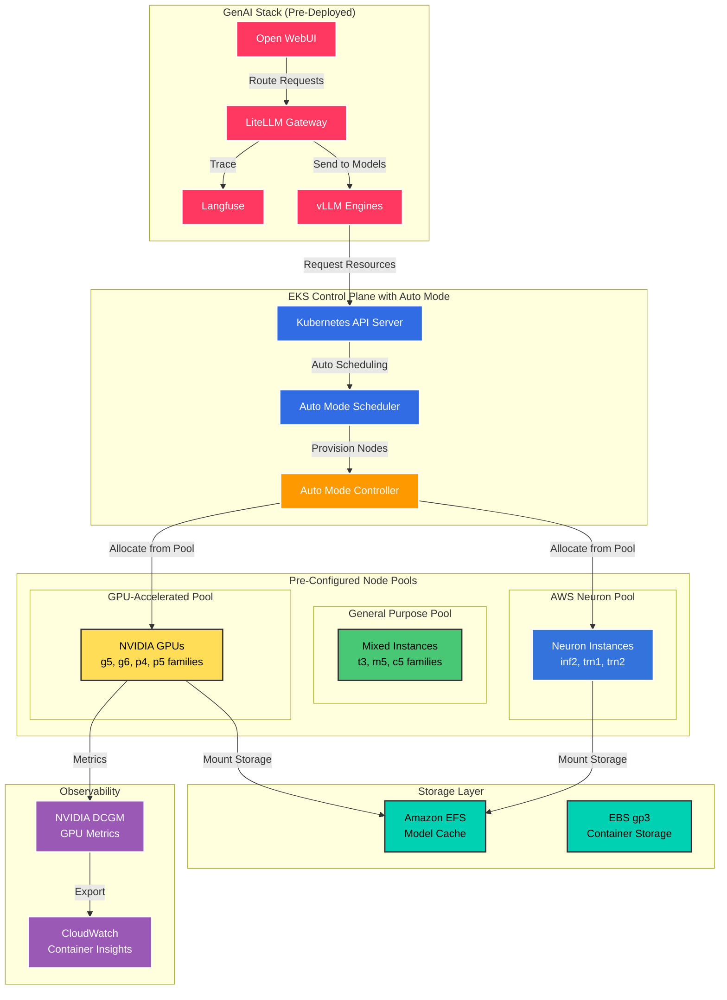

In this section, you'll explore and optimize the EKS Auto Mode configuration that's already deployed in your workshop environment. EKS Auto Mode provides fully managed compute, storage, and networking, eliminating the operational overhead of node management while automatically scaling based on your GenAI workload demands.

:::alert[**Pre-Configured Environment**: Your workshop cluster already has EKS Auto Mode enabled with specialized node pools for GPU and CPU workloads. This section focuses on understanding, monitoring, and optimizing the existing configuration.]{type="success"}
:::

## Learning Objectives

By the end of this section, you will:
- Understand EKS Auto Mode architecture and its benefits for GenAI workloads
- Explore the pre-configured node pools for GPU and CPU workloads
- Monitor automatic scaling behavior with your GenAI applications
- Configure workload placement using node selectors and taints
- Optimize cost and performance using EKS Auto Mode features
- Set up advanced monitoring for GPU utilization
- Implement best practices for production GenAI deployments

## Workshop Environment Architecture

Your workshop cluster leverages EKS Auto Mode, which automatically manages the underlying infrastructure:



## Understanding EKS Auto Mode

### What is EKS Auto Mode?

EKS Auto Mode is a fully managed Kubernetes experience where AWS handles all aspects of compute, storage, and networking management. Unlike traditional node management approaches (self-managed or managed node groups), Auto Mode eliminates operational overhead while providing optimal performance for your workloads.

### Key Benefits for GenAI Workloads

**🚀 Zero Node Management**
- No need to create, update, or manage EC2 instances
- Automatic OS patching and security updates
- Built-in node health monitoring and replacement

**💰 Cost Optimization**
- Automatic right-sizing based on pod requirements
- Intelligent Spot instance integration (up to 70% savings)
- No over-provisioning or idle resources

**⚡ Instant Scaling**
- Provisions nodes in seconds, not minutes
- Automatically scales based on pending pods
- Supports scaling to thousands of pods

**🔒 Enhanced Security**
- Automatic security patches and updates
- Pod Identity integration for secure AWS API access
- Network isolation and security group management

### How It Differs from Karpenter

| Feature | EKS Auto Mode | Karpenter |
|---------|--------------|-----------|
| Management Model | Fully Managed by AWS | Self-Managed |
| Setup Complexity | Zero Configuration | Requires IAM, SQS, EC2 Setup |
| Node Provisioning | Automatic | Requires NodePool Configuration |
| Spot Integration | Built-in | Manual Configuration |
| Maintenance | AWS Managed | User Managed |
| GPU Support | Native Support | Requires Custom AMIs |
| Cost | Per-pod pricing | EC2 instance pricing |

## 🛠️ Exploring Your EKS Auto Mode Configuration

### Step 1: Verify EKS Auto Mode Status

Let's start by verifying that EKS Auto Mode is enabled and explore the pre-configured node pools:

```bash
# Check cluster configuration
kubectl cluster-info

# View EKS Auto Mode compute types
kubectl get nodes -L eks.amazonaws.com/compute-type

# Check available node pools
kubectl get nodepools -o wide

# View node pool details
kubectl describe nodepool general-purpose
kubectl describe nodepool gpu-accelerated
kubectl describe nodepool aws-neuron
```

### Step 2: Explore Node Pool Configuration

EKS Auto Mode uses node pools to organize compute resources. Let's examine the pre-configured pools:

```yaml
# View the general-purpose node pool configuration
cat <<EOF
apiVersion: eks.amazonaws.com/v1
kind: NodePool
metadata:
  name: general-purpose
spec:
  # Instance families optimized for general workloads
  instanceFamilies:
    - t3
    - m5
    - c5
  
  # Scaling configuration
  scaling:
    minSize: 1
    maxSize: 100
    targetUtilization: 80
  
  # Cost optimization with Spot
  purchasingOptions:
    - spot
    - on-demand
  spotMaxPrice: 0.5  # 50% of on-demand price
  
  # Labels for workload placement
  labels:
    workload-type: general
    compute-type: cpu
EOF

# View the GPU node pool configuration
cat <<EOF
apiVersion: eks.amazonaws.com/v1
kind: NodePool
metadata:
  name: gpu-accelerated
spec:
  # GPU instance families
  instanceFamilies:
    - g5    # NVIDIA A10G
    - g6    # NVIDIA L4
    - p4    # NVIDIA A100
    - p5    # NVIDIA H100
  
  # GPU-specific scaling
  scaling:
    minSize: 0  # Scale to zero when not needed
    maxSize: 10
    scaleDownDelay: 5m  # Quick scale-down for cost
  
  # Taints to prevent non-GPU workloads
  taints:
    - key: nvidia.com/gpu
      value: "true"
      effect: NoSchedule
  
  labels:
    workload-type: ai-ml
    compute-type: gpu
EOF

# View the AWS Neuron node pool configuration
cat <<EOF
apiVersion: eks.amazonaws.com/v1
kind: NodePool
metadata:
  name: aws-neuron
spec:
  # AWS Neuron instance families
  instanceFamilies:
    - inf2   # AWS Inferentia2
    - trn1   # AWS Trainium1
    - trn2   # AWS Trainium2
  
  # Neuron-specific scaling
  scaling:
    minSize: 0  # Scale to zero when not needed
    maxSize: 5
    scaleDownDelay: 10m  # Longer delay for model loading
  
  # Taints for Neuron workloads
  taints:
    - key: aws.amazon.com/neuron
      value: "true"
      effect: NoSchedule
  
  labels:
    workload-type: neuron-inference
    compute-type: neuron
EOF
```

### Step 3: Monitor Node Scaling Behavior

Watch how EKS Auto Mode automatically provisions nodes based on your workload demands:

```bash
# Monitor node provisioning in real-time
watch -n 2 kubectl get nodes -L eks.amazonaws.com/compute-type,node.kubernetes.io/instance-type

# Check pod scheduling events
kubectl get events --sort-by='.lastTimestamp' | grep -E "Scheduled|FailedScheduling"

# View Auto Mode metrics
kubectl top nodes

# Check node pool utilization
kubectl get nodepools -o custom-columns=NAME:.metadata.name,DESIRED:.status.desiredCapacity,CURRENT:.status.currentCapacity,READY:.status.readyCapacity
```

### Step 4: Deploy a Test Workload

Let's deploy a test workload to observe EKS Auto Mode's automatic scaling:

```yaml
cat <<EOF | kubectl apply -f -
apiVersion: apps/v1
kind: Deployment
metadata:
  name: auto-mode-test
  namespace: default
spec:
  replicas: 3
  selector:
    matchLabels:
      app: auto-mode-test
  template:
    metadata:
      labels:
        app: auto-mode-test
    spec:
      containers:
      - name: stress
        image: polinux/stress
        resources:
          requests:
            memory: "1Gi"
            cpu: "500m"
          limits:
            memory: "2Gi"
            cpu: "1000m"
        command: ["stress"]
        args: ["--cpu", "1", "--vm", "1", "--vm-bytes", "512M", "--timeout", "600s"]
EOF

# Watch nodes scale automatically
kubectl get nodes -w

# Scale the deployment to trigger more nodes
kubectl scale deployment auto-mode-test --replicas=10

# Observe Auto Mode provisioning new nodes
kubectl get events -w | grep "Node"
```

### Step 5: Configure GPU Workload Placement

Deploy a GPU workload to see how EKS Auto Mode handles specialized compute:

```yaml
cat <<EOF | kubectl apply -f -
apiVersion: v1
kind: Namespace
metadata:
  name: gpu-workloads
---
apiVersion: apps/v1
kind: Deployment
metadata:
  name: gpu-test
  namespace: gpu-workloads
spec:
  replicas: 1
  selector:
    matchLabels:
      app: gpu-test
  template:
    metadata:
      labels:
        app: gpu-test
    spec:
      tolerations:
      - key: nvidia.com/gpu
        operator: Exists
        effect: NoSchedule
      containers:
      - name: cuda-vector-add
        image: nvidia/samples:vectoradd-cuda11.6.0
        resources:
          requests:
            nvidia.com/gpu: 1
          limits:
            nvidia.com/gpu: 1
EOF

# Monitor GPU node provisioning
kubectl get nodes -L nvidia.com/gpu.present -w

# Check GPU allocation
kubectl describe node -l nvidia.com/gpu.present=true | grep -A 5 "Allocated resources"
```

### Step 6: Configure AWS Neuron Workload

Deploy a workload optimized for AWS Neuron:

```yaml
cat <<EOF | kubectl apply -f -
apiVersion: v1
kind: Namespace
metadata:
  name: neuron-workloads
---
apiVersion: v1
kind: ConfigMap
metadata:
  name: neuron-test-script
  namespace: neuron-workloads
data:
  test.py: |
    import torch
    import torch_neuronx
    import time
    
    # Create a simple model
    model = torch.nn.Linear(784, 10)
    
    # Compile for Neuron
    example = torch.randn(1, 784)
    model_neuron = torch_neuronx.trace(model, example)
    
    # Run inference
    print("Running inference on AWS Neuron...")
    for i in range(10):
        output = model_neuron(example)
        print(f"Iteration {i+1}: Output shape = {output.shape}")
        time.sleep(1)
---
apiVersion: batch/v1
kind: Job
metadata:
  name: neuron-test
  namespace: neuron-workloads
spec:
  template:
    spec:
      tolerations:
      - key: aws.amazon.com/neuron
        operator: Exists
        effect: NoSchedule
      containers:
      - name: neuron-test
        image: 763104351884.dkr.ecr.us-west-2.amazonaws.com/pytorch-inference-neuronx:2.1.2-neuronx-py310-sdk2.19.1-ubuntu20.04
        command: ["python", "/scripts/test.py"]
        volumeMounts:
        - name: script
          mountPath: /scripts
        resources:
          requests:
            aws.amazon.com/neuron: 1
          limits:
            aws.amazon.com/neuron: 1
      volumes:
      - name: script
        configMap:
          name: neuron-test-script
      restartPolicy: Never
EOF

# Watch Neuron node provisioning
kubectl get nodes -L aws.amazon.com/neuron -w

# Check job status
kubectl get job -n neuron-workloads neuron-test -w
```

### Step 7: Implement Cost Optimization Strategies

Configure workloads to leverage Spot instances through EKS Auto Mode:

```yaml
cat <<EOF | kubectl apply -f -
apiVersion: v1
kind: Namespace
metadata:
  name: spot-workloads
---
apiVersion: apps/v1
kind: Deployment
metadata:
  name: spot-tolerant-app
  namespace: spot-workloads
spec:
  replicas: 5
  selector:
    matchLabels:
      app: spot-tolerant
  template:
    metadata:
      labels:
        app: spot-tolerant
      annotations:
        eks.amazonaws.com/compute-type: "spot"  # Request Spot instances
    spec:
      containers:
      - name: app
        image: nginx:latest
        resources:
          requests:
            memory: "256Mi"
            cpu: "250m"
      tolerations:
      - key: eks.amazonaws.com/compute-type
        value: spot
        effect: NoSchedule
      # Handle Spot interruptions gracefully
      terminationGracePeriodSeconds: 120
EOF

# Monitor Spot instance usage
kubectl get nodes -L eks.amazonaws.com/capacity-type

# Check cost savings
kubectl describe nodes | grep -E "capacity-type|instance-type" | sort | uniq -c
```

### Step 8: Configure Monitoring and Observability

Set up comprehensive monitoring for your EKS Auto Mode cluster:

```bash
# Enable Container Insights (if not already enabled)
aws eks update-cluster-config \
  --name ${CLUSTER_NAME} \
  --logging '{"clusterLogging":[{"types":["api","audit","authenticator","controllerManager","scheduler"],"enabled":true}]}'

# Deploy CloudWatch Fluent Bit for container logs
curl https://raw.githubusercontent.com/aws-samples/amazon-cloudwatch-container-insights/latest/k8s-deployment-manifest-templates/deployment-mode/daemonset/container-insights-monitoring/fluent-bit/fluent-bit.yaml | \
  sed "s/{{cluster_name}}/${CLUSTER_NAME}/" | \
  sed "s/{{region_name}}/${AWS_REGION}/" | \
  kubectl apply -f -

# Create CloudWatch dashboard for Auto Mode metrics
cat <<EOF > auto-mode-dashboard.json
{
    "name": "EKS-AutoMode-${CLUSTER_NAME}",
    "body": {
        "widgets": [
            {
                "type": "metric",
                "properties": {
                    "metrics": [
                        ["AWS/EKS", "NodeCount", {"stat": "Average", "label": "Total Nodes"}],
                        [".", ".", {"stat": "Maximum", "label": "Max Nodes"}],
                        [".", ".", {"stat": "Minimum", "label": "Min Nodes"}]
                    ],
                    "period": 300,
                    "region": "${AWS_REGION}",
                    "title": "Node Scaling"
                }
            },
            {
                "type": "metric",
                "properties": {
                    "metrics": [
                        ["EKS/GPU", "GPUUtilization", {"stat": "Average"}],
                        [".", "GPUMemoryUtilization", {"stat": "Average"}],
                        ["AWS/Neuron", "NeuronCoreUtilization", {"stat": "Average"}]
                    ],
                    "period": 300,
                    "region": "${AWS_REGION}",
                    "title": "Accelerator Utilization"
                }
            }
        ]
    }
}
EOF

aws cloudwatch put-dashboard \
  --dashboard-name EKS-AutoMode-${CLUSTER_NAME} \
  --dashboard-body file://auto-mode-dashboard.json
```

### Step 9: Deploy NVIDIA DCGM for GPU Monitoring

Since EKS Auto Mode handles node management, we focus on application-level monitoring:

```yaml
cat <<EOF | kubectl apply -f -
apiVersion: v1
kind: Namespace
metadata:
  name: gpu-monitoring
---
apiVersion: apps/v1
kind: DaemonSet
metadata:
  name: dcgm-exporter
  namespace: gpu-monitoring
spec:
  selector:
    matchLabels:
      app: dcgm-exporter
  template:
    metadata:
      labels:
        app: dcgm-exporter
    spec:
      nodeSelector:
        nvidia.com/gpu.present: "true"
      tolerations:
      - key: nvidia.com/gpu
        operator: Exists
        effect: NoSchedule
      containers:
      - name: dcgm-exporter
        image: nvcr.io/nvidia/k8s/dcgm-exporter:3.3.0-3.2.0-ubuntu22.04
        env:
        - name: DCGM_EXPORTER_LISTEN
          value: ":9400"
        ports:
        - containerPort: 9400
          name: metrics
        resources:
          requests:
            memory: "128Mi"
            cpu: "100m"
          limits:
            memory: "256Mi"
            cpu: "200m"
---
apiVersion: v1
kind: Service
metadata:
  name: dcgm-exporter
  namespace: gpu-monitoring
spec:
  type: ClusterIP
  ports:
  - port: 9400
    targetPort: 9400
    name: metrics
  selector:
    app: dcgm-exporter
EOF

# Verify DCGM is running on GPU nodes
kubectl get pods -n gpu-monitoring -o wide
```

## 📊 Best Practices for EKS Auto Mode

### 1. Resource Requests and Limits

Always specify appropriate resource requests and limits for optimal Auto Mode performance:

```yaml
resources:
  requests:
    memory: "4Gi"      # Auto Mode uses this to select instance type
    cpu: "2"           # Auto Mode uses this for bin packing
    nvidia.com/gpu: 1  # Triggers GPU node provisioning
  limits:
    memory: "8Gi"      # Prevents OOM kills
    cpu: "4"           # Prevents CPU throttling
    nvidia.com/gpu: 1  # GPU limits must equal requests
```

### 2. Pod Disruption Budgets

Protect critical workloads during Auto Mode scaling operations:

```yaml
cat <<EOF | kubectl apply -f -
apiVersion: policy/v1
kind: PodDisruptionBudget
metadata:
  name: genai-pdb
spec:
  minAvailable: 1
  selector:
    matchLabels:
      app: vllm
EOF
```

### 3. Node Affinity for Workload Placement

Use node affinity to control where workloads run:

```yaml
affinity:
  nodeAffinity:
    requiredDuringSchedulingIgnoredDuringExecution:
      nodeSelectorTerms:
      - matchExpressions:
        - key: eks.amazonaws.com/compute-type
          operator: In
          values: ["gpu"]
    preferredDuringSchedulingIgnoredDuringExecution:
    - weight: 100
      preference:
        matchExpressions:
        - key: node.kubernetes.io/instance-type
          operator: In
          values: ["g5.2xlarge", "g5.4xlarge"]
```

### 4. Cost Optimization Strategies

#### Use Spot Instances for Fault-Tolerant Workloads
```yaml
metadata:
  annotations:
    eks.amazonaws.com/compute-type: "spot"
spec:
  tolerations:
  - key: eks.amazonaws.com/compute-type
    value: spot
    effect: NoSchedule
```

#### Implement Cluster Autoscaler Policies
```yaml
metadata:
  annotations:
    cluster-autoscaler.kubernetes.io/safe-to-evict: "true"
```

#### Use Horizontal Pod Autoscaling
```yaml
cat <<EOF | kubectl apply -f -
apiVersion: autoscaling/v2
kind: HorizontalPodAutoscaler
metadata:
  name: genai-hpa
spec:
  scaleTargetRef:
    apiVersion: apps/v1
    kind: Deployment
    name: genai-app
  minReplicas: 1
  maxReplicas: 10
  metrics:
  - type: Resource
    resource:
      name: cpu
      target:
        type: Utilization
        averageUtilization: 70
EOF
```

## 🔧 Troubleshooting

### Common Issues and Solutions

#### 1. Pods Stuck in Pending State

```bash
# Check pod events
kubectl describe pod <pod-name>

# Check node pool status
kubectl get nodepools

# View Auto Mode events
kubectl get events --field-selector reason=ProvisioningStarted

# Check for taints/tolerations mismatch
kubectl get nodes -o json | jq '.items[].spec.taints'
```

#### 2. GPU Not Available

```bash
# Verify GPU nodes are present
kubectl get nodes -L nvidia.com/gpu.present

# Check GPU resource capacity
kubectl describe nodes | grep -A 5 "nvidia.com/gpu"

# Verify GPU driver installation
kubectl debug node/<node-name> -it --image=ubuntu -- nvidia-smi
```

#### 3. Cost Monitoring

```bash
# Check current node distribution
kubectl get nodes -L eks.amazonaws.com/capacity-type,node.kubernetes.io/instance-type

# Monitor pod resource usage
kubectl top pods -A

# View cost allocation tags
kubectl get nodes -o json | jq '.items[].metadata.labels' | grep -E "cost|billing"
```

## 🎯 Validation Checklist

Ensure your EKS Auto Mode configuration is optimal:

- [ ] Node pools are configured and visible
- [ ] GPU workloads successfully provision GPU nodes
- [ ] Neuron workloads successfully provision Neuron nodes
- [ ] Spot instances are being utilized for cost savings
- [ ] DCGM exporter is running on GPU nodes
- [ ] CloudWatch dashboard shows Auto Mode metrics
- [ ] Pod Disruption Budgets are configured
- [ ] Resource requests/limits are properly set
- [ ] Cost allocation tags are applied
- [ ] Monitoring and observability tools are operational

## Key Takeaways

✅ **EKS Auto Mode**: Fully managed node provisioning eliminates operational overhead

✅ **Specialized Node Pools**: Automatic selection of GPU, Neuron, or CPU nodes based on workload requirements

✅ **Cost Optimization**: Built-in Spot instance support and intelligent bin packing

✅ **Zero Configuration**: No need to manage node groups, AMIs, or scaling policies

✅ **Production Ready**: Enterprise-grade security, patching, and compliance built-in

✅ **Observability**: Comprehensive monitoring through CloudWatch and DCGM

## What's Next?

Your EKS cluster with Auto Mode is now fully configured and optimized for GenAI workloads. The automatic scaling and node provisioning will ensure your applications have the resources they need while minimizing costs. Next, let's configure Horizontal Pod Autoscaling to make your vLLM deployments even more responsive to demand.

---

**[Next: vLLM HPA Configuration →](../vllm-hpa/)**
