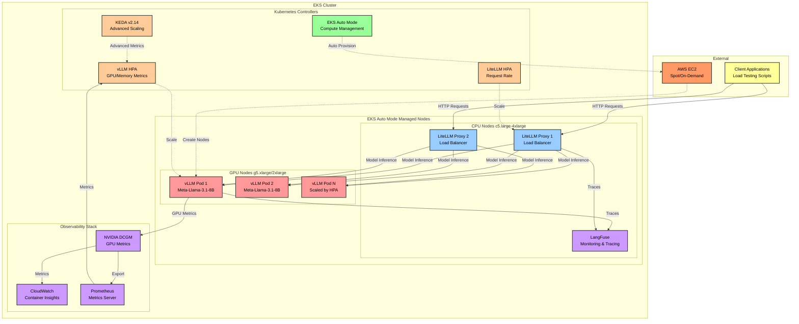

# Module 4: Scaling and Securing Agents

Welcome to Module 4! In this module, you'll transform your existing GenAI platform into a production-grade, auto-scaling system. Building on the vLLM and LiteLLM deployments from Modules 1 and 2, you'll leverage EKS Auto Mode's intelligent scaling capabilities, add comprehensive monitoring, and implement security best practices to create a robust, cost-effective AI infrastructure.

:::alert{header="EKS Auto Mode Configuration" type="info"}
This module leverages the pre-configured EKS Auto Mode from your workshop environment with: 
- Automatic compute provisioning for GPU and CPU workloads
- Dynamic scaling based on pod requirements
- Intelligent instance selection and Spot optimization
- Metrics Server v0.8.0 for HPA support
- Pod Identity for scalable authentication
:::

## Learning Objectives

By the end of this module, you will:

- 🚀 **Leverage EKS Auto Mode** for intelligent GPU/CPU node provisioning with zero configuration
- 📈 **Add HPA to existing vLLM deployment** with GPU-aware metrics from NVIDIA DCGM
- ⚖️ **Enable auto-scaling for existing LiteLLM** to handle varying loads efficiently
- 📊 **Set up comprehensive observability** with LangFuse, CloudWatch, and NVIDIA DCGM
- 💰 **Optimize costs** with EKS Auto Mode's intelligent Spot instance integration
- 🔒 **Apply security best practices** including Pod Identity, IMDSv2, encryption, and Pod Disruption Budgets

## Module Architecture



## What Makes This Module Special?

This module focuses on **production-grade patterns** following AWS best practices for AI/ML workloads:

- **Just-in-Time Scaling**: GPU nodes provision on-demand and deprovision when idle
- **Cost Optimization**: Up to 70% savings with EKS Auto Mode's Spot optimization
- **High Availability**: Multiple replicas, health checks, and automatic failover
- **Comprehensive Monitoring**: GPU utilization, inference metrics, and cost tracking
- **Security Hardening**: Pod Identity, IMDSv2, encryption at rest for production-grade security

## Module Sections

### 1. [EKS Auto Mode Configuration](./eks-auto-mode/)
Optimize the pre-configured EKS Auto Mode for GenAI workloads with:
- Node pool configuration for GPU workloads (g5, g6, p4, p5)
- AWS Neuron instance support (inf2, trn1, trn2)
- Compute class selection for cost optimization
- Pod scheduling best practices for GPU affinity
- NVIDIA DCGM integration for GPU observability
- Auto Mode monitoring with CloudWatch Container Insights

### 2. [vLLM HPA Configuration](./vllm-hpa/)
Implement intelligent scaling for vLLM with:
- GPU-aware metrics using NVIDIA DCGM
- KEDA v2.14 for advanced scaling scenarios (Pod Identity compatible)
- Multiple metrics (GPU, TPS, TTFT, queue depth)
- CloudWatch Container Insights integration

### 3. [LiteLLM Auto-scaling Configuration](./litellm-proxy/)
Add auto-scaling to your existing LiteLLM deployment with:
- HPA configuration for the existing LiteLLM from Module 2
- Enhanced load balancing configuration
- Health checks and automatic failover
- Scaling behavior testing

### 4. [LangFuse Monitoring and Load Testing](./langfuse-monitoring/)
Set up comprehensive observability with:
- Distributed tracing across all components
- Python-based load testing scripts
- Performance benchmarking
- Cost analysis and optimization

### 5. [Results Verification and Cleanup](./cleanup/)
Validate and clean up with:
- End-to-end system verification
- Cost savings analysis
- Resource cleanup procedures
- Production readiness checklist

## Prerequisites Check

Before starting, verify your environment from previous modules:

```bash
# Check EKS cluster version (should be 1.33)
kubectl version --short | grep Server

# Check that vLLM and LiteLLM are deployed
kubectl get pods -n vllm
kubectl get pods -n litellm

# Verify EKS Auto Mode is enabled
kubectl get nodes -L eks.amazonaws.com/compute-type

# Check available node pools
kubectl get nodepools -o wide

# Verify EKS Pod Identity Agent is installed
kubectl get daemonset eks-pod-identity-agent -n kube-system
```

:::alert[This module requires vLLM and LiteLLM from Module 2. Please complete Module 2 first if you haven't already.]{type="warning"}
:::

## Expected Outcomes

By completing this module, you will have:
- ✅ A fully auto-scaling GenAI inference platform
- ✅ GPU nodes that provision on-demand and deprovision when idle
- ✅ Load-balanced model serving with automatic failover
- ✅ Comprehensive monitoring following AWS observability best practices
- ✅ Cost optimization through EKS Auto Mode's Spot integration (up to 70% savings)
- ✅ Production-ready security configurations

## Cost Considerations

This module emphasizes cost-effective scaling strategies:

| Component | Instance Type | Pricing Model | Typical Cost/Hour |
|-----------|--------------|---------------|-------------------|
| vLLM Inference | g5.xlarge | Spot | $0.42 (vs $1.006 on-demand) |
| vLLM Inference | g5.2xlarge | Spot | $0.50 (vs $1.212 on-demand) |
| LiteLLM Proxy | c5.large | Spot | $0.038 (vs $0.085 on-demand) |
| Monitoring | c5.xlarge | On-Demand | $0.17 |

**Potential savings**: Up to 70% cost reduction with EKS Auto Mode's intelligent Spot allocation

## Time Allocation

Total module time: **2 hours (120 minutes)**

- Karpenter setup: 30 minutes
- vLLM HPA configuration: 25 minutes  
- LiteLLM proxy setup: 35 minutes
- Monitoring & testing: 20 minutes
- Cleanup & validation: 10 minutes

## Let's Get Started!

Ready to build a production-grade, auto-scaling GenAI platform? Let's begin with dynamic GPU node provisioning using Karpenter!

:::alert[**Tip**: Keep CloudWatch and kubectl monitoring commands running in separate terminals to observe the auto-scaling behavior in real-time.]{type="info"}
:::

---

**[Next: EKS Auto Mode Configuration →](./eks-auto-mode/)**