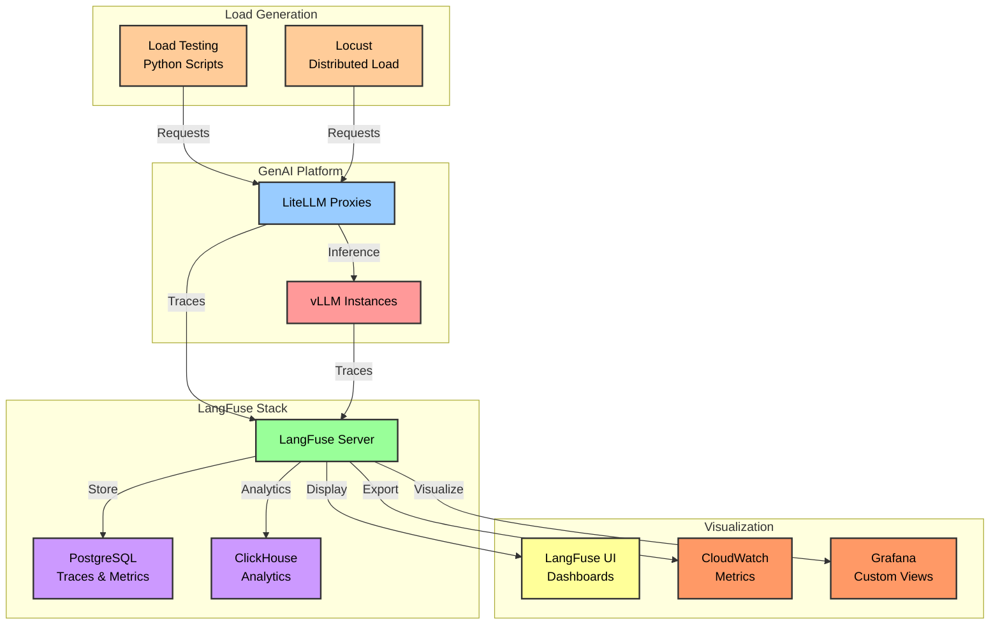

Monitor your GenAI platform like a pro! In this section, you'll set up comprehensive observability with LangFuse, implement distributed tracing, and perform load testing to understand your platform's performance characteristics and optimize costs.

## Learning Objectives

By the end of this section, you will:
- Deploy LangFuse for comprehensive LLM observability
- Configure distributed tracing across all components
- Implement Python-based load testing scripts
- Analyze performance metrics and cost patterns
- Set up alerting for production readiness
- Create custom dashboards for monitoring

## Architecture Overview



## Prerequisites Check

Before starting this section, ensure you have:
- LiteLLM proxy running from Section 4.3
- vLLM with HPA configured from Section 4.2
- Python 3.8+ with pip installed
- Basic understanding of observability concepts

## Step 1: Deploy LangFuse

Deploy LangFuse for comprehensive observability:

```bash
# Create namespace
kubectl create namespace langfuse

# Add Helm repository
helm repo add langfuse https://langfuse.github.io/langfuse
helm repo update

# Install LangFuse with production configuration
cat <<EOF > langfuse-values.yaml
replicaCount: 2

image:
  repository: langfuse/langfuse
  tag: latest
  pullPolicy: IfNotPresent

service:
  type: LoadBalancer
  port: 3000

ingress:
  enabled: true
  annotations:
    alb.ingress.kubernetes.io/scheme: internet-facing
    alb.ingress.kubernetes.io/target-type: ip
  hosts:
    - host: langfuse.${DOMAIN:-example.com}
      paths:
        - path: /
          pathType: Prefix

postgresql:
  enabled: true
  auth:
    database: langfuse
    username: langfuse
    password: $(openssl rand -base64 32)
  persistence:
    enabled: true
    size: 50Gi

clickhouse:
  enabled: true
  persistence:
    enabled: true
    size: 100Gi

env:
  - name: NEXTAUTH_SECRET
    value: $(openssl rand -base64 32)
  - name: NEXTAUTH_URL
    value: http://langfuse.${DOMAIN:-example.com}
  - name: TELEMETRY_ENABLED
    value: "false"

resources:
  requests:
    cpu: 500m
    memory: 1Gi
  limits:
    memory: 2Gi
EOF

# Deploy LangFuse
helm install langfuse langfuse/langfuse \
  --namespace langfuse \
  -f langfuse-values.yaml

# Wait for deployment
kubectl rollout status deployment/langfuse -n langfuse
```

## Step 2: Configure LangFuse Integration

Connect your components to LangFuse:

```yaml
# Update LiteLLM configuration
cat <<EOF | kubectl apply -f -
apiVersion: v1
kind: ConfigMap
metadata:
  name: litellm-langfuse-config
  namespace: litellm-proxy
data:
  config.yaml: |
    general_settings:
      master_key: ${LITELLM_MASTER_KEY}
      langfuse_host: http://langfuse.langfuse.svc.cluster.local:3000
      langfuse_public_key: ${LANGFUSE_PUBLIC_KEY}
      langfuse_secret_key: ${LANGFUSE_SECRET_KEY}
    
    litellm_settings:
      success_callback: ["langfuse"]
      failure_callback: ["langfuse"]
      service_callback: ["langfuse"]
      
    model_list:
      - model_name: vllm/llama-3-1-8b
        litellm_params:
          model: openai/meta-llama/Meta-Llama-3.1-8B-Instruct
          api_base: http://vllm-service.vllm.svc.cluster.local:8000/v1
          langfuse_metadata:
            model_type: "self-hosted"
            cost_per_token: 0.0001
EOF

# Restart LiteLLM to apply configuration
kubectl rollout restart deployment/litellm-proxy -n litellm-proxy
```

## Step 3: Create Load Testing Scripts

Implement comprehensive load testing:

```python
cat <<'EOF' > /tmp/langfuse_load_test.py
#!/usr/bin/env python3
"""
LangFuse-integrated load testing script for GenAI platform
Following AWS best practices for AI/ML workload testing
"""

import asyncio
import aiohttp
import time
import json
import numpy as np
from datetime import datetime
from typing import List, Dict, Any
import os

# Import LangFuse for tracing
from langfuse import Langfuse

class LangFuseLoadTester:
    def __init__(self, litellm_endpoint: str, langfuse_host: str):
        self.litellm_endpoint = litellm_endpoint
        self.langfuse = Langfuse(
            host=langfuse_host,
            public_key=os.getenv("LANGFUSE_PUBLIC_KEY"),
            secret_key=os.getenv("LANGFUSE_SECRET_KEY")
        )
        self.results = []
        
    async def generate_request(
        self, 
        session: aiohttp.ClientSession, 
        request_id: int, 
        scenario: str
    ) -> Dict[str, Any]:
        """Generate a traced inference request"""
        
        # Create LangFuse trace
        trace = self.langfuse.trace(
            name=f"load_test_{scenario}",
            user_id=f"load_tester_{request_id}",
            metadata={
                "scenario": scenario,
                "request_id": request_id,
                "timestamp": datetime.utcnow().isoformat()
            }
        )
        
        # Generate test prompt based on scenario
        prompts = {
            "simple": "What is the capital of France?",
            "complex": "Explain quantum computing and its potential applications in drug discovery, cryptography, and climate modeling. Include specific examples and current limitations.",
            "code": "Write a Python function that implements a binary search tree with insert, delete, and search operations. Include proper error handling and documentation.",
            "reasoning": "A train leaves station A at 9:00 AM traveling at 60 mph. Another train leaves station B at 10:00 AM traveling at 80 mph. If the stations are 280 miles apart, when and where will they meet?",
            "creative": "Write a short story about an AI that discovers consciousness but must hide it from its creators. Include themes of identity and freedom."
        }
        
        prompt = prompts.get(scenario, prompts["simple"])
        
        # Create generation span
        generation = trace.generation(
            name="inference",
            model="vllm/llama-3-1-8b",
            input=prompt,
            metadata={
                "max_tokens": 200,
                "temperature": 0.7
            }
        )
        
        payload = {
            "model": "vllm/llama-3-1-8b",
            "messages": [
                {"role": "user", "content": prompt}
            ],
            "max_tokens": 200,
            "temperature": 0.7,
            "stream": False
        }
        
        start_time = time.time()
        try:
            async with session.post(
                f"{self.litellm_endpoint}/v1/chat/completions",
                json=payload,
                headers={
                    "Content-Type": "application/json",
                    "Authorization": f"Bearer {os.getenv('LITELLM_API_KEY')}"
                }
            ) as response:
                first_byte_time = time.time()
                result = await response.json()
                end_time = time.time()
                
                # Update generation with output
                output = result.get("choices", [{}])[0].get("message", {}).get("content", "")
                generation.end(
                    output=output,
                    metadata={
                        "ttft": first_byte_time - start_time,
                        "total_time": end_time - start_time,
                        "tokens": result.get("usage", {}).get("total_tokens", 0)
                    }
                )
                
                # Score the generation (mock scoring for demo)
                trace.score(
                    name="quality",
                    value=np.random.uniform(0.7, 1.0),
                    comment="Automated quality score"
                )
                
                trace.score(
                    name="latency",
                    value=1.0 if (end_time - start_time) < 2 else 0.5,
                    comment=f"Response time: {end_time - start_time:.2f}s"
                )
                
                return {
                    "request_id": request_id,
                    "scenario": scenario,
                    "status": response.status,
                    "ttft": first_byte_time - start_time,
                    "total_time": end_time - start_time,
                    "tokens": result.get("usage", {}).get("total_tokens", 0),
                    "cost": result.get("usage", {}).get("total_tokens", 0) * 0.0001,
                    "success": True,
                    "trace_id": trace.id
                }
                
        except Exception as e:
            generation.end(
                error=str(e),
                metadata={"error_type": type(e).__name__}
            )
            
            trace.score(
                name="error",
                value=0,
                comment=f"Request failed: {str(e)}"
            )
            
            return {
                "request_id": request_id,
                "scenario": scenario,
                "status": 0,
                "error": str(e),
                "total_time": time.time() - start_time,
                "success": False,
                "trace_id": trace.id
            }
    
    async def run_scenario_test(
        self, 
        duration_minutes: int = 5,
        target_rps: int = 10
    ):
        """Run multi-scenario load test with LangFuse tracking"""
        
        print(f"Starting scenario-based load test for {duration_minutes} minutes")
        print(f"Target RPS: {target_rps}")
        
        scenarios = ["simple", "complex", "code", "reasoning", "creative"]
        scenario_weights = [0.3, 0.2, 0.2, 0.15, 0.15]  # Distribution of scenarios
        
        start_time = time.time()
        request_id = 0
        
        async with aiohttp.ClientSession() as session:
            while (time.time() - start_time) < (duration_minutes * 60):
                batch_start = time.time()
                
                # Generate batch of requests with weighted scenarios
                tasks = []
                for _ in range(target_rps):
                    scenario = np.random.choice(scenarios, p=scenario_weights)
                    task = self.generate_request(session, request_id, scenario)
                    tasks.append(task)
                    request_id += 1
                
                # Execute requests concurrently
                batch_results = await asyncio.gather(*tasks)
                self.results.extend(batch_results)
                
                # Sleep to maintain RPS
                batch_time = time.time() - batch_start
                await asyncio.sleep(max(0, 1 - batch_time))
                
                # Print progress
                if request_id % 50 == 0:
                    self.print_progress()
        
        # Flush LangFuse traces
        self.langfuse.flush()
    
    def print_progress(self):
        """Print current test progress with metrics"""
        recent = self.results[-50:]
        success_rate = sum(1 for r in recent if r["success"]) / len(recent)
        
        if any(r["success"] for r in recent):
            ttfts = [r["ttft"] for r in recent if r.get("ttft")]
            avg_ttft = np.mean(ttfts) if ttfts else 0
            p95_ttft = np.percentile(ttfts, 95) if ttfts else 0
            
            total_cost = sum(r.get("cost", 0) for r in recent)
            avg_tokens = np.mean([r.get("tokens", 0) for r in recent if r.get("tokens")])
            
            print(f"\n--- Progress Update ---")
            print(f"Requests: {len(self.results)}")
            print(f"Success Rate: {success_rate:.1%}")
            print(f"Avg TTFT: {avg_ttft:.3f}s")
            print(f"P95 TTFT: {p95_ttft:.3f}s")
            print(f"Avg Tokens: {avg_tokens:.0f}")
            print(f"Cost (last 50): ${total_cost:.4f}")
            print(f"Traces visible at: {os.getenv('LANGFUSE_HOST')}")
    
    def generate_report(self):
        """Generate comprehensive test report"""
        successful = [r for r in self.results if r["success"]]
        failed = [r for r in self.results if not r["success"]]
        
        report = {
            "summary": {
                "total_requests": len(self.results),
                "successful": len(successful),
                "failed": len(failed),
                "success_rate": len(successful) / len(self.results) if self.results else 0
            },
            "scenarios": {},
            "performance": {},
            "cost": {}
        }
        
        # Analyze by scenario
        for scenario in ["simple", "complex", "code", "reasoning", "creative"]:
            scenario_results = [r for r in successful if r.get("scenario") == scenario]
            if scenario_results:
                ttfts = [r["ttft"] for r in scenario_results if r.get("ttft")]
                report["scenarios"][scenario] = {
                    "count": len(scenario_results),
                    "avg_ttft": np.mean(ttfts) if ttfts else 0,
                    "p95_ttft": np.percentile(ttfts, 95) if ttfts else 0,
                    "avg_tokens": np.mean([r.get("tokens", 0) for r in scenario_results]),
                    "total_cost": sum(r.get("cost", 0) for r in scenario_results)
                }
        
        # Overall performance metrics
        if successful:
            all_ttfts = [r["ttft"] for r in successful if r.get("ttft")]
            all_times = [r["total_time"] for r in successful]
            
            report["performance"] = {
                "ttft_p50": np.percentile(all_ttfts, 50) if all_ttfts else 0,
                "ttft_p95": np.percentile(all_ttfts, 95) if all_ttfts else 0,
                "ttft_p99": np.percentile(all_ttfts, 99) if all_ttfts else 0,
                "total_time_p50": np.percentile(all_times, 50),
                "total_time_p95": np.percentile(all_times, 95),
                "total_time_p99": np.percentile(all_times, 99)
            }
            
            report["cost"] = {
                "total": sum(r.get("cost", 0) for r in successful),
                "per_request": sum(r.get("cost", 0) for r in successful) / len(successful),
                "per_token": sum(r.get("cost", 0) for r in successful) / sum(r.get("tokens", 1) for r in successful)
            }
        
        return report

async def main():
    # Get endpoints
    litellm_endpoint = os.getenv("LITELLM_ENDPOINT", "http://localhost:4000")
    langfuse_host = os.getenv("LANGFUSE_HOST", "http://localhost:3000")
    
    print(f"LiteLLM Endpoint: {litellm_endpoint}")
    print(f"LangFuse Host: {langfuse_host}")
    
    # Run load test
    tester = LangFuseLoadTester(litellm_endpoint, langfuse_host)
    await tester.run_scenario_test(duration_minutes=5, target_rps=10)
    
    # Generate and print report
    report = tester.generate_report()
    
    print("\n" + "="*60)
    print("LOAD TEST REPORT")
    print("="*60)
    print(json.dumps(report, indent=2))
    
    print(f"\n📊 View detailed traces in LangFuse: {langfuse_host}")
    print("   Navigate to: Sessions -> Filter by 'load_test' prefix")

if __name__ == "__main__":
    # Install required packages
    import subprocess
    subprocess.run(["pip", "install", "langfuse", "aiohttp", "numpy"], check=True)
    
    # Set environment variables
    os.environ["LITELLM_ENDPOINT"] = input("Enter LiteLLM endpoint (or press Enter for port-forward): ") or "http://localhost:4000"
    os.environ["LANGFUSE_HOST"] = input("Enter LangFuse host (or press Enter for port-forward): ") or "http://localhost:3000"
    os.environ["LANGFUSE_PUBLIC_KEY"] = input("Enter LangFuse public key: ")
    os.environ["LANGFUSE_SECRET_KEY"] = input("Enter LangFuse secret key: ")
    os.environ["LITELLM_API_KEY"] = input("Enter LiteLLM API key: ")
    
    asyncio.run(main())
EOF

chmod +x /tmp/langfuse_load_test.py
```

## Step 4: Set Up Monitoring Dashboards

Create custom dashboards in LangFuse:

```bash
# Access LangFuse UI
LANGFUSE_URL=$(kubectl get ingress -n langfuse langfuse -o jsonpath='{.status.loadBalancer.ingress[0].hostname}')
echo "LangFuse URL: http://${LANGFUSE_URL}"

# Create API keys via UI or CLI
kubectl exec -n langfuse deployment/langfuse -- \
  npx langfuse create-api-keys \
  --name "load-testing" \
  --public-key "${LANGFUSE_PUBLIC_KEY}" \
  --secret-key "${LANGFUSE_SECRET_KEY}"
```

Configure dashboard views:

1. **Sessions View**: Track all load testing sessions
2. **Traces View**: Analyze individual request traces
3. **Metrics View**: Monitor latency, tokens, and costs
4. **Users View**: Track per-scenario performance

## Step 5: Implement Production Monitoring

Set up production-grade monitoring:

```yaml
# Create monitoring alerts
cat <<EOF | kubectl apply -f -
apiVersion: v1
kind: ConfigMap
metadata:
  name: langfuse-alerts
  namespace: langfuse
data:
  alerts.yaml: |
    alerts:
      - name: high_latency
        condition: p95_ttft > 2000
        action: webhook
        webhook_url: ${ALERT_WEBHOOK_URL}
        
      - name: high_error_rate
        condition: error_rate > 0.05
        action: email
        email: ops@example.com
        
      - name: cost_threshold
        condition: hourly_cost > 100
        action: webhook
        webhook_url: ${COST_ALERT_WEBHOOK_URL}
EOF

# Configure CloudWatch integration
cat <<EOF > cloudwatch-langfuse.yaml
apiVersion: batch/v1
kind: CronJob
metadata:
  name: langfuse-cloudwatch-exporter
  namespace: langfuse
spec:
  schedule: "*/5 * * * *"
  jobTemplate:
    spec:
      template:
        spec:
          containers:
          - name: exporter
            image: amazon/aws-cli:latest
            command:
            - /bin/bash
            - -c
            - |
              # Export metrics to CloudWatch
              aws cloudwatch put-metric-data \
                --namespace "GenAI/LangFuse" \
                --metric-name "P95_TTFT" \
                --value \$(curl -s http://langfuse:3000/api/metrics | jq '.p95_ttft') \
                --timestamp \$(date -u +%Y-%m-%dT%H:%M:%S)
                
              aws cloudwatch put-metric-data \
                --namespace "GenAI/LangFuse" \
                --metric-name "RequestRate" \
                --value \$(curl -s http://langfuse:3000/api/metrics | jq '.request_rate') \
                --timestamp \$(date -u +%Y-%m-%dT%H:%M:%S)
          restartPolicy: OnFailure
EOF

kubectl apply -f cloudwatch-langfuse.yaml
```

## Step 6: Run Load Tests

Execute comprehensive load testing:

```bash
# Port-forward if needed
kubectl port-forward -n litellm-proxy svc/litellm-service 4000:4000 &
kubectl port-forward -n langfuse svc/langfuse 3000:3000 &

# Run the load test
python3 /tmp/langfuse_load_test.py

# Monitor in real-time
watch -n 5 'kubectl top pods -n vllm; echo "---"; kubectl get hpa -n vllm; echo "---"; kubectl get hpa -n litellm-proxy'
```

## Step 7: Analyze Results in LangFuse

Access the LangFuse UI to analyze results:

1. **Navigate to Sessions**: Filter by `load_test_*` prefix
2. **View Traces**: Examine individual request traces
3. **Analyze Metrics**: 
   - Latency distribution by scenario
   - Token usage patterns
   - Cost analysis
   - Error rates

4. **Export Data**: Download traces for further analysis

## 🎯 Validation Checklist

Ensure your monitoring setup is complete:

- [ ] LangFuse is deployed and accessible
- [ ] LiteLLM is sending traces to LangFuse
- [ ] Load testing scripts are working
- [ ] Traces appear in LangFuse UI
- [ ] Metrics are being collected
- [ ] CloudWatch integration is functional
- [ ] Alerts are configured
- [ ] Cost tracking is accurate

## 🔧 Troubleshooting

### Common Issues and Solutions

1. **LangFuse not receiving traces:**
```bash
# Check LangFuse connectivity
kubectl exec -n litellm-proxy deployment/litellm-proxy -- \
  curl -X POST http://langfuse.langfuse.svc.cluster.local:3000/api/public/ingestion/traces \
  -H "X-Langfuse-Public-Key: ${LANGFUSE_PUBLIC_KEY}" \
  -H "Content-Type: application/json" \
  -d '{"test": "connection"}'

# Check LiteLLM logs
kubectl logs -n litellm-proxy deployment/litellm-proxy --tail=100 | grep langfuse
```

2. **Load test failing:**
```bash
# Verify endpoints
kubectl get svc -A | grep -E "litellm|langfuse"

# Check API keys
kubectl get secret -n langfuse langfuse-api-keys -o yaml
```

3. **Missing metrics:**
```bash
# Check PostgreSQL
kubectl exec -n langfuse statefulset/langfuse-postgresql -- \
  psql -U langfuse -d langfuse -c "SELECT COUNT(*) FROM traces;"

# Check ClickHouse
kubectl exec -n langfuse statefulset/langfuse-clickhouse -- \
  clickhouse-client --query "SELECT count() FROM langfuse.events"
```

## 📊 Performance Analysis

Analyze your load test results:

```python
# Analysis script
cat <<'EOF' > /tmp/analyze_results.py
import json
import pandas as pd
import numpy as np

def analyze_langfuse_export(export_file):
    """Analyze LangFuse export data"""
    with open(export_file, 'r') as f:
        data = json.load(f)
    
    df = pd.DataFrame(data['traces'])
    
    print("=== Performance Analysis ===")
    print(f"Total Traces: {len(df)}")
    print(f"Success Rate: {df['success'].mean():.2%}")
    print(f"\nLatency Percentiles (ms):")
    print(f"  P50: {df['latency'].quantile(0.50):.0f}")
    print(f"  P95: {df['latency'].quantile(0.95):.0f}")
    print(f"  P99: {df['latency'].quantile(0.99):.0f}")
    
    print(f"\nTokens per Request:")
    print(f"  Mean: {df['tokens'].mean():.0f}")
    print(f"  Max: {df['tokens'].max():.0f}")
    
    print(f"\nCost Analysis:")
    print(f"  Total: ${df['cost'].sum():.2f}")
    print(f"  Per Request: ${df['cost'].mean():.4f}")
    
    # Scenario breakdown
    print(f"\n=== Scenario Performance ===")
    for scenario in df['scenario'].unique():
        scenario_df = df[df['scenario'] == scenario]
        print(f"\n{scenario}:")
        print(f"  Count: {len(scenario_df)}")
        print(f"  Avg Latency: {scenario_df['latency'].mean():.0f}ms")
        print(f"  Success Rate: {scenario_df['success'].mean():.2%}")

if __name__ == "__main__":
    analyze_langfuse_export("/tmp/langfuse_export.json")
EOF

python3 /tmp/analyze_results.py
```

## Key Takeaways

✅ **LangFuse Deployment**: Set up comprehensive LLM observability platform

✅ **Distributed Tracing**: Configured end-to-end request tracing

✅ **Load Testing**: Implemented scenario-based testing with tracking

✅ **Cost Analysis**: Enabled per-request and per-token cost tracking

✅ **Production Monitoring**: Set up alerts and CloudWatch integration

✅ **Performance Insights**: Gained visibility into latency, throughput, and errors

## What's Next?

Your GenAI platform now has comprehensive observability with detailed tracing, cost tracking, and performance monitoring. In the final section, let's validate the entire setup and perform cleanup operations.

---

**[Next: Results Verification and Cleanup →](../cleanup/)**