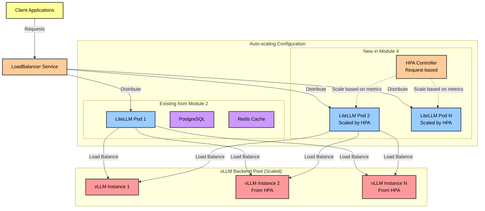

Your LiteLLM proxy is already running from Module 2 - now let's make it auto-scale! In this section, you'll add Horizontal Pod Autoscaling to the existing LiteLLM deployment, enabling it to handle varying loads efficiently while maintaining high availability.

## Learning Objectives

By the end of this section, you will:
- Add HPA to the existing LiteLLM deployment from Module 2
- Configure request-based scaling metrics
- Update LiteLLM to enable load balancing across multiple vLLM replicas
- Test auto-scaling behavior under load
- Verify failover and health check functionality

## Architecture Overview



## Prerequisites Check

Before starting this section, ensure you have:
- LiteLLM already deployed from Module 2 (namespace: `litellm`)
- vLLM with HPA configured from Section 4.2
- Metrics Server installed from Section 4.2
- kubectl access to your cluster

## Step 1: Verify Existing LiteLLM Deployment

First, let's check the current LiteLLM deployment from Module 2:

```bash
# Check existing LiteLLM components
kubectl get all -n litellm

# Expected output should show:
# - litellm deployment (1 replica)
# - litellm-postgresql-0 statefulset
# - litellm-redis-master-0 statefulset
# - litellm service

# Verify current replica count and resource limits
kubectl get deployment litellm -n litellm -o jsonpath='{.spec.replicas}' && echo " replicas"
kubectl get deployment litellm -n litellm -o jsonpath='{.spec.template.spec.containers[0].resources}' | jq
```

## Step 2: Add Resource Requests for HPA

HPA requires resource requests to be defined. Let's patch the existing deployment:

```bash
# Add resource requests and limits to enable HPA
kubectl patch deployment litellm -n litellm --type='json' -p='[
  {
    "op": "add",
    "path": "/spec/template/spec/containers/0/resources",
    "value": {
      "requests": {
        "cpu": "500m",
        "memory": "1Gi"
      },
      "limits": {
        "cpu": "2000m",
        "memory": "4Gi"
      }
    }
  }
]'

# Verify the patch was applied
kubectl get deployment litellm -n litellm -o jsonpath='{.spec.template.spec.containers[0].resources}' | jq
```

## Step 3: Configure HPA for LiteLLM

Create an HPA resource for the existing LiteLLM deployment:

```yaml
cat <<EOF | kubectl apply -f -
apiVersion: autoscaling/v2
kind: HorizontalPodAutoscaler
metadata:
  name: litellm-hpa
  namespace: litellm
spec:
  scaleTargetRef:
    apiVersion: apps/v1
    kind: Deployment
    name: litellm
  minReplicas: 2  # Minimum for HA
  maxReplicas: 10  # Adjust based on your needs
  metrics:
  - type: Resource
    resource:
      name: cpu
      target:
        type: Utilization
        averageUtilization: 70
  - type: Resource
    resource:
      name: memory
      target:
        type: Utilization
        averageUtilization: 80
  behavior:
    scaleDown:
      stabilizationWindowSeconds: 300  # Wait 5 minutes before scaling down
      policies:
      - type: Percent
        value: 50  # Scale down by 50% at a time
        periodSeconds: 60
      - type: Pods
        value: 1  # But at least 1 pod at a time
        periodSeconds: 60
      selectPolicy: Min  # Use the most conservative policy
    scaleUp:
      stabilizationWindowSeconds: 60  # Scale up faster (1 minute)
      policies:
      - type: Percent
        value: 100  # Double the pods if needed
        periodSeconds: 60
      - type: Pods
        value: 2  # Add up to 2 pods at a time
        periodSeconds: 60
      selectPolicy: Max  # Use the most aggressive policy
EOF

# Verify HPA creation
kubectl get hpa litellm-hpa -n litellm
kubectl describe hpa litellm-hpa -n litellm
```

## Step 4: Update LiteLLM Configuration for Better Load Balancing

Update the LiteLLM configuration to better handle multiple vLLM backends:

```bash
# Get current LiteLLM configuration
kubectl get configmap -n litellm -o yaml | grep -A 20 "model_list"

# Create an updated configuration patch
cat <<'EOF' > /tmp/litellm-config-patch.yaml
apiVersion: v1
kind: ConfigMap
metadata:
  name: litellm-routing-config
  namespace: litellm
data:
  routing.yaml: |
    router_settings:
      routing_strategy: "least-busy"  # Better for scaled backends
      redis_host: "litellm-redis-master"
      redis_port: 6379
      redis_password: ""
      enable_pre_call_checks: true  # Check health before routing
      health_check_interval: 30  # Health check every 30 seconds
      allowed_fails: 3  # Mark unhealthy after 3 fails
      cooldown_time: 60  # Wait 60s before retrying unhealthy endpoint
      num_retries: 2  # Retry failed requests
      request_timeout: 120  # Overall timeout
      fallbacks:  # Fallback chain for failures
        - ["vllm/llama-3-1-8b-int8-neuron", "vllm/qwen3-8b-fp8-neuron"]
    
    # Update cache settings for better performance
    cache_params:
      type: "redis"
      host: "litellm-redis-master"
      port: 6379
      ttl: 3600  # Cache for 1 hour
      supported_call_types: ["completion", "chat_completion"]
EOF

kubectl apply -f /tmp/litellm-config-patch.yaml

# Mount this config in the deployment
kubectl patch deployment litellm -n litellm --type='json' -p='[
  {
    "op": "add",
    "path": "/spec/template/spec/volumes/-",
    "value": {
      "name": "routing-config",
      "configMap": {
        "name": "litellm-routing-config"
      }
    }
  },
  {
    "op": "add",
    "path": "/spec/template/spec/containers/0/volumeMounts/-",
    "value": {
      "name": "routing-config",
      "mountPath": "/app/routing",
      "readOnly": true
    }
  }
]'
```

## Step 5: Test HPA Scaling

Let's test the HPA scaling behavior:

```python
cat <<'EOF' > /tmp/test_litellm_hpa.py
#!/usr/bin/env python3
"""
Test script for LiteLLM HPA scaling
"""

import asyncio
import aiohttp
import time
import subprocess
import json

class LiteLLMHPATest:
    def __init__(self, endpoint: str):
        self.endpoint = endpoint
        self.results = []
    
    async def send_request(self, session: aiohttp.ClientSession, request_id: int):
        """Send a single request to LiteLLM"""
        payload = {
            "model": "vllm/llama-3-1-8b-int8-neuron",
            "messages": [
                {"role": "user", "content": f"Test request {request_id}: Generate a random fact"}
            ],
            "max_tokens": 50,
            "temperature": 0.7
        }
        
        try:
            start = time.time()
            async with session.post(
                f"{self.endpoint}/v1/chat/completions",
                json=payload,
                headers={"Content-Type": "application/json"}
            ) as response:
                result = await response.json()
                latency = time.time() - start
                return {
                    "request_id": request_id,
                    "status": response.status,
                    "latency": latency,
                    "success": response.status == 200
                }
        except Exception as e:
            return {
                "request_id": request_id,
                "status": 0,
                "error": str(e),
                "success": False
            }
    
    async def generate_load(self, duration_seconds: int = 180, rps: int = 20):
        """Generate load to trigger HPA scaling"""
        print(f"Generating load: {rps} requests/second for {duration_seconds} seconds")
        print("Monitor HPA with: kubectl get hpa -n litellm -w")
        
        start_time = time.time()
        request_id = 0
        
        # Get initial pod count
        initial_pods = self._get_pod_count()
        print(f"Initial LiteLLM pods: {initial_pods}")
        
        async with aiohttp.ClientSession() as session:
            while (time.time() - start_time) < duration_seconds:
                batch_start = time.time()
                
                # Send batch of requests
                tasks = []
                for _ in range(rps):
                    task = self.send_request(session, request_id)
                    tasks.append(task)
                    request_id += 1
                
                results = await asyncio.gather(*tasks)
                self.results.extend(results)
                
                # Sleep to maintain RPS
                elapsed = time.time() - batch_start
                await asyncio.sleep(max(0, 1 - elapsed))
                
                # Check pod count every 30 seconds
                if request_id % (rps * 30) == 0:
                    current_pods = self._get_pod_count()
                    success_rate = sum(1 for r in results if r["success"]) / len(results)
                    avg_latency = sum(r.get("latency", 0) for r in results) / len(results)
                    
                    print(f"\n[{int(time.time() - start_time)}s] Pods: {current_pods}, "
                          f"Success: {success_rate:.1%}, Avg Latency: {avg_latency:.2f}s")
                    
                    if current_pods > initial_pods:
                        print(f"✅ HPA triggered! Scaled from {initial_pods} to {current_pods} pods")
        
        # Final check
        final_pods = self._get_pod_count()
        print(f"\nFinal LiteLLM pods: {final_pods}")
        
        # Print summary
        successful = sum(1 for r in self.results if r["success"])
        print(f"\nTest Summary:")
        print(f"  Total Requests: {len(self.results)}")
        print(f"  Successful: {successful} ({successful/len(self.results)*100:.1f}%)")
        print(f"  Scaling: {initial_pods} -> {final_pods} pods")
    
    def _get_pod_count(self) -> int:
        """Get current LiteLLM pod count"""
        try:
            result = subprocess.run(
                ["kubectl", "get", "pods", "-n", "litellm", "-l", "app.kubernetes.io/name=litellm",
                 "--field-selector=status.phase=Running", "-o", "json"],
                capture_output=True,
                text=True
            )
            if result.returncode == 0:
                data = json.loads(result.stdout)
                return len(data.get("items", []))
        except:
            pass
        return 0

async def main():
    # Get LiteLLM service endpoint
    result = subprocess.run(
        ["kubectl", "get", "svc", "-n", "litellm", "litellm",
         "-o", "jsonpath={.status.loadBalancer.ingress[0].hostname}"],
        capture_output=True,
        text=True
    )
    
    if result.stdout:
        endpoint = f"http://{result.stdout}"
    else:
        # Use port-forward
        print("Setting up port-forward to LiteLLM service...")
        print("Run in another terminal: kubectl port-forward -n litellm svc/litellm 4000:4000")
        endpoint = "http://localhost:4000"
        input("Press Enter when port-forward is ready...")
    
    # Run test
    tester = LiteLLMHPATest(endpoint)
    await tester.generate_load(duration_seconds=180, rps=20)

if __name__ == "__main__":
    import sys
    if not any(["aiohttp" in str(m) for m in sys.modules]):
        subprocess.run(["pip", "install", "aiohttp"], check=True)
    
    asyncio.run(main())
EOF

chmod +x /tmp/test_litellm_hpa.py

# Run the test
python3 /tmp/test_litellm_hpa.py
```

## Step 6: Monitor Scaling Behavior

Monitor the HPA and pod scaling in real-time:

```bash
# Watch HPA status
watch -n 2 'kubectl get hpa -n litellm; echo "---"; kubectl get pods -n litellm | grep litellm'

# Check HPA events
kubectl describe hpa litellm-hpa -n litellm

# View scaling events
kubectl get events -n litellm --sort-by='.lastTimestamp' | grep -E "Scaled|HorizontalPodAutoscaler"

# Check pod distribution across nodes
kubectl get pods -n litellm -o wide

# Monitor resource usage
kubectl top pods -n litellm
```

## Step 7: Verify Load Balancing

Test that requests are distributed across scaled LiteLLM instances:

```bash
# Check logs from different pods to see request distribution
for pod in $(kubectl get pods -n litellm -l app.kubernetes.io/name=litellm -o name); do
  echo "=== $pod ==="
  kubectl logs $pod -n litellm --tail=5 | grep -E "request_id|model_name"
done

# Check Redis cache hits (if configured)
kubectl exec -n litellm litellm-redis-master-0 -- redis-cli INFO stats | grep -E "keyspace_hits|keyspace_misses"
```

## 🎯 Validation Checklist

Ensure your LiteLLM auto-scaling is working:

- [ ] HPA is created and showing metrics
- [ ] LiteLLM scales up under load (from 1 to 2+ pods)
- [ ] Requests are distributed across pods
- [ ] Scaling down occurs after load decreases
- [ ] No errors in pod logs during scaling
- [ ] Response times remain acceptable during scaling

## 🔧 Troubleshooting

### Common Issues and Solutions

1. **HPA not getting metrics:**
```bash
# Check if metrics-server is running
kubectl get deployment metrics-server -n kube-system

# Check if resource requests are set
kubectl get deployment litellm -n litellm -o jsonpath='{.spec.template.spec.containers[0].resources}'

# Check HPA status
kubectl describe hpa litellm-hpa -n litellm
```

2. **Pods not scaling:**
```bash
# Check HPA metrics
kubectl get hpa litellm-hpa -n litellm

# Check for resource constraints
kubectl describe nodes | grep -A 5 "Allocated resources"

# Check pod events
kubectl describe pod -n litellm -l app.kubernetes.io/name=litellm
```

3. **Load balancing issues:**
```bash
# Check service endpoints
kubectl get endpoints -n litellm litellm

# Test direct pod access
for pod in $(kubectl get pods -n litellm -l app.kubernetes.io/name=litellm -o jsonpath='{.items[*].metadata.name}'); do
  echo "Testing $pod"
  kubectl exec -n litellm $pod -- curl -s http://localhost:4000/health
done
```

## Key Takeaways

✅ **HPA Added**: Configured auto-scaling for existing LiteLLM deployment

✅ **Resource Limits**: Set appropriate CPU and memory requests for scaling

✅ **Load Balancing**: Updated routing strategy for better distribution

✅ **Cache Integration**: Leveraged Redis for improved performance

✅ **Scaling Behavior**: Configured appropriate scale-up and scale-down policies

✅ **Health Checks**: Enabled pre-call checks for reliability

## What's Next?

Your LiteLLM proxy now automatically scales based on load, distributing requests efficiently across both scaled LiteLLM instances and scaled vLLM backends. Next, let's set up comprehensive monitoring with LangFuse to track this complex, auto-scaling system.

---

**[Next: LangFuse Monitoring and Load Testing →](../langfuse-monitoring/)**