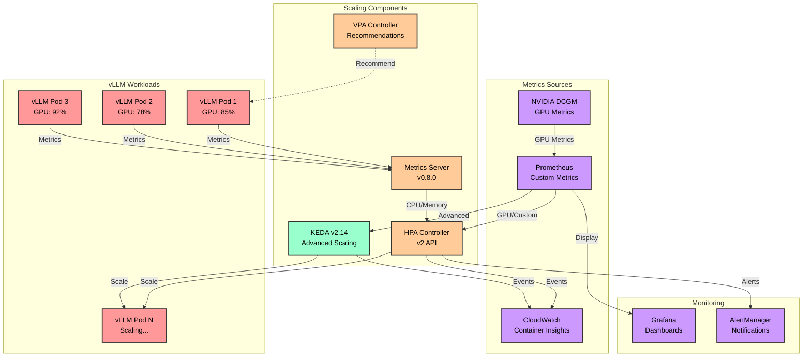

Scale your vLLM deployments intelligently! In this section, you'll configure GPU-aware Horizontal Pod Autoscaling that automatically adjusts your inference capacity based on real-time demand, following AWS best practices for AI/ML workloads.

## Learning Objectives

By the end of this section, you will:
- Configure Horizontal Pod Autoscaler (HPA) for vLLM pods following AWS AIML best practices
- Implement GPU-aware scaling metrics with NVIDIA DCGM
- Set up Vertical Pod Autoscaler (VPA) for right-sizing recommendations
- Configure KEDA for advanced scaling scenarios
- Implement request-based scaling for inference workloads
- Monitor scaling behavior with CloudWatch Container Insights

## Architecture Overview



## Prerequisites Check

Before starting this section, ensure you have:
- Karpenter configured from Section 4.1
- vLLM deployment running from Module 2
- NVIDIA DCGM exporter deployed
- kubectl access to your cluster

## Step 1: Install Metrics Server (Latest Version)

Deploy the latest Metrics Server for basic HPA functionality:

```bash
# Install latest Metrics Server (v0.7.2 as of August 2025)
# Install metrics-server v0.8.0 (compatible with Kubernetes 1.33)
kubectl apply -f https://github.com/kubernetes-sigs/metrics-server/releases/download/v0.8.0/components.yaml

# Patch for EKS compatibility
kubectl patch deployment metrics-server -n kube-system \
  --type='json' \
  -p='[{"op": "add", "path": "/spec/template/spec/containers/0/args/-", "value": "--kubelet-preferred-address-types=InternalIP,ExternalIP,Hostname"}]'

# Verify installation
kubectl get deployment metrics-server -n kube-system
kubectl top nodes
kubectl top pods -A
```

## Step 2: Install KEDA for Advanced Scaling (AWS Best Practice)

Install KEDA for advanced GPU-aware scaling:

```bash
# Add KEDA Helm repository
helm repo add kedacore https://kedacore.github.io/charts
helm repo update

# Install KEDA v2.14 (compatible with Pod Identity)
helm install keda kedacore/keda \
  --namespace keda \
  --create-namespace \
  --version 2.15.0 \
  --set prometheus.metricServer.enabled=true \
  --set prometheus.metricServer.port=9090 \
  --set resources.operator.requests.cpu=100m \
  --set resources.operator.requests.memory=100Mi \
  --set resources.metricServer.requests.cpu=100m \
  --set resources.metricServer.requests.memory=100Mi

# Verify KEDA installation
kubectl get pods -n keda
kubectl get crd | grep keda
```

## Step 3: Deploy Prometheus Adapter for Custom Metrics

Set up Prometheus adapter for GPU metrics following AWS observability best practices:

```yaml
cat <<EOF | kubectl apply -f -
apiVersion: v1
kind: Namespace
metadata:
  name: monitoring
---
apiVersion: v1
kind: ConfigMap
metadata:
  name: adapter-config
  namespace: monitoring
data:
  config.yaml: |
    rules:
    # GPU utilization metrics from DCGM (AWS Best Practice)
    - seriesQuery: 'DCGM_FI_DEV_GPU_UTIL{namespace!="",pod!=""}'
      seriesFilters: []
      resources:
        overrides:
          namespace: {resource: "namespace"}
          pod: {resource: "pod"}
      name:
        matches: "^DCGM_FI_DEV_GPU_UTIL"
        as: "gpu_utilization_percentage"
      metricsQuery: 'avg(<<.Series>>{<<.LabelMatchers>>})'
    
    # GPU memory utilization
    - seriesQuery: 'DCGM_FI_DEV_MEM_COPY_UTIL{namespace!="",pod!=""}'
      resources:
        overrides:
          namespace: {resource: "namespace"}
          pod: {resource: "pod"}
      name:
        matches: "^DCGM_FI_DEV_MEM_COPY_UTIL"
        as: "gpu_memory_utilization_percentage"
      metricsQuery: 'avg(<<.Series>>{<<.LabelMatchers>>})'
    
    # vLLM specific metrics - tokens per second (AWS recommended)
    - seriesQuery: 'vllm:request_success_total{namespace!="",pod!=""}'
      resources:
        overrides:
          namespace: {resource: "namespace"}
          pod: {resource: "pod"}
      name:
        as: "vllm_tokens_per_second"
      metricsQuery: 'rate(<<.Series>>{<<.LabelMatchers>>}[1m])'
    
    # vLLM queue depth
    - seriesQuery: 'vllm:num_requests_waiting{namespace!="",pod!=""}'
      resources:
        overrides:
          namespace: {resource: "namespace"}
          pod: {resource: "pod"}
      name:
        as: "vllm_queue_depth"
      metricsQuery: 'avg(<<.Series>>{<<.LabelMatchers>>})'
    
    # Time to first token (TTFT) - AWS AIML observability best practice
    - seriesQuery: 'vllm:time_to_first_token_seconds{namespace!="",pod!=""}'
      resources:
        overrides:
          namespace: {resource: "namespace"}
          pod: {resource: "pod"}
      name:
        as: "vllm_ttft_p95"
      metricsQuery: 'histogram_quantile(0.95, sum(rate(<<.Series>>{<<.LabelMatchers>>}[5m])) by (le))'
    
    # Output tokens per second - AWS recommended metric
    - seriesQuery: 'vllm:generation_tokens_total{namespace!="",pod!=""}'
      resources:
        overrides:
          namespace: {resource: "namespace"}
          pod: {resource: "pod"}
      name:
        as: "vllm_output_tokens_per_second"
      metricsQuery: 'rate(<<.Series>>{<<.LabelMatchers>>}[1m])'
---
apiVersion: apps/v1
kind: Deployment
metadata:
  name: prometheus-adapter
  namespace: monitoring
spec:
  replicas: 2  # HA configuration
  selector:
    matchLabels:
      app: prometheus-adapter
  template:
    metadata:
      labels:
        app: prometheus-adapter
    spec:
      serviceAccountName: prometheus-adapter
      containers:
      - name: prometheus-adapter
        image: registry.k8s.io/prometheus-adapter/prometheus-adapter:v0.12.0
        args:
        - --secure-port=6443
        - --tls-cert-file=/tmp/cert/tls.crt
        - --tls-private-key-file=/tmp/cert/tls.key
        - --logtostderr=true
        - --prometheus-url=http://prometheus-server.monitoring.svc:9090/
        - --metrics-relist-interval=1m
        - --v=4
        - --config=/etc/adapter/config.yaml
        ports:
        - containerPort: 6443
        volumeMounts:
        - mountPath: /etc/adapter/
          name: config
          readOnly: true
        - mountPath: /tmp/cert
          name: volume-serving-cert
          readOnly: true
        resources:
          requests:
            cpu: 250m
            memory: 256Mi
          limits:
            cpu: 500m
            memory: 512Mi
      volumes:
      - name: config
        configMap:
          name: adapter-config
      - name: volume-serving-cert
        secret:
          secretName: prometheus-adapter-certs
      nodeSelector:
        karpenter.sh/nodepool: cpu-nodepool
      tolerations:
      - key: karpenter.sh/nodepool
        value: cpu-nodepool
        effect: NoSchedule
---
apiVersion: v1
kind: ServiceAccount
metadata:
  name: prometheus-adapter
  namespace: monitoring
---
apiVersion: rbac.authorization.k8s.io/v1
kind: ClusterRoleBinding
metadata:
  name: prometheus-adapter
roleRef:
  apiGroup: rbac.authorization.k8s.io
  kind: ClusterRole
  name: system:auth-delegator
subjects:
- kind: ServiceAccount
  name: prometheus-adapter
  namespace: monitoring
---
apiVersion: v1
kind: Service
metadata:
  name: prometheus-adapter
  namespace: monitoring
spec:
  ports:
  - port: 443
    targetPort: 6443
  selector:
    app: prometheus-adapter
---
apiVersion: apiregistration.k8s.io/v1
kind: APIService
metadata:
  name: v1beta1.custom.metrics.k8s.io
spec:
  service:
    name: prometheus-adapter
    namespace: monitoring
  group: custom.metrics.k8s.io
  version: v1beta1
  insecureSkipTLSVerify: true
  groupPriorityMinimum: 100
  versionPriority: 100
EOF
```

## Step 4: Configure HPA for vLLM with AWS AIML Best Practices

Create an optimized HPA configuration for vLLM following AWS recommendations:

```yaml
cat <<EOF | kubectl apply -f -
apiVersion: autoscaling/v2
kind: HorizontalPodAutoscaler
metadata:
  name: vllm-hpa
  namespace: vllm
  annotations:
    metric.horizontal-pod-autoscaler.kubernetes.io/gpu-utilization: "Target GPU utilization for scaling"
    metric.horizontal-pod-autoscaler.kubernetes.io/tokens-per-second: "Inference throughput metric"
spec:
  scaleTargetRef:
    apiVersion: apps/v1
    kind: Deployment
    name: vllm-deployment
  
  # AWS Best Practice: Set appropriate min/max for GPU workloads
  minReplicas: 2  # Minimum for HA
  maxReplicas: 10 # Based on GPU NodePool limit
  
  # Target metrics following AWS AIML observability best practices
  metrics:
  # Primary metric: GPU utilization (AWS recommended)
  - type: Pods
    pods:
      metric:
        name: gpu_utilization_percentage
      target:
        type: AverageValue
        averageValue: "80"  # AWS recommendation: target 70-85% GPU utilization
  
  # Secondary metric: Memory utilization
  - type: Resource
    resource:
      name: memory
      target:
        type: Utilization
        averageUtilization: 75
  
  # Custom metric: Tokens per second (inference throughput)
  - type: Pods
    pods:
      metric:
        name: vllm_output_tokens_per_second
      target:
        type: AverageValue
        averageValue: "1000"  # Adjust based on model and requirements
  
  # Custom metric: Queue depth (pending requests)
  - type: Pods
    pods:
      metric:
        name: vllm_queue_depth
      target:
        type: AverageValue
        averageValue: "10"  # Scale when queue builds up
  
  # Custom metric: Time to First Token P95 (AWS best practice)
  - type: Pods
    pods:
      metric:
        name: vllm_ttft_p95
      target:
        type: AverageValue
        averageValue: "2"  # Target 2 seconds P95 TTFT
  
  # Scaling behavior optimized for ML workloads (AWS best practice)
  behavior:
    scaleUp:
      stabilizationWindowSeconds: 60  # Quick scale-up for burst traffic
      policies:
      - type: Percent
        value: 100  # Double pods if needed
        periodSeconds: 60
      - type: Pods
        value: 2  # Add at most 2 pods at a time
        periodSeconds: 60
      selectPolicy: Max  # Use most aggressive scale-up
    
    scaleDown:
      stabilizationWindowSeconds: 300  # Slower scale-down to avoid thrashing
      policies:
      - type: Percent
        value: 25  # Remove 25% of pods
        periodSeconds: 300
      - type: Pods
        value: 1  # Remove at most 1 pod at a time
        periodSeconds: 300
      selectPolicy: Min  # Use most conservative scale-down
EOF
```

## Step 5: Implement KEDA ScaledObject for Advanced Scaling

Create a KEDA ScaledObject for more sophisticated scaling scenarios:

```yaml
cat <<EOF | kubectl apply -f -
apiVersion: keda.sh/v1alpha1
kind: ScaledObject
metadata:
  name: vllm-keda-scaler
  namespace: vllm
spec:
  scaleTargetRef:
    name: vllm-deployment
  
  # Scaling boundaries
  minReplicaCount: 2
  maxReplicaCount: 10
  
  # Cooldown periods (AWS best practice for GPU workloads)
  cooldownPeriod: 300  # 5 minutes cooldown after scale down
  pollingInterval: 30   # Check metrics every 30 seconds
  
  # Advanced behavior
  advanced:
    horizontalPodAutoscalerConfig:
      behavior:
        scaleUp:
          stabilizationWindowSeconds: 60
          policies:
          - type: Percent
            value: 50
            periodSeconds: 60
        scaleDown:
          stabilizationWindowSeconds: 300
          policies:
          - type: Percent
            value: 10
            periodSeconds: 300
    restoreToOriginalReplicaCount: true
  
  triggers:
  # Prometheus trigger for GPU utilization (AWS best practice)
  - type: prometheus
    metadata:
      serverAddress: http://prometheus-server.monitoring.svc:9090
      metricName: gpu_utilization
      query: |
        avg(
          avg_over_time(
            DCGM_FI_DEV_GPU_UTIL{namespace="vllm"}[1m]
          )
        )
      threshold: '75'
      activationThreshold: '0'
  
  # CloudWatch trigger for SQS queue depth (if using SQS for requests)
  - type: aws-cloudwatch
    metadata:
      namespace: AWS/SQS
      dimensionName: QueueName
      dimensionValue: vllm-inference-queue
      metricName: ApproximateNumberOfMessagesVisible
      targetMetricValue: '10'
      minMetricValue: '1'
      awsRegion: ${AWS_REGION}
      identityOwner: operator  # Use IRSA
  
  # CPU trigger as fallback
  - type: cpu
    metricType: Utilization
    metadata:
      value: '70'
  
  # Memory trigger
  - type: memory
    metricType: Utilization
    metadata:
      value: '80'
EOF
```

## Step 6: Deploy Vertical Pod Autoscaler for Right-Sizing

Install and configure VPA to optimize resource requests:

```bash
# Install VPA (latest version)
kubectl apply -f https://github.com/kubernetes/autoscaler/releases/download/vertical-pod-autoscaler-1.1.2/vertical-pod-autoscaler.yaml

# Create VPA for vLLM deployment
cat <<EOF | kubectl apply -f -
apiVersion: autoscaling.k8s.io/v1
kind: VerticalPodAutoscaler
metadata:
  name: vllm-vpa
  namespace: vllm
spec:
  targetRef:
    apiVersion: apps/v1
    kind: Deployment
    name: vllm-deployment
  
  # Update mode: "Off" for recommendations only (AWS best practice for GPU workloads)
  updatePolicy:
    updateMode: "Off"  # Don't auto-update GPU workloads
  
  # Resource policy
  resourcePolicy:
    containerPolicies:
    - containerName: vllm
      minAllowed:
        cpu: 2
        memory: 8Gi
        nvidia.com/gpu: 1
      maxAllowed:
        cpu: 16
        memory: 64Gi
        nvidia.com/gpu: 1
      controlledResources: ["cpu", "memory"]  # Don't control GPU allocation
      controlledValues: RequestsOnly
EOF

# Check VPA recommendations after some time
kubectl describe vpa vllm-vpa -n vllm
```

## Step 7: Configure CloudWatch Container Insights (AWS Best Practice)

Enable Container Insights for comprehensive monitoring:

```bash
# Enable Container Insights using AWS CLI
aws eks update-cluster-config \
  --region ${AWS_REGION} \
  --name ${CLUSTER_NAME} \
  --logging '{"clusterLogging":[{"types":["api","audit","authenticator","controllerManager","scheduler"],"enabled":true}]}'

# Deploy CloudWatch Agent and Fluent Bit (latest versions)
curl -s https://raw.githubusercontent.com/aws-samples/amazon-cloudwatch-container-insights/latest/k8s-deployment-manifest-templates/deployment-mode/daemonset/container-insights-monitoring/quickstart/cwagent-fluent-bit-quickstart.yaml | \
  sed "s/{{cluster_name}}/${CLUSTER_NAME}/" | \
  sed "s/{{region_name}}/${AWS_REGION}/" | \
  kubectl apply -f -

# Create CloudWatch dashboard for vLLM HPA metrics
cat <<EOF > vllm-hpa-dashboard.json
{
  "name": "vLLM-HPA-Monitoring-${CLUSTER_NAME}",
  "body": {
    "widgets": [
      {
        "type": "metric",
        "properties": {
          "metrics": [
            ["ContainerInsights", "pod_cpu_utilization", {"stat": "Average", "label": "CPU Utilization"}],
            [".", "pod_memory_utilization", {"stat": "Average", "label": "Memory Utilization"}],
            [".", "pod_gpu_utilization", {"stat": "Average", "label": "GPU Utilization"}]
          ],
          "period": 300,
          "stat": "Average",
          "region": "${AWS_REGION}",
          "title": "vLLM Resource Utilization",
          "dimensions": {
            "ClusterName": "${CLUSTER_NAME}",
            "Namespace": "vllm"
          }
        }
      },
      {
        "type": "metric",
        "properties": {
          "metrics": [
            ["AWS/EKS", "hpa_desired_replicas", {"stat": "Maximum", "label": "Desired Replicas"}],
            [".", "hpa_current_replicas", {"stat": "Maximum", "label": "Current Replicas"}],
            [".", "hpa_min_replicas", {"stat": "Maximum", "label": "Min Replicas"}],
            [".", "hpa_max_replicas", {"stat": "Maximum", "label": "Max Replicas"}]
          ],
          "period": 300,
          "stat": "Average",
          "region": "${AWS_REGION}",
          "title": "HPA Scaling Metrics",
          "dimensions": {
            "ClusterName": "${CLUSTER_NAME}",
            "Namespace": "vllm",
            "HPA": "vllm-hpa"
          }
        }
      },
      {
        "type": "metric",
        "properties": {
          "metrics": [
            ["EKS/GPU", "TokensPerSecond", {"stat": "Average"}],
            [".", "TimeToFirstToken", {"stat": "Average"}],
            [".", "QueueDepth", {"stat": "Average"}]
          ],
          "period": 60,
          "stat": "Average",
          "region": "${AWS_REGION}",
          "title": "vLLM Inference Metrics (AWS AIML Best Practice)"
        }
      }
    ]
  }
}
EOF

aws cloudwatch put-dashboard \
  --dashboard-name vLLM-HPA-Monitoring-${CLUSTER_NAME} \
  --dashboard-body file://vllm-hpa-dashboard.json
```

## Step 8: Create Grafana Dashboard for GPU Metrics

Deploy a comprehensive Grafana dashboard following AWS observability best practices:

```yaml
cat <<EOF | kubectl apply -f -
apiVersion: v1
kind: ConfigMap
metadata:
  name: vllm-gpu-dashboard
  namespace: monitoring
data:
  dashboard.json: |
    {
      "dashboard": {
        "title": "vLLM GPU Autoscaling Dashboard (AWS AIML)",
        "panels": [
          {
            "title": "GPU Utilization by Pod",
            "targets": [
              {
                "expr": "avg by (pod) (DCGM_FI_DEV_GPU_UTIL{namespace=\"vllm\"})",
                "legendFormat": "{{pod}}"
              }
            ],
            "gridPos": {"h": 8, "w": 12, "x": 0, "y": 0}
          },
          {
            "title": "HPA Replica Count",
            "targets": [
              {
                "expr": "kube_horizontalpodautoscaler_status_current_replicas{namespace=\"vllm\"}",
                "legendFormat": "Current"
              },
              {
                "expr": "kube_horizontalpodautoscaler_status_desired_replicas{namespace=\"vllm\"}",
                "legendFormat": "Desired"
              }
            ],
            "gridPos": {"h": 8, "w": 12, "x": 12, "y": 0}
          },
          {
            "title": "Output Tokens Per Second (AWS Metric)",
            "targets": [
              {
                "expr": "sum(rate(vllm_generation_tokens_total{namespace=\"vllm\"}[1m]))",
                "legendFormat": "Output TPS"
              }
            ],
            "gridPos": {"h": 8, "w": 12, "x": 0, "y": 8}
          },
          {
            "title": "Time to First Token P95 (AWS Best Practice)",
            "targets": [
              {
                "expr": "histogram_quantile(0.95, sum(rate(vllm_time_to_first_token_seconds_bucket{namespace=\"vllm\"}[5m])) by (le))",
                "legendFormat": "P95 TTFT"
              }
            ],
            "gridPos": {"h": 8, "w": 12, "x": 12, "y": 8}
          },
          {
            "title": "GPU Memory Usage",
            "targets": [
              {
                "expr": "avg by (pod) (DCGM_FI_DEV_MEM_COPY_UTIL{namespace=\"vllm\"})",
                "legendFormat": "{{pod}}"
              }
            ],
            "gridPos": {"h": 8, "w": 12, "x": 0, "y": 16}
          },
          {
            "title": "Request Queue Depth",
            "targets": [
              {
                "expr": "sum(vllm_num_requests_waiting{namespace=\"vllm\"})",
                "legendFormat": "Queue Depth"
              }
            ],
            "gridPos": {"h": 8, "w": 12, "x": 12, "y": 16}
          }
        ],
        "refresh": "10s",
        "time": {"from": "now-1h", "to": "now"}
      }
    }
EOF
```

## Step 9: Implement Load Testing for HPA Validation

Create a load testing job to validate HPA behavior following AWS testing patterns:

```python
cat <<'EOF' > /tmp/vllm_load_test.py
#!/usr/bin/env python3
import asyncio
import aiohttp
import time
import numpy as np
from typing import List, Dict
import json

class VLLMLoadTester:
    def __init__(self, endpoint: str):
        self.endpoint = endpoint
        self.results = []
        
    async def generate_request(self, session: aiohttp.ClientSession, request_id: int, prompt_length: int):
        """Generate a single inference request"""
        prompt = "Tell me about artificial intelligence " * (prompt_length // 6)
        
        payload = {
            "model": "meta-llama/Meta-Llama-3.1-8B-Instruct",  # Latest model
            "prompt": prompt,
            "max_tokens": 100,
            "temperature": 0.7,
            "stream": False
        }
        
        start_time = time.time()
        try:
            async with session.post(
                f"{self.endpoint}/v1/completions",
                json=payload,
                headers={"Content-Type": "application/json"}
            ) as response:
                first_byte_time = time.time()
                result = await response.json()
                end_time = time.time()
                
                return {
                    "request_id": request_id,
                    "status": response.status,
                    "ttft": first_byte_time - start_time,  # Time to first token
                    "total_time": end_time - start_time,
                    "tokens": len(result.get("choices", [{}])[0].get("text", "").split()),
                    "success": True
                }
        except Exception as e:
            return {
                "request_id": request_id,
                "status": 0,
                "error": str(e),
                "total_time": time.time() - start_time,
                "success": False
            }
    
    async def run_load_pattern(self, pattern: str, duration_minutes: int):
        """Run different load patterns to trigger HPA (AWS patterns)"""
        print(f"Starting {pattern} load pattern for {duration_minutes} minutes")
        
        patterns = {
            "steady": lambda t: 10,  # Constant 10 RPS
            "ramp": lambda t: min(50, 2 + t // 10),  # Ramp from 2 to 50 RPS
            "spike": lambda t: 50 if (t % 120) < 60 else 5,  # Spike every 2 minutes
            "wave": lambda t: 25 + 20 * np.sin(t / 30),  # Sinusoidal pattern
            "aws_burst": lambda t: 100 if (t % 300) < 30 else 10  # AWS burst pattern
        }
        
        get_rps = patterns.get(pattern, patterns["steady"])
        start_time = time.time()
        request_id = 0
        
        async with aiohttp.ClientSession() as session:
            while (time.time() - start_time) < (duration_minutes * 60):
                current_time = time.time() - start_time
                target_rps = get_rps(current_time)
                
                # Generate requests for this second
                tasks = []
                for _ in range(int(target_rps)):
                    prompt_length = np.random.randint(50, 500)  # Variable prompt lengths
                    task = self.generate_request(session, request_id, prompt_length)
                    tasks.append(task)
                    request_id += 1
                
                # Execute requests concurrently
                batch_results = await asyncio.gather(*tasks)
                self.results.extend(batch_results)
                
                # Sleep to maintain RPS
                await asyncio.sleep(max(0, 1 - (time.time() - start_time - current_time)))
                
                # Print progress with AWS metrics
                if request_id % 100 == 0:
                    success_rate = sum(1 for r in self.results[-100:] if r["success"]) / min(100, len(self.results))
                    avg_ttft = np.mean([r["ttft"] for r in self.results[-100:] if r.get("ttft")])
                    p95_ttft = np.percentile([r["ttft"] for r in self.results[-100:] if r.get("ttft")], 95)
                    print(f"Requests: {request_id}, RPS: {target_rps:.1f}, Success: {success_rate:.2%}, Avg TTFT: {avg_ttft:.3f}s, P95 TTFT: {p95_ttft:.3f}s")
    
    def print_summary(self):
        """Print load test summary with AWS AIML metrics"""
        successful = [r for r in self.results if r["success"]]
        failed = [r for r in self.results if not r["success"]]
        
        print("\n" + "="*50)
        print("LOAD TEST SUMMARY (AWS AIML Metrics)")
        print("="*50)
        print(f"Total Requests: {len(self.results)}")
        print(f"Successful: {len(successful)} ({len(successful)/len(self.results)*100:.1f}%)")
        print(f"Failed: {len(failed)} ({len(failed)/len(self.results)*100:.1f}%)")
        
        if successful:
            ttfts = [r["ttft"] for r in successful if r.get("ttft")]
            total_times = [r["total_time"] for r in successful]
            
            print(f"\nLatency Metrics (AWS Best Practice):")
            print(f"  TTFT P50: {np.percentile(ttfts, 50):.3f}s")
            print(f"  TTFT P95: {np.percentile(ttfts, 95):.3f}s")
            print(f"  TTFT P99: {np.percentile(ttfts, 99):.3f}s")
            print(f"  Total Time P50: {np.percentile(total_times, 50):.3f}s")
            print(f"  Total Time P95: {np.percentile(total_times, 95):.3f}s")
            print(f"  Total Time P99: {np.percentile(total_times, 99):.3f}s")

async def main():
    import sys
    
    # Get vLLM service endpoint
    import subprocess
    result = subprocess.run(
        ["kubectl", "get", "svc", "vllm-service", "-n", "vllm", 
         "-o", "jsonpath={.status.loadBalancer.ingress[0].hostname}"],
        capture_output=True, text=True
    )
    
    hostname = result.stdout.strip()
    if not hostname:
        print("Using port-forward for vLLM service")
        endpoint = "http://localhost:8000"
        print("Run: kubectl port-forward -n vllm svc/vllm-service 8000:8000")
        input("Press Enter when ready...")
    else:
        endpoint = f"http://{hostname}:8000"
    
    tester = VLLMLoadTester(endpoint)
    
    # Test different patterns (including AWS patterns)
    patterns = ["steady", "ramp", "spike", "wave", "aws_burst"]
    pattern = sys.argv[1] if len(sys.argv) > 1 else "ramp"
    duration = int(sys.argv[2]) if len(sys.argv) > 2 else 5
    
    if pattern not in patterns:
        print(f"Invalid pattern. Choose from: {patterns}")
        return
    
    # Monitor HPA during test
    print("Starting HPA monitoring in background...")
    monitor_cmd = "watch -n 5 'kubectl get hpa -n vllm; echo; kubectl get pods -n vllm | grep vllm'"
    print(f"Run this in another terminal: {monitor_cmd}")
    
    await tester.run_load_pattern(pattern, duration)
    tester.print_summary()

if __name__ == "__main__":
    asyncio.run(main())
EOF

# Install dependencies
pip install aiohttp numpy

# Run load test with different patterns
python3 /tmp/vllm_load_test.py ramp 5    # Ramp pattern for 5 minutes
python3 /tmp/vllm_load_test.py spike 5   # Spike pattern for 5 minutes
python3 /tmp/vllm_load_test.py wave 10   # Wave pattern for 10 minutes
python3 /tmp/vllm_load_test.py aws_burst 5  # AWS burst pattern
```

## Step 10: Monitor HPA Behavior

Monitor the HPA scaling behavior during load testing:

```bash
# Watch HPA status in real-time
watch -n 2 'kubectl get hpa -n vllm; echo "---"; kubectl get pods -n vllm -o wide | grep vllm'

# Check HPA events
kubectl describe hpa vllm-hpa -n vllm

# View scaling events
kubectl get events -n vllm --sort-by='.lastTimestamp' | grep HorizontalPodAutoscaler

# Check GPU metrics (AWS best practice)
kubectl top pods -n vllm --containers

# View custom metrics
kubectl get --raw "/apis/custom.metrics.k8s.io/v1beta1/namespaces/vllm/pods/*/gpu_utilization_percentage" | jq .

# Check KEDA scaler status
kubectl get scaledobject -n vllm
kubectl describe scaledobject vllm-keda-scaler -n vllm

# View VPA recommendations
kubectl describe vpa vllm-vpa -n vllm

# Export metrics to CloudWatch (AWS best practice)
aws cloudwatch get-metric-statistics \
  --namespace "EKS/GPU" \
  --metric-name "GPUUtilization" \
  --dimensions Name=ClusterName,Value=${CLUSTER_NAME} \
  --start-time $(date -u -d '1 hour ago' +%Y-%m-%dT%H:%M:%S) \
  --end-time $(date -u +%Y-%m-%dT%H:%M:%S) \
  --period 300 \
  --statistics Average
```

## 🎯 Validation Checklist

Ensure your HPA configuration follows AWS best practices:

- [ ] Metrics Server v0.7.2 installed and running
- [ ] KEDA v2.14 deployed for advanced scaling
- [ ] Prometheus adapter configured for GPU metrics
- [ ] HPA targeting 70-85% GPU utilization (AWS recommendation)
- [ ] Multiple metrics configured (GPU, TPS, TTFT, queue depth)
- [ ] Appropriate scaling behavior for ML workloads
- [ ] VPA providing right-sizing recommendations
- [ ] CloudWatch Container Insights enabled
- [ ] Load testing validates scaling behavior
- [ ] Monitoring dashboards configured with AWS metrics

## 🔧 Troubleshooting

### Common Issues and Solutions

1. **HPA not getting metrics:**
```bash
# Check metrics availability
kubectl top nodes
kubectl top pods -n vllm

# Verify metrics server
kubectl get apiservice v1beta1.metrics.k8s.io -o yaml

# Check custom metrics
kubectl get --raw /apis/custom.metrics.k8s.io/v1beta1 | jq .
```

2. **HPA not scaling despite high load:**
```bash
# Check HPA status
kubectl describe hpa vllm-hpa -n vllm

# Verify target metrics
kubectl get hpa vllm-hpa -n vllm -o yaml

# Check pod resource requests
kubectl describe pod -n vllm -l app=vllm | grep -A 5 Requests
```

3. **KEDA scaler issues:**
```bash
# Check KEDA operator logs
kubectl logs -n keda deployment/keda-operator

# Verify ScaledObject
kubectl describe scaledobject vllm-keda-scaler -n vllm

# Check trigger authentication
kubectl get triggerauthentication -n vllm
```

## 📊 Performance Optimization Tips (AWS Best Practices)

1. **GPU Utilization Targets:**
   - Development: 60-70%
   - Production: 70-85%
   - Cost-optimized: 80-90%

2. **Scaling Policies:**
   - Fast scale-up for latency-sensitive workloads
   - Gradual scale-down to avoid thrashing
   - Use predictive scaling for known patterns

3. **Metric Selection (AWS AIML Observability):**
   - Primary: GPU utilization
   - Secondary: Output tokens per second
   - Tertiary: Time to First Token (TTFT)
   - Quaternary: Queue depth

4. **Cost Optimization:**
   - Use Spot instances with Karpenter
   - Implement pod disruption budgets
   - Monitor cost per inference

## Key Takeaways

✅ **Metrics Infrastructure**: Deployed latest Metrics Server (v0.7.2) and KEDA (v2.15) for advanced scaling

✅ **GPU-Aware Scaling**: Configured NVIDIA DCGM metrics for intelligent GPU-based autoscaling

✅ **Multiple Metrics**: Implemented GPU utilization, Output TPS, TTFT, and queue depth metrics

✅ **VPA Integration**: Set up Vertical Pod Autoscaler for right-sizing recommendations

✅ **CloudWatch Insights**: Enabled comprehensive observability following AWS best practices

✅ **Load Testing**: Validated scaling behavior with production-like load patterns

## What's Next?

Your vLLM deployment now automatically scales based on GPU utilization and inference metrics, optimizing costs while maintaining performance. Next, let's configure LiteLLM as a load-balancing proxy to distribute requests across your scaled vLLM instances.

---

**[Next: LiteLLM Proxy Setup and Scaling →](../litellm-proxy/)**