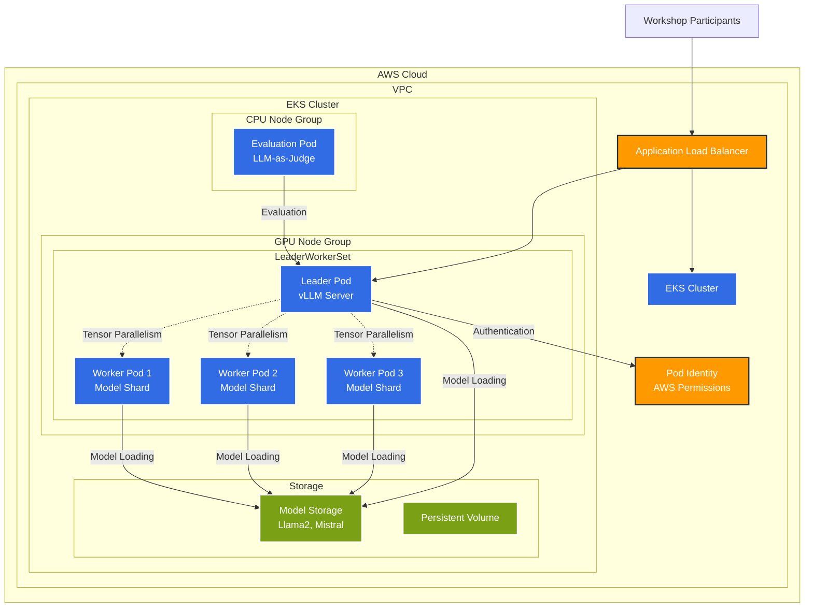

# Module 1: Optimizing and Evaluating OSS LLMs on EKS

Welcome to Module 1! In this module, you'll learn how to optimize and evaluate open-source Large Language Models (LLMs) on Amazon EKS.

## Module Architecture Overview

This module implements a high-performance LLM serving architecture using vLLM and LeaderWorkerSet pattern on Amazon EKS:

### Key Components

1. **LeaderWorkerSet Pattern**: Distributed model serving with one leader coordinating multiple worker pods
2. **GPU Node Group**: High-performance instances (g5.xlarge, p4d.24xlarge) for model inference
3. **Tensor Parallelism**: Model shards distributed across multiple GPUs for large models
4. **Model Storage**: EFS for shared model weights and checkpoints
5. **Evaluation Framework**: Separate pods for LLM-as-a-judge evaluation
6. **Pod Identity**: Modern AWS authentication for secure resource access

### Performance Optimizations

- **Quantization**: GPTQ, AWQ, GGUF for memory efficiency
- **KV Cache**: Optimized attention caching for reduced latency
- **Batch Processing**: Dynamic batching for improved throughput
- **Memory Management**: Efficient GPU memory allocation and sharing

## Learning Objectives

By the end of this module, you will be able to:
- Deploy LLMs using LeaderWorkerSet (LWS) for parallel inferencing
- Implement tensor parallelism for improved performance
- Apply quantization techniques to reduce memory usage
- Optimize KV cache for better latency
- Evaluate LLM performance using LLM-as-a-judge techniques

## Module Overview

### 1. LLM Inferencing with LWS
- Understanding LeaderWorkerSet pattern
- Setting up parallel inferencing
- Performance benchmarking

### 2. Optimization Techniques
- **Tensor Parallelism**: Distributing model layers across GPUs
- **Quantization**: Memory and compute optimization with GPTQ, AWQ, and GGUF
- **KV Cache Optimization**: Reducing inference latency

### 3. LLM Evaluation
- LLM-as-a-judge evaluation framework
- Metrics collection and analysis
- Automated evaluation pipelines

## Prerequisites

Before starting this module, ensure you have:
- Completed the [Prerequisites](/prerequisites/) section
- Basic understanding of LLMs and transformer architecture
- Familiarity with Kubernetes deployments

## Technology Stack

- **LeaderWorkerSet (LWS)**: Kubernetes operator for distributed workloads
- **vLLM**: High-performance inference server
- **PyTorch**: Deep learning framework
- **Transformers**: Hugging Face library
- **CUDA**: GPU acceleration

## Estimated Time

- **Total Duration**: 2 hours
- **Inferencing Section**: 45 minutes
- **Optimization Techniques**: 60 minutes
- **Evaluation**: 35 minutes

## Let's Get Started!

Ready to optimize your first LLM? Let's begin with [LLM Inferencing](/module1-llm-optimization/inferencing/). 